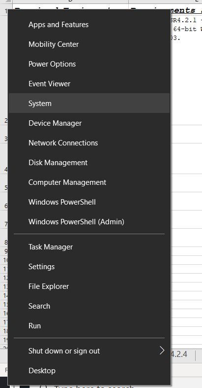
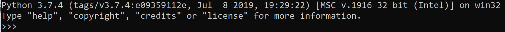
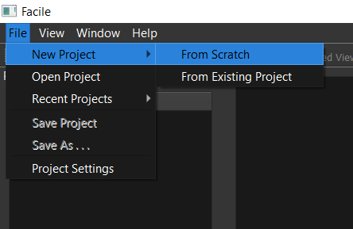
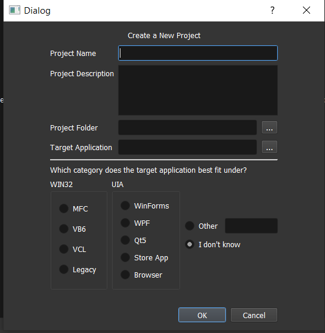
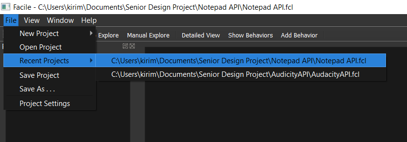
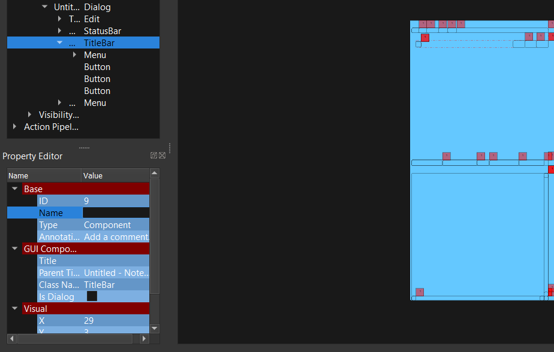
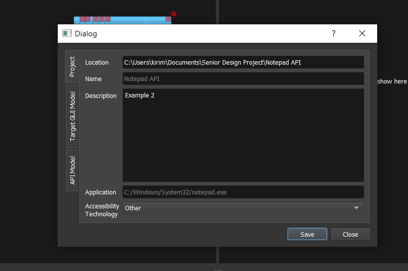
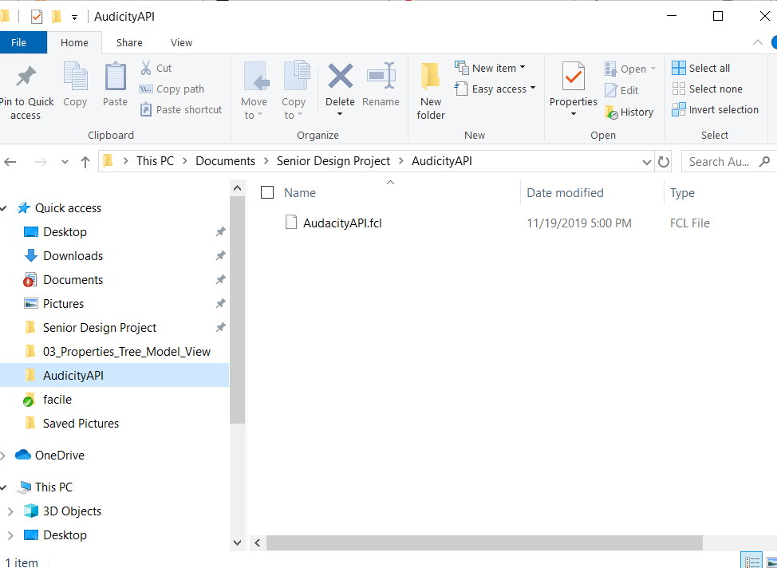

..
	This document has been auto generated by the test_procedure sphinx extension. Any changes to
	this file will be overwritten. DO NOT EDIT THIS FILE!

*************************
Acceptance Test Procedure
*************************

.. raw:: latex

	\newpage
	
----------------------------------------------------------------------------------------------------
Operating System Acceptance Test
----------------------------------------------------------------------------------------------------

============
Introduction
============

This acceptance test document verifies that the software system, Facile is functional on 64 Bit Windows 10 Home Version 1903.  This acceptance test establishes the framework used by the acceptance test team to plan, execute, and document acceptance testing.  It describes the scope of the work performed and the approach taken to execute the tests created to validate that the system performs as required with the intended operating system. The details of this acceptance test are developed according to the requirements specifications and show traceability back to those specifications.

====================
Referenced Documents
====================

- System Requirements Document, Rev B, 10/27/2019

=======================
Required Test Equipment
=======================

- PC (Personal Computer)

=========================
Requirements Summary
=========================

To verify SR4.2.1 - Facile shall operate on 64-bit Windows 10 Home Version 1903.

===================
Pre-Test Conditions
===================

- Need to be running application on Operating system Windows 10 Home Version 1903.
- Python 3.7.4 is installed and added to the PATH.

.. tabularcolumns:: |c|L|L|
.. table:: Test Procedure Steps

	+------+---------------------------------------------------------------------------------------+-----------------------------------------+
	| Step | Action                                                                                | Expected Result                         |
	+======+=======================================================================================+=========================================+
	|    1 | Right click on **Explorer**                                                           | A context menu of items open up         |
	+------+---------------------------------------------------------------------------------------+-----------------------------------------+
	|    2 | Select **System**                                                                     | **Settings** is open                    |
	+------+---------------------------------------------------------------------------------------+-----------------------------------------+
	|    3 | Scroll to **Device specifications,** and verify the System type, Edition, and Version | Refer to :num:`Fig. #ostest01zccjryfu`  |
	+------+---------------------------------------------------------------------------------------+-----------------------------------------+
	|    4 | Click on **Windows Search Bar**                                                       | Windows Search Bar comes into focus     |
	+------+---------------------------------------------------------------------------------------+-----------------------------------------+
	|    5 | Type cmd and press enter                                                              | A **Command Prompt** terminal opens     |
	+------+---------------------------------------------------------------------------------------+-----------------------------------------+
	|    6 | Click on the **Command Prompt**                                                       | The **Command Prompt** comes into focus |
	+------+---------------------------------------------------------------------------------------+-----------------------------------------+
	|    7 | Type "python facile.py" in the **Command Prompt**                                     | Facile should run. Test Case Completed. |
	+------+---------------------------------------------------------------------------------------+-----------------------------------------+
	|    8 | Right click on **Explorer**                                                           | A context menu of items open up         |
	+------+---------------------------------------------------------------------------------------+-----------------------------------------+

.. _OStest01zcCjRyFu:

    
    The Windows 10 system settings dialog showing that you're running Windows 10 version 1903
    

.. raw:: latex

	\newpage
	
----------------------------------------------------------------------------------------------------
Programming Language Acceptance Test
----------------------------------------------------------------------------------------------------

============
Introduction
============

This acceptance test document verifies that the software system, Facile is functional while using a Python 3.7.4 interpreter.  This acceptance test establishes the framework used by the acceptance test team to plan, execute, and document acceptance testing.  It describes the scope of the work performed and the approach taken to execute the tests created to validate that the system performs as required with the intended programming language. The details of this acceptance test are developed according to the requirements specifications and show traceability back to those specifications.

====================
Referenced Documents
====================

- System Requirements Document, Rev B, 10/27/2019

=======================
Required Test Equipment
=======================

- PC (Personal Computer)

=========================
Requirements Summary
=========================

To verify SR4.2.4 - Facile source code shall be compatible with the Python 3.7.4 interpreter.

===================
Pre-Test Conditions
===================

- Need to be running application on Operating system Windows 10 Home Version 1903.
- Python 3.7.4 is installed and added to the PATH.

.. tabularcolumns:: |c|L|L|
.. table:: Test Procedure Steps

	+------+------------------------------------------------------------------------------------------------------+----------------------------------------------+
	| Step | Action                                                                                               | Expected Result                              |
	+======+======================================================================================================+==============================================+
	|    1 | Click on the **Windows Search Bar**                                                                  | **Windows Search Bar** comes into focus      |
	+------+------------------------------------------------------------------------------------------------------+----------------------------------------------+
	|    2 | Type **cmd**                                                                                         | The sindows **Command Prompt** opens         |
	+------+------------------------------------------------------------------------------------------------------+----------------------------------------------+
	|    3 | Click on the command prompt                                                                          | The **Command Prompt** comes into focus      |
	+------+------------------------------------------------------------------------------------------------------+----------------------------------------------+
	|    4 | Type **python**                                                                                      | Refer to :num:`Fig. #languagetest01mozhxvyr` |
	+------+------------------------------------------------------------------------------------------------------+----------------------------------------------+
	|    5 | Verify that the *Python 3.7.4* and *32-bit* exist in the resulting text from the previous step.      | Refer to :num:`Fig. #languagetest01mozhxvyr` |
	+------+------------------------------------------------------------------------------------------------------+----------------------------------------------+
	|    6 | Navigate to the directory containing facile.py, then type "python facile.py" in the **Command line** | Facile should run. Test Case Completed.      |
	+------+------------------------------------------------------------------------------------------------------+----------------------------------------------+
	|    7 | Click on the **Windows Search Bar**                                                                  | **Windows Search Bar** comes into focus      |
	+------+------------------------------------------------------------------------------------------------------+----------------------------------------------+

.. _languagetest01MozhxVYr:

    
    A snippit of the Windows Command Prompt after typing *python* and pressing Enter. It shows the version and bitness of the Python interpreter being run.
    

.. raw:: latex

	\newpage
	
----------------------------------------------------------------------------------------------------
Graphical User Interface Acceptance Test
----------------------------------------------------------------------------------------------------

============
Introduction
============

This acceptance test document verifies that the software system, Facile has a functional GUI that interacts with the user.  This acceptance test establishes the framework used by the acceptance test team to plan, execute, and document acceptance testing.  It describes the scope of the work performed and the approach taken to execute the tests created to validate that the system performs as required in the GUI. The details of this acceptance test are developed according to the requirements specifications and show traceability back to those specifications.

.. note::
    The requirement that this test case is verifying is not completed yet because sub-system and sub-assembly requirements must first be completed.

====================
Referenced Documents
====================

- System Requirements Document, Rev B, 10/27/2019

=======================
Required Test Equipment
=======================

- PC (Personal Computer)

=========================
Requirements Summary
=========================

To verify SR4.3.1 - Facile shall contain a GUI that interacts with the user to produce custom APIs that control the target GUI.

===================
Pre-Test Conditions
===================

- Need to be running application on Operating system Windows 10 Home Version 1903.
- Python 3.7.4 is installed and added to the PATH.

.. tabularcolumns:: |c|L|L|
.. table:: Test Procedure Steps

	+------+---------------------------------------------------------------------------------------------------------------------------------------------------------------------------------------------------------+-------------------------------------------------------------------------+
	| Step | Action                                                                                                                                                                                                  | Expected Result                                                         |
	+======+=========================================================================================================================================================================================================+=========================================================================+
	|    1 | Click on the **Windows Search Bar**                                                                                                                                                                     | **Windows Seach Bar** comes into focus.                                 |
	+------+---------------------------------------------------------------------------------------------------------------------------------------------------------------------------------------------------------+-------------------------------------------------------------------------+
	|    2 | Type **cmd** and press Enter                                                                                                                                                                            | A **Command Prompt** opens                                              |
	+------+---------------------------------------------------------------------------------------------------------------------------------------------------------------------------------------------------------+-------------------------------------------------------------------------+
	|    3 | Click on the **Command Prompt**                                                                                                                                                                         | The **Command Prompt** comes into focus                                 |
	+------+---------------------------------------------------------------------------------------------------------------------------------------------------------------------------------------------------------+-------------------------------------------------------------------------+
	|    4 | Type "python facile.py" in the **Command Prompt**                                                                                                                                                       | Facile should run.                                                      |
	+------+---------------------------------------------------------------------------------------------------------------------------------------------------------------------------------------------------------+-------------------------------------------------------------------------+
	|    5 | Click on **File**                                                                                                                                                                                       | Refer to :num:`Fig. #guitest01hdbxovhw`                                 |
	+------+---------------------------------------------------------------------------------------------------------------------------------------------------------------------------------------------------------+-------------------------------------------------------------------------+
	|    6 | Click on **New Project**                                                                                                                                                                                | Refer to :num:`Fig. #guitest01hdbxovhw`                                 |
	+------+---------------------------------------------------------------------------------------------------------------------------------------------------------------------------------------------------------+-------------------------------------------------------------------------+
	|    7 | Click on **From Scratch**                                                                                                                                                                               | Refer to :num:`Fig. #guitest01hdbxovhw`                                 |
	+------+---------------------------------------------------------------------------------------------------------------------------------------------------------------------------------------------------------+-------------------------------------------------------------------------+
	|    8 | Fill in **Project Name** and **Project Description.** Upload your **Project Folder** and **Target Application.** Choose the category the **Target Application** best fits under. Finally, click **OK.** | Refer to :num:`Fig. #guitest02urcdepsu`                                 |
	+------+---------------------------------------------------------------------------------------------------------------------------------------------------------------------------------------------------------+-------------------------------------------------------------------------+
	|    9 | Click on **Start App**                                                                                                                                                                                  | **Target Application** will pop up.                                     |
	+------+---------------------------------------------------------------------------------------------------------------------------------------------------------------------------------------------------------+-------------------------------------------------------------------------+
	|   10 | Click on **Auto Explore** or **Manual Explore**                                                                                                                                                         | A model of the target GUI is shown in the view. Test case is completed. |
	+------+---------------------------------------------------------------------------------------------------------------------------------------------------------------------------------------------------------+-------------------------------------------------------------------------+
	|   11 | Click on the **Windows Search Bar**                                                                                                                                                                     | **Windows Seach Bar** comes into focus.                                 |
	+------+---------------------------------------------------------------------------------------------------------------------------------------------------------------------------------------------------------+-------------------------------------------------------------------------+
	|   12 | Type **cmd** and press Enter                                                                                                                                                                            | A **Command Prompt** opens                                              |
	+------+---------------------------------------------------------------------------------------------------------------------------------------------------------------------------------------------------------+-------------------------------------------------------------------------+

.. _GUItest01HdbXoVHW:

    
    A snippit of the Facile software system that shows the menu path to create a new project from scratch.
    

.. _GUItest02urcDEPsu:

    
    A snippit of the Facile project creation dialog. This dialog allows the user to specify some basic information abou the project and application they wish to control.
    

.. raw:: latex

	\newpage
	
----------------------------------------------------------------------------------------------------
Target GUI Component Identifier Acceptance Test
----------------------------------------------------------------------------------------------------

============
Introduction
============

This acceptance test document verifies that the software system, Facile has a view that will allow the user to identify components of a target GUI.  This acceptance test establishes the framework used by the acceptance test team to plan, execute, and document acceptance testing.  It describes the scope of the work performed and the approach taken to execute the tests created to validate that the system performs as required in the target GUI. The details of this acceptance test are developed according to the requirements specifications and show traceability back to those specifications.

====================
Referenced Documents
====================

- System Requirements Document, Rev B, 10/27/2019

=======================
Required Test Equipment
=======================

- PC (Personal Computer)

=========================
Requirements Summary
=========================

To verify SSR 4.3.1.1 - The Facile GUI shall contain a view that allows users to identify components from the target GUI.

===================
Pre-Test Conditions
===================

- Need to be running application on Operating system Windows 10 Home Version 1903.
- Python 3.7.4 is installed and added to the PATH.
- A Facile project has already been created.

.. tabularcolumns:: |c|L|L|
.. table:: Test Procedure Steps

	+------+--------------------------------------------------------+--------------------------------------------------------------------------------------+
	| Step | Action                                                 | Expected Result                                                                      |
	+======+========================================================+======================================================================================+
	|    1 | Click on the **Windows Search Bar**                    | **Windows Search Bar** comes into focus                                              |
	+------+--------------------------------------------------------+--------------------------------------------------------------------------------------+
	|    2 | Type **cmd** and press enter                           | A **Command Prompt** opens                                                           |
	+------+--------------------------------------------------------+--------------------------------------------------------------------------------------+
	|    3 | Click on the **Command Prompt**                        | The **Command Prompt** comes into focus                                              |
	+------+--------------------------------------------------------+--------------------------------------------------------------------------------------+
	|    4 | Type "python facile.py" in the **Command Prompt**      | Facile should run.                                                                   |
	+------+--------------------------------------------------------+--------------------------------------------------------------------------------------+
	|    5 | Click on **File** in the menu.                         | See :num:`Fig. #tguicitest01jmmvwwkm`                                                |
	+------+--------------------------------------------------------+--------------------------------------------------------------------------------------+
	|    6 | Click on **Recent Projects**                           | See :num:`Fig. #tguicitest01jmmvwwkm`                                                |
	+------+--------------------------------------------------------+--------------------------------------------------------------------------------------+
	|    7 | Click on a recent project that you created previously. | See :num:`Fig. #tguicitest01jmmvwwkm`                                                |
	+------+--------------------------------------------------------+--------------------------------------------------------------------------------------+
	|    8 | Click on **Start App**                                 | **Target Application** will run.                                                     |
	+------+--------------------------------------------------------+--------------------------------------------------------------------------------------+
	|    9 | Click on **Auto Explore** or **Manual Explore**        | GUI is shown in the view with components highlighted in red. Test case is completed. |
	+------+--------------------------------------------------------+--------------------------------------------------------------------------------------+
	|   10 | Click on the **Windows Search Bar**                    | **Windows Search Bar** comes into focus                                              |
	+------+--------------------------------------------------------+--------------------------------------------------------------------------------------+

.. _TGUICItest01JmMvWwkM:

    
    A snippit of the Facile software system that shows the menu path to open an existing project.
    

.. raw:: latex

	\newpage
	
----------------------------------------------------------------------------------------------------
Target GUI Behavior Mapper Acceptance Test
----------------------------------------------------------------------------------------------------

============
Introduction
============

This acceptance test document verifies that the software system, Facile has a GUI that contains a view that allows the users to specify 'Show/Hide' for relation between two components.  This acceptance test establishes the framework used by the acceptance test team to plan, execute, and document acceptance testing.  It describes the scope of the work performed and the approach taken to execute the tests created to validate that the system performs as required in the GUI. The details of this acceptance test are developed according to the requirements specifications and show traceability back to those specifications.

====================
Referenced Documents
====================

- System Requirements Document, Rev B, 10/27/2019

=======================
Required Test Equipment
=======================

- PC (Personal Computer)

=========================
Requirements Summary
=========================

To verify SSR 4.3.1.2 The Facile GUI shall contain a view that allows user to specify 'Show/Hide' relation between two components.

===================
Pre-Test Conditions
===================

- Need to be running application on Operating system Windows 10 Home Version 1903.
- Python 3.7.4 is installed and added to the PATH.
- A Facile project has already been created.

.. tabularcolumns:: |c|L|L|
.. table:: Test Procedure Steps

	+------+--------------------------------------------------------------------+---------------------------------------------------------------------------------------------+
	| Step | Action                                                             | Expected Result                                                                             |
	+======+====================================================================+=============================================================================================+
	|    1 | Click on the **Windows Search Bar**                                | **Windows Search Bar** comes into focus                                                     |
	+------+--------------------------------------------------------------------+---------------------------------------------------------------------------------------------+
	|    2 | Type **cmd** and press enter                                       | A **Command Prompt** opens                                                                  |
	+------+--------------------------------------------------------------------+---------------------------------------------------------------------------------------------+
	|    3 | Click on the **Command Prompt**                                    | The **Command Prompt** comes into focus                                                     |
	+------+--------------------------------------------------------------------+---------------------------------------------------------------------------------------------+
	|    4 | Type "python facile.py" in the **Command Prompt**                  | Facile should run.                                                                          |
	+------+--------------------------------------------------------------------+---------------------------------------------------------------------------------------------+
	|    5 | Click on **File** in the menu.                                     | Context menu of items will be shown                                                         |
	+------+--------------------------------------------------------------------+---------------------------------------------------------------------------------------------+
	|    6 | Click on **Recent Projects**                                       | Context menu of recent projects will be shown.                                              |
	+------+--------------------------------------------------------------------+---------------------------------------------------------------------------------------------+
	|    7 | Click on a recent project that you created previously.             | The selected project will be opened.                                                        |
	+------+--------------------------------------------------------------------+---------------------------------------------------------------------------------------------+
	|    8 | Click on **Start App**                                             | **Target Application** will open                                                            |
	+------+--------------------------------------------------------------------+---------------------------------------------------------------------------------------------+
	|    9 | Click on **Auto Explore** or **Manual Explore**                    | GUI is shown in the view with the selected component highlighted in red.                    |
	+------+--------------------------------------------------------------------+---------------------------------------------------------------------------------------------+
	|   10 | Click on the same button that you clicked on in the previous step. | **Observer** (and **Explorer**) will stop running.                                          |
	+------+--------------------------------------------------------------------+---------------------------------------------------------------------------------------------+
	|   11 | Click on **Add Behavior**                                          | Facile will enter the **ADD_VB** state and wait for the user to select 2 components.        |
	+------+--------------------------------------------------------------------+---------------------------------------------------------------------------------------------+
	|   12 | Click on 2 highlighted components that are shown in the view.      | an arrow will be drawn going from the first component to the second component.              |
	+------+--------------------------------------------------------------------+---------------------------------------------------------------------------------------------+
	|   13 | Select the new visibility behavior in the **project explorer**.    | The properties for the selected visibility behavior will be shown in the Properties editor. |
	+------+--------------------------------------------------------------------+---------------------------------------------------------------------------------------------+
	|   14 | Double click on the right column of the Reaction Type property.    | Options of **Show** or **Hide** will appear in the dropdown menu.                           |
	+------+--------------------------------------------------------------------+---------------------------------------------------------------------------------------------+
	|   15 | Click on **Shows** or **Hides**                                    | Reaction Type property is altered                                                           |
	+------+--------------------------------------------------------------------+---------------------------------------------------------------------------------------------+
	|   16 | Select any behavior in the **Project Explorer**                    | Reaction Type property iis changed in the **Project Explorer**. Test case is completed.     |
	+------+--------------------------------------------------------------------+---------------------------------------------------------------------------------------------+

.. raw:: latex

	\newpage
	
----------------------------------------------------------------------------------------------------
Project Overview Sidebar Acceptance Test
----------------------------------------------------------------------------------------------------

============
Introduction
============

This acceptance test document verifies that the software system, Facile has a GUI, that will have a view of all model components of the API project.  This acceptance test establishes the framework used by the acceptance test team to plan, execute, and document acceptance testing.  It describes the scope of the work performed and the approach taken to execute the tests created to validate that the system performs as required in the GUI. The details of this acceptance test are developed according to the requirements specifications and show traceability back to those specifications.

====================
Referenced Documents
====================

- System Requirements Document, Rev B, 10/27/2019

=======================
Required Test Equipment
=======================

- PC (Personal Computer)

=========================
Requirements Summary
=========================

To verify SSR 4.3.1.3 - The system shall contain a view that shows all model components of the API project.

===================
Pre-Test Conditions
===================

- Need to be running application on Operating system Windows 10 Home Version 1903.
- Python 3.7.4 is installed and added to the PATH.

.. tabularcolumns:: |c|L|L|
.. table:: Test Procedure Steps

	+------+---------------------------------------------------------------------------------------------------------------------------------------------------------------------------------------------------------+--------------------------------------------------------------------------------------------------------------+
	| Step | Action                                                                                                                                                                                                  | Expected Result                                                                                              |
	+======+=========================================================================================================================================================================================================+==============================================================================================================+
	|    1 | Click on the **Windows Search Bar**                                                                                                                                                                     | **Windows Seach Bar** comes into focus.                                                                      |
	+------+---------------------------------------------------------------------------------------------------------------------------------------------------------------------------------------------------------+--------------------------------------------------------------------------------------------------------------+
	|    2 | Type **cmd** and press Enter                                                                                                                                                                            | A **Command Prompt** opens                                                                                   |
	+------+---------------------------------------------------------------------------------------------------------------------------------------------------------------------------------------------------------+--------------------------------------------------------------------------------------------------------------+
	|    3 | Click on the **Command Prompt**                                                                                                                                                                         | The **Command Prompt** comes into focus                                                                      |
	+------+---------------------------------------------------------------------------------------------------------------------------------------------------------------------------------------------------------+--------------------------------------------------------------------------------------------------------------+
	|    4 | Type "python facile.py" in the **Command Prompt**                                                                                                                                                       | Facile should run.                                                                                           |
	+------+---------------------------------------------------------------------------------------------------------------------------------------------------------------------------------------------------------+--------------------------------------------------------------------------------------------------------------+
	|    5 | Click on **File**                                                                                                                                                                                       | Refer to :num:`Fig. #ostest01gxwshbue`                                                                       |
	+------+---------------------------------------------------------------------------------------------------------------------------------------------------------------------------------------------------------+--------------------------------------------------------------------------------------------------------------+
	|    6 | Click on **New Project**                                                                                                                                                                                | Refer to :num:`Fig. #ostest01gxwshbue`                                                                       |
	+------+---------------------------------------------------------------------------------------------------------------------------------------------------------------------------------------------------------+--------------------------------------------------------------------------------------------------------------+
	|    7 | Click on **From Scratch**                                                                                                                                                                               | Refer to :num:`Fig. #ostest01gxwshbue`                                                                       |
	+------+---------------------------------------------------------------------------------------------------------------------------------------------------------------------------------------------------------+--------------------------------------------------------------------------------------------------------------+
	|    8 | Fill in **Project Name** and **Project Description.** Upload your **Project Folder** and **Target Application.** Choose the category the **Target Application** best fits under. Finally, click **OK.** | Project is saved with the *.fcl* extension in the selected folder. Refer to :num:`Fig. #guitest02jrswixyr`   |
	+------+---------------------------------------------------------------------------------------------------------------------------------------------------------------------------------------------------------+--------------------------------------------------------------------------------------------------------------+
	|    9 | Click on **Start App**                                                                                                                                                                                  | **Target Application** will pop up.                                                                          |
	+------+---------------------------------------------------------------------------------------------------------------------------------------------------------------------------------------------------------+--------------------------------------------------------------------------------------------------------------+
	|   10 | Click on **Auto Explore** or **Manual Explore**                                                                                                                                                         | A model of the target GUI is shown in the view.                                                              |
	+------+---------------------------------------------------------------------------------------------------------------------------------------------------------------------------------------------------------+--------------------------------------------------------------------------------------------------------------+
	|   11 | In the left sidebar, expand **Project**, then expand **GUI Components**                                                                                                                                 | All of the GUI Components that make up the project are shown as a hierarchical view in the project explorer. |
	+------+---------------------------------------------------------------------------------------------------------------------------------------------------------------------------------------------------------+--------------------------------------------------------------------------------------------------------------+
	|   12 | Click on the **Windows Search Bar**                                                                                                                                                                     | **Windows Seach Bar** comes into focus.                                                                      |
	+------+---------------------------------------------------------------------------------------------------------------------------------------------------------------------------------------------------------+--------------------------------------------------------------------------------------------------------------+

.. _OStest01GXWsHbUe:

    
    The Windows 10 system settings dialog showing that you're running Windows 10 version 1903
    

.. _GUItest02JrswIXyr:

    
    
    

.. raw:: latex

	\newpage
	
----------------------------------------------------------------------------------------------------
Property Editor Panel Acceptance Test
----------------------------------------------------------------------------------------------------

============
Introduction
============

This acceptance test document verifies that the software system, Facile has a functional GUI that shall contain a view that allows the user to edit specific properties. The properties will be for any model components of the project that are selected by the user.  This acceptance test establishes the framework used by the acceptance test team to plan, execute, and document acceptance testing.  It describes the scope of the work performed and the approach taken to execute the tests created to validate that the system performs as required in the GUI. The details of this acceptance test are developed according to the requirements specifications and show traceability back to those specifications.

====================
Referenced Documents
====================

- System Requirements Document, Rev B, 10/27/2019

=======================
Required Test Equipment
=======================

- PC (Personal Computer)

=========================
Requirements Summary
=========================

To verify SRR 4.3.1.4 - The system shall contain a view that allows the user to edit specific properties for any model components in the project.

===================
Pre-Test Conditions
===================

- Need to be running application on Operating system Windows 10 Home Version 1903.
- Python 3.7.4 is installed and added to the PATH.
- A Facile project has already been created.

.. tabularcolumns:: |c|L|L|
.. table:: Test Procedure Steps

	+------+--------------------------------------------------------------------------------------------+--------------------------------------------------------------------------------------------+
	| Step | Action                                                                                     | Expected Result                                                                            |
	+======+============================================================================================+============================================================================================+
	|    1 | Click on the **Windows Search Bar**                                                        | **Windows Search Bar** comes into focus                                                    |
	+------+--------------------------------------------------------------------------------------------+--------------------------------------------------------------------------------------------+
	|    2 | Type **cmd** and press enter                                                               | A **Command Prompt** opens                                                                 |
	+------+--------------------------------------------------------------------------------------------+--------------------------------------------------------------------------------------------+
	|    3 | Click on the **Command Prompt**                                                            | The **Command Prompt** comes into focus                                                    |
	+------+--------------------------------------------------------------------------------------------+--------------------------------------------------------------------------------------------+
	|    4 | Type "python facile.py" in the **Command Prompt**                                          | Facile should run.                                                                         |
	+------+--------------------------------------------------------------------------------------------+--------------------------------------------------------------------------------------------+
	|    5 | Click on **File** in the menu.                                                             | Context menu of items will be shown                                                        |
	+------+--------------------------------------------------------------------------------------------+--------------------------------------------------------------------------------------------+
	|    6 | Click on **Recent Projects**                                                               | Context menu of recent projects will be shown.                                             |
	+------+--------------------------------------------------------------------------------------------+--------------------------------------------------------------------------------------------+
	|    7 | Click on a recent project that you created previously.                                     | The selected project will be opened.                                                       |
	+------+--------------------------------------------------------------------------------------------+--------------------------------------------------------------------------------------------+
	|    8 | Click on **Start App**                                                                     | **Target Application** will open                                                           |
	+------+--------------------------------------------------------------------------------------------+--------------------------------------------------------------------------------------------+
	|    9 | Click on **Auto Explore** or **Manual Explore**                                            | GUI is shown in the view with the selected component highlighted in red.                   |
	+------+--------------------------------------------------------------------------------------------+--------------------------------------------------------------------------------------------+
	|   10 | Click on a component in the **Target GUI Model Graphics View**                             | Highlighted component will have its properties shown in the **Property Editor** view.      |
	+------+--------------------------------------------------------------------------------------------+--------------------------------------------------------------------------------------------+
	|   11 | Click on a property in the **Property Editor** view                                        | The property will come into focus. Refer to :num:`Fig. #propertytest01ebocuogg`            |
	+------+--------------------------------------------------------------------------------------------+--------------------------------------------------------------------------------------------+
	|   12 | Edit the property value (If editable)                                                      | The value of the property is edited.                                                       |
	+------+--------------------------------------------------------------------------------------------+--------------------------------------------------------------------------------------------+
	|   13 | Select a different component and then select the one that had the *Name* property changed. | The *Name* of the component has been updated in the **Project Explorer**. Test is complete |
	+------+--------------------------------------------------------------------------------------------+--------------------------------------------------------------------------------------------+
	|   14 | Click on the **Windows Search Bar**                                                        | **Windows Search Bar** comes into focus                                                    |
	+------+--------------------------------------------------------------------------------------------+--------------------------------------------------------------------------------------------+

.. _propertytest01ebOCuogg:

    
    Shows the Facile software with the *Name* property selected. The *Name* property is always editable.
    

.. raw:: latex

	\newpage
	
----------------------------------------------------------------------------------------------------
Project Settings Dialog Acceptance Test
----------------------------------------------------------------------------------------------------

============
Introduction
============

This acceptance test document verifies that the software system, Facile has a functional GUI that contains a dialog that will allow the user to edit the setting of a specified project.  This acceptance test establishes the framework used by the acceptance test team to plan, execute, and document acceptance testing.  It describes the scope of the work performed and the approach taken to execute the tests created to validate that the system performs as required in the GUI. The details of this acceptance test are developed according to the requirements specifications and show traceability back to those specifications.

====================
Referenced Documents
====================

- System Requirements Document, Rev B, 10/27/2019

=======================
Required Test Equipment
=======================

- PC (Personal Computer)

=========================
Requirements Summary
=========================

To verify SSR 4.3.1.5 - The Facile GUI shall contain a dialog that allows the user to edit project settings.

===================
Pre-Test Conditions
===================

- Need to be running application on Operating system Windows 10 Home Version 1903.
- Python 3.7.4 is installed and added to the PATH.
- A Facile project has already been created.

.. tabularcolumns:: |c|L|L|
.. table:: Test Procedure Steps

	+------+--------------------------------------------------------+---------------------------------------------------------+
	| Step | Action                                                 | Expected Result                                         |
	+======+========================================================+=========================================================+
	|    1 | Click on the **Windows Search Bar**                    | **Windows Search Bar** comes into focus                 |
	+------+--------------------------------------------------------+---------------------------------------------------------+
	|    2 | Type **cmd** and press enter                           | A **Command Prompt** opens                              |
	+------+--------------------------------------------------------+---------------------------------------------------------+
	|    3 | Click on the **Command Prompt**                        | The **Command Prompt** comes into focus                 |
	+------+--------------------------------------------------------+---------------------------------------------------------+
	|    4 | Type "python facile.py" in the **Command Prompt**      | Facile should run.                                      |
	+------+--------------------------------------------------------+---------------------------------------------------------+
	|    5 | Click on **File** in the menu.                         | Context menu of items will be shown                     |
	+------+--------------------------------------------------------+---------------------------------------------------------+
	|    6 | Click on **Recent Projects**                           | Context menu of recent projects will be shown.          |
	+------+--------------------------------------------------------+---------------------------------------------------------+
	|    7 | Click on a recent project that you created previously. | The selected project will be opened.                    |
	+------+--------------------------------------------------------+---------------------------------------------------------+
	|    8 | Click on **File** again                                | Context menu of items will be shown                     |
	+------+--------------------------------------------------------+---------------------------------------------------------+
	|    9 | Click on **Project Settings**                          | Refer to :num:`Fig. #settingstest01trbcimur`            |
	+------+--------------------------------------------------------+---------------------------------------------------------+
	|   10 | Edit any project setting and click on **Save**         | Project setting is edited and saved.                    |
	+------+--------------------------------------------------------+---------------------------------------------------------+
	|   11 | Close the project settings dialog.                     | The project settings dialog is closed.                  |
	+------+--------------------------------------------------------+---------------------------------------------------------+
	|   12 | Open the project settings dialog again.                | The updated values should show. Test case is completed. |
	+------+--------------------------------------------------------+---------------------------------------------------------+
	|   13 | Click on the **Windows Search Bar**                    | **Windows Search Bar** comes into focus                 |
	+------+--------------------------------------------------------+---------------------------------------------------------+

.. _settingstest01tRbciMUr:

    
    Shows the Project Settings dialog.
    

.. raw:: latex

	\newpage
	
----------------------------------------------------------------------------------------------------
Project File Extension Acceptance Test
----------------------------------------------------------------------------------------------------

============
Introduction
============

This acceptance test document verifies that the software system, Facile will have its project files saved with a .fcl extension.  This acceptance test establishes the framework used by the acceptance test team to plan, execute, and document acceptance testing.  It describes the scope of the work performed and the approach taken to execute the tests created to validate that the system performs as required in the GUI. The details of this acceptance test are developed according to the requirements specifications and show traceability back to those specifications.

====================
Referenced Documents
====================

- System Requirements Document, Rev B, 10/27/2019

=======================
Required Test Equipment
=======================

- PC (Personal Computer)

=========================
Requirements Summary
=========================

To verify SR4.2.1 - Facile shall operate on 64-bit Windows 10 Home Version 1903.

===================
Pre-Test Conditions
===================

- Need to be running application on Operating system Windows 10 Home Version 1903.
- Python 3.7.4 is installed and added to the PATH.

.. tabularcolumns:: |c|L|L|
.. table:: Test Procedure Steps

	+------+---------------------------------------------------------------------------------------------------------------------------------------------------------------------------------------------------------+--------------------------------------------------------------------------------------------------------------------------------------------------+
	| Step | Action                                                                                                                                                                                                  | Expected Result                                                                                                                                  |
	+======+=========================================================================================================================================================================================================+==================================================================================================================================================+
	|    1 | Click on the **Windows Search Bar**                                                                                                                                                                     | **Windows Seach Bar** comes into focus.                                                                                                          |
	+------+---------------------------------------------------------------------------------------------------------------------------------------------------------------------------------------------------------+--------------------------------------------------------------------------------------------------------------------------------------------------+
	|    2 | Type **cmd** and press Enter                                                                                                                                                                            | A **Command Prompt** opens                                                                                                                       |
	+------+---------------------------------------------------------------------------------------------------------------------------------------------------------------------------------------------------------+--------------------------------------------------------------------------------------------------------------------------------------------------+
	|    3 | Click on the **Command Prompt**                                                                                                                                                                         | The **Command Prompt** comes into focus                                                                                                          |
	+------+---------------------------------------------------------------------------------------------------------------------------------------------------------------------------------------------------------+--------------------------------------------------------------------------------------------------------------------------------------------------+
	|    4 | Type "python facile.py" in the **Command Prompt**                                                                                                                                                       | Facile should run.                                                                                                                               |
	+------+---------------------------------------------------------------------------------------------------------------------------------------------------------------------------------------------------------+--------------------------------------------------------------------------------------------------------------------------------------------------+
	|    5 | Click on **File**                                                                                                                                                                                       | Refer to :num:`Fig. #ostest01pgxxdaem`                                                                                                           |
	+------+---------------------------------------------------------------------------------------------------------------------------------------------------------------------------------------------------------+--------------------------------------------------------------------------------------------------------------------------------------------------+
	|    6 | Click on **New Project**                                                                                                                                                                                | Refer to :num:`Fig. #ostest01pgxxdaem`                                                                                                           |
	+------+---------------------------------------------------------------------------------------------------------------------------------------------------------------------------------------------------------+--------------------------------------------------------------------------------------------------------------------------------------------------+
	|    7 | Click on **From Scratch**                                                                                                                                                                               | Refer to :num:`Fig. #ostest01pgxxdaem`                                                                                                           |
	+------+---------------------------------------------------------------------------------------------------------------------------------------------------------------------------------------------------------+--------------------------------------------------------------------------------------------------------------------------------------------------+
	|    8 | Fill in **Project Name** and **Project Description.** Upload your **Project Folder** and **Target Application.** Choose the category the **Target Application** best fits under. Finally, click **OK.** | Project is saved with the *.fcl* extension in the selected folder. Refer to :num:`Fig. #guitest02rybfmqpw`                                       |
	+------+---------------------------------------------------------------------------------------------------------------------------------------------------------------------------------------------------------+--------------------------------------------------------------------------------------------------------------------------------------------------+
	|    9 | In the Windows taskbar, click on **File Explorer** and navigate to your project folder.                                                                                                                 | A variety of files are shown. The main file is the name of your project with the *.fcl* extension. Refer to :num:`Fig. #extensiontest01rmcayjwx` |
	+------+---------------------------------------------------------------------------------------------------------------------------------------------------------------------------------------------------------+--------------------------------------------------------------------------------------------------------------------------------------------------+
	|   10 | Click on the **Windows Search Bar**                                                                                                                                                                     | **Windows Seach Bar** comes into focus.                                                                                                          |
	+------+---------------------------------------------------------------------------------------------------------------------------------------------------------------------------------------------------------+--------------------------------------------------------------------------------------------------------------------------------------------------+

.. _OStest01pGxXDaEM:

    
    
    

.. _GUItest02rYBFmqPw:

    
    
    

.. _extensiontest01rmCAYJWx:

    
    Shows the files in your project. The filenames in your project may differ, but the extensions should remain the same.
    

.. raw:: latex

	\newpage
	
----------------------------------------------------------------------------------------------------
Project File Format Acceptance Test
----------------------------------------------------------------------------------------------------

============
Introduction
============

This acceptance test document verifies that the software system, Facile will have project files than be in a human-readable format such as JSON.  This acceptance test establishes the framework used by the acceptance test team to plan, execute, and document acceptance testing.  It describes the scope of the work performed and the approach taken to execute the tests created to validate that the system performs as required. The details of this acceptance test are developed according to the requirements specifications and show traceability back to those specifications.

====================
Referenced Documents
====================

- System Requirements Document, Rev B, 10/27/2019

=======================
Required Test Equipment
=======================

- PC (Personal Computer)

=========================
Requirements Summary
=========================

To verify SR 4.6.4 - Facile project files shall be in a human-readable format such as JSON.

===================
Pre-Test Conditions
===================

- Need to be running application on Operating system Windows 10 Home Version 1903.
- Python 3.7.4 is installed and added to the PATH.

.. tabularcolumns:: |c|L|L|
.. table:: Test Procedure Steps

	+------+---------------------------------------------------------------------------------------------------------------------------------------------------------------------------------------------------------+--------------------------------------------------------------------------------------------------------------------------------------------------+
	| Step | Action                                                                                                                                                                                                  | Expected Result                                                                                                                                  |
	+======+=========================================================================================================================================================================================================+==================================================================================================================================================+
	|    1 | Click on the **Windows Search Bar**                                                                                                                                                                     | **Windows Seach Bar** comes into focus.                                                                                                          |
	+------+---------------------------------------------------------------------------------------------------------------------------------------------------------------------------------------------------------+--------------------------------------------------------------------------------------------------------------------------------------------------+
	|    2 | Type **cmd** and press Enter                                                                                                                                                                            | A **Command Prompt** opens                                                                                                                       |
	+------+---------------------------------------------------------------------------------------------------------------------------------------------------------------------------------------------------------+--------------------------------------------------------------------------------------------------------------------------------------------------+
	|    3 | Click on the **Command Prompt**                                                                                                                                                                         | The **Command Prompt** comes into focus                                                                                                          |
	+------+---------------------------------------------------------------------------------------------------------------------------------------------------------------------------------------------------------+--------------------------------------------------------------------------------------------------------------------------------------------------+
	|    4 | Type "python facile.py" in the **Command Prompt**                                                                                                                                                       | Facile should run.                                                                                                                               |
	+------+---------------------------------------------------------------------------------------------------------------------------------------------------------------------------------------------------------+--------------------------------------------------------------------------------------------------------------------------------------------------+
	|    5 | Click on **File**                                                                                                                                                                                       | Refer to :num:`Fig. #ostest01iwuyegnw`                                                                                                           |
	+------+---------------------------------------------------------------------------------------------------------------------------------------------------------------------------------------------------------+--------------------------------------------------------------------------------------------------------------------------------------------------+
	|    6 | Click on **New Project**                                                                                                                                                                                | Refer to :num:`Fig. #ostest01iwuyegnw`                                                                                                           |
	+------+---------------------------------------------------------------------------------------------------------------------------------------------------------------------------------------------------------+--------------------------------------------------------------------------------------------------------------------------------------------------+
	|    7 | Click on **From Scratch**                                                                                                                                                                               | Refer to :num:`Fig. #ostest01iwuyegnw`                                                                                                           |
	+------+---------------------------------------------------------------------------------------------------------------------------------------------------------------------------------------------------------+--------------------------------------------------------------------------------------------------------------------------------------------------+
	|    8 | Fill in **Project Name** and **Project Description.** Upload your **Project Folder** and **Target Application.** Choose the category the **Target Application** best fits under. Finally, click **OK.** | Project is saved with the *.fcl* extension in the selected folder. Refer to :num:`Fig. #guitest02tcceuhwi`                                       |
	+------+---------------------------------------------------------------------------------------------------------------------------------------------------------------------------------------------------------+--------------------------------------------------------------------------------------------------------------------------------------------------+
	|    9 | In the Windows taskbar, click on **File Explorer** and navigate to your project folder.                                                                                                                 | A variety of files are shown. The main file is the name of your project with the *.fcl* extension. Refer to :num:`Fig. #extensiontest01qlbpwiou` |
	+------+---------------------------------------------------------------------------------------------------------------------------------------------------------------------------------------------------------+--------------------------------------------------------------------------------------------------------------------------------------------------+
	|   10 | Right click on the project file (*.fcl* extension) and select **Open with**. Select a text editor to open the file with.                                                                                | The content of the Project file is shown in human-readable format in the chosen text editor. Test case completed.                                |
	+------+---------------------------------------------------------------------------------------------------------------------------------------------------------------------------------------------------------+--------------------------------------------------------------------------------------------------------------------------------------------------+
	|   11 | Click on the **Windows Search Bar**                                                                                                                                                                     | **Windows Seach Bar** comes into focus.                                                                                                          |
	+------+---------------------------------------------------------------------------------------------------------------------------------------------------------------------------------------------------------+--------------------------------------------------------------------------------------------------------------------------------------------------+

.. _OStest01IwUyeGnW:

    
    The Windows 10 system settings dialog showing that you're running Windows 10 version 1903
    

.. _GUItest02tcCEuhWi:

    
    
    

.. _extensiontest01qlbpWIoU:

    
    
    
