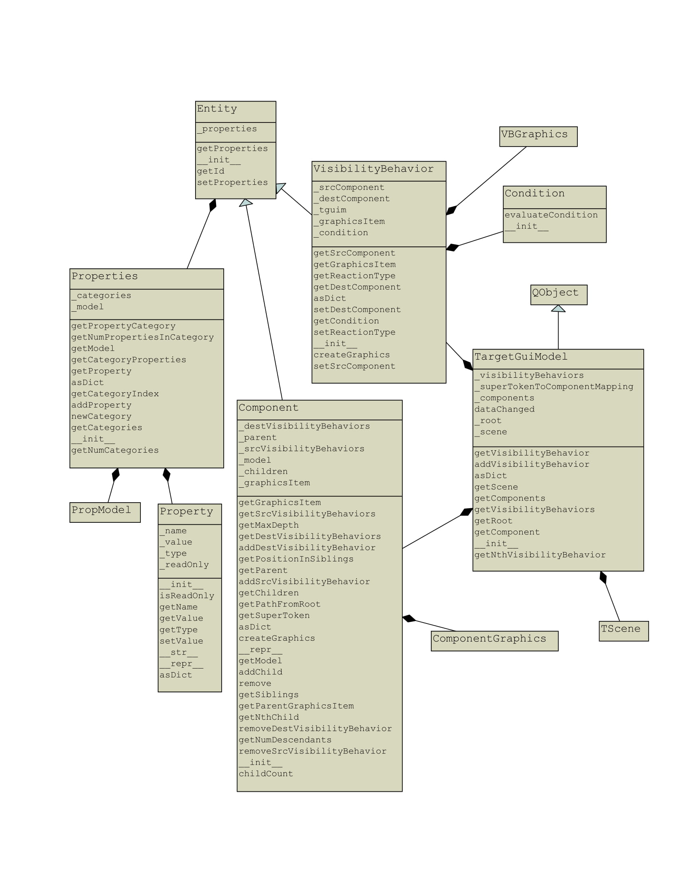

***************
Data Structures
***************

This section describes the critical data structures that Facile uses. The two primary data
structures are:

- Target GUI Model
- API Model

These data structures are compositions of many other data structures that will be discussed in
this section.

------------------------
Target GUI Model (TGUIM)
------------------------

The TargetGuiModel class models the structure and behavior of the target GUI.  It contains GUI
components (from the Component class) organized in a tree structure, and stores visibility
behaviors (from the VisibilityBehavior class) in an ordered dictionary.

The root node of the Component tree is constructed at the time the TargetGuiModel object is
constructed and remains constant through the TargetGuiModel object’s lifespan.  New components
are constructed and added to the tree when it receives new SuperTokens from the Observer.

.. todo::
    elaborate more

.. todo::
    Link to figure below somewhere

    This class diagram depicts the structure of the Target GUI Model data structure. This is a
    highly critical part of Facile.

----------------
API Model (APIM)
----------------

The APIModel class is currently under construction.

