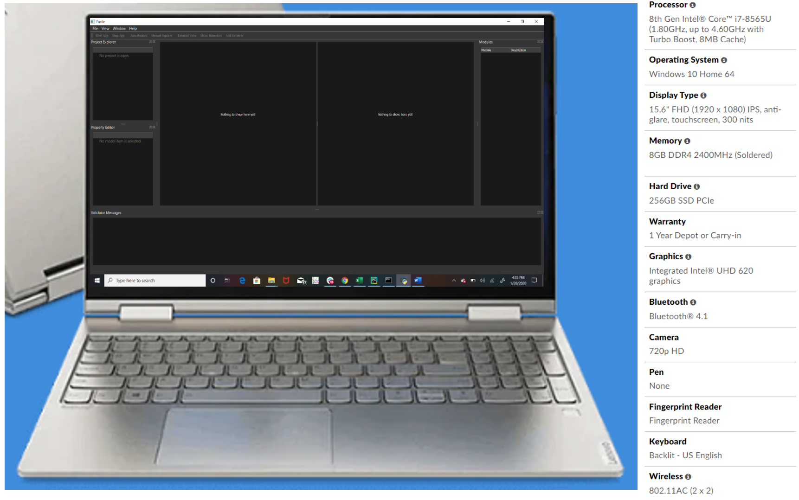

**************************
Top-Level Assembly Drawing
**************************

Because this is a software project, this document is pretty much pointless. Since we need to have
a "top-level assembly drawing", we have one. However, we could just tell you that Facile runs on a
Windows 10 operating system that needs at least 4GB RAM and 5GB disk space, as well as Python 3.7.4
installed (by the way, we do tell you this in the requirements).

    The top-level assembly drawing shows Facile running on a PC (personal computer)