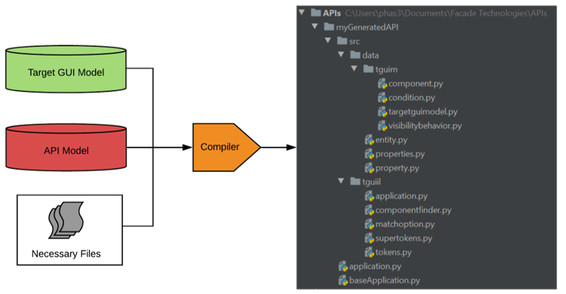
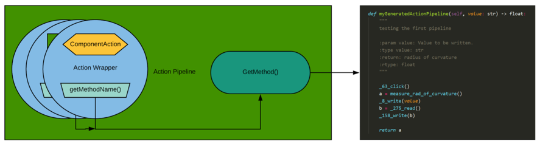
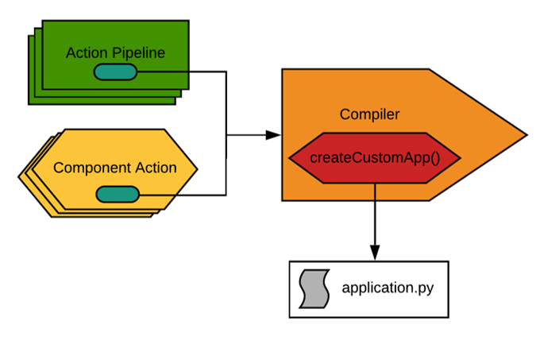

**********
Algorithms
**********

This section describes the critical algorithms of Facile. The four primary algorithms used are:

- Main State Machine
- Token Comparison Algorithm
- Observer Algorithm
- Explorer Algorithm
- Component Placement Algorithm

These algorithms are discussed in detail in the following sections.

-------------------------
Main State Machine
-------------------------

Facile's state machine is growing as we develop Facile. Currently, it only shows the side of
Facile that deals with building the model of the target GUI, but eventually it will show building
the model of the API and compiling the API. The state machine is shown in :num:`Fig. #statemachine`.

.. _StateMachine:

.. figure:: ../../images/StateMachine.png
    :alt: Facile's state machine.

    Facile's state machine.

--------------------------
Token Comparison Algorithm
--------------------------

Token Comparison allows facile to detect if a new component has been found, or if a component has
simply been rediscovered. While this may seem like a relatively trivial task, it is not. The
dynamic nature of GUIs means that components can and will change sizes and appearances, either
from computer to computer or due to interaction with the GUIs themselves. In order to solve this
issue, Facile uses modules such as pywinauto and pyautogui to collect as much information as
possible about a GUI and its components, and makes one of three decisions: exact, close, or no match
between two tokens.

The following algorithm is used in order to determine the correct decision:

- An *EXACT* decision is immediately made if all of the following are identical for both tokens:

    - Top-level Parent Components
    - Parent Components
    - Titles
    - Sizes
    - Number of Children Components
    - Children Texts

- A *NO MATCH* decision is immediately made if any of the following do not match between the two tokens:

    - Class/Type of Component
    - Process ID
    - Automation ID (consistent component identifier supplied by pywinauto)
    - Parent Component Class/Type
    - Class/Type of Top-level Parent
    - Control ID (another consistent component identifier supplied by pywinauto)

- Otherwise, a more in-depth and probabilistic method of determining the match type is used.

    - All of the following properties are taken into consideration, and they often have differing
      impacts on the final decision, based on their importance.

        - Control ID
        - Picture (If given)
        - Component Dimensions and Position On Screen
        - Title
        - Parent Title
        - Top Level Parent Title
        - Children Texts
        - Enabled State
        - Visible State
        - Expanded State
        - Shown State

    - Additionally, if the component is a dialog type, such as a message box, Facile relies
      much more heavily on these fields:

        - Number Of Children
        - Children Text
        - Component Size

------------------
Observer Algorithm
------------------

The Observer is the part of Facile that looks at the target application and reports all visible
parts of it, along with any new views or windows that are opened. In order to achieve this
functionality, the observer is driven by the following behavior:

- The observer must first connect to the target application using its Process ID.
- While the application is open, the following occurs:

    - Handles to all visible windows are stored as (window, *None*) tuples (or couples) in a list
      of components to
      analyze, as the list will later be filled with (component, parentSuperToken) tuples as well.
    - Then, as long as there is at least one element in that list:

        - The last element of the list, which is a tuple, is removed and stored in order to be
          analyzed. The first part of the tuple is the handle to a component, for which a Token
          is immediately created, and the second is a reference to the component's parent's
          SuperToken.
        - The algorithm then checks whether a SuperToken already exists for the newly created
          token. To do this, the token comparison algorithm is used to determine if the new token
          and any of its parents' children's SuperTokens have an exact, close, or no match.
        - If there is an exact match, the algorithm takes no action and continues, since the new
          token already exists in a SuperToken.
        - If there is no match, a new SuperToken is created with the new token, and a signal is
          emitted to the Target GUI Model for it to be updated as well.
        - If there is a close match, the token is added to the resembling SuperToken's token
          list, and the algorithm then continues.
        - Handles to the current component's children are then added as (child,
          currentComponentSuperToken) to the list of components to be analyzed.

.. figure:: ../../images/TC&Observer_Diagram.png
    :alt: Token Comparison and Observer Algorithms Diagram

------------------
Explorer Algorithm
------------------

The Explorer is the part of Facile that interacts with the target application on its own, in an
attempt to display as many parts of the target application as possible. In order to achieve this
functionality, the explorer is driven by the following behavior:

- The explorer must first connect to the target application using its Process ID.
- While the application is open, the following occurs:

    - Handles to all visible windows are stored in a list of components to be interacted with.
    - Then, as long as there is at least one element in that list:

        - The last element of the list is removed and stored (as the current component) in order
          to be interacted with.
        - The current component's children are first added to the list.
        - If the current component is a textfield, the explorer pauses and asks the user to enter
          any necessary information (useful for login/credential cases), after which the user
          confirms the text and allows the explorer to continue.
        - If the current component is clickable, such as a button or menu item, then the explorer
          clicks on it, as long as it is not a "Cancel" button.

-----------------------------
Component Placement Algorithm
-----------------------------

Component Placement in Facile's target GUI view is crucial in order to get a visually recognizable
result. Because Facile wants every component to be selectable, margins must be made around every
component, and any collisions between sibling components must be resolved. In order to do this,
Facile uses the following methods:

- If a component has no parent, it is not displayed, because it represents a scene: the
  environment in which the application is running.
- If a component's parent has no parent, it means the component is a top level window. Once
  detected, these components are set to be movable, that way they can move around the scene.
  Additionally, they do not need any margins since no visible component surrounds them, but a
  titlebar is added in order to display information about the component and to allow for better
  selectability.
- Otherwise, components are shrunk by a specific amount in order to have margins around them, and
  a titlebar is added once again. Once this is done, collision resolution takes place:

    - When two components collide, they are overlapping, and this overlap must be mitigated in
      order to obtain a better and more realistic-looking final result. In order to do  this, there
      are four cases considered.

        .. note:: We define a component's placement by its top-left corner

        1. If component 2 is between 45 and 0 degrees from component 1, then component 2 is
           pushed to the right until there is no longer an overlap with component 1.
        #. If component 2 is between 0 and -90 degrees from component 1, then component 2 is
           pushed radially away from component 1 until there is no longer an overlap with
           component 1.
        #. If component 2 is between -90 and -135 degrees from component 1, then component 2 is
           pushed  down until there is no longer an overlap with component 1.
        #. Otherwise, component 2 'wins' and the same rules are applied, but with component 1
           relative to component 2.

------------
API Compiler
------------

This section describes Facile's API compiler's behavior and functionality.
The compiler performs two main actions: file copy and custom code generation. File copy is trivial, and hence will not
be discussed in depth in this section. In contrast, the code generation is the main feature of the compiler that will be
discussed here. Code generation is performed using the following classes in Facile:

- Action
- ComponentAction
- ActionPipeline
- TargetGuiModel
- Compiler

******
Action
******

Since the action class is inherited by the action types, it only defines general methods that apply to all action types.
Specifically, these are the most important methods in Action that are related to code generation, and their function:

- getMethodSignature(): Gives the signature for a method using its name and parameter list.
- getDocStr(): Generates the docstring for the action, including details about it and its ports.
- getMethod(): Generates the entirety of the code needed for the action, using other available methods.

While these functions are defined in the Action class, they are not functional without two additional functions:
getMethodCode() and getMethodName(). These are defined in Action, but only raise an exception. The reason for this is
that component actions and action pipelines have different naming conventions and inherently different code generation
techniques.

********************
Function Definitions
********************

The functions getMethodName() and getMethodCode() are instantiated in the following ways:

- ComponentAction class:
    - getMethodName(): All component action method names are generated using a naming scheme of
      "_(componentID)_(actionName)". Because component IDs are unique, and actions will only be instantiated once for
      one component, this guarantees a unique name for the method, while the leading underscore classifies it as a
      private method.
    - getMethodCode(): ComponentActions use a predefined component finding algorithm in order to get a handle to
      a component whose ID is known. Then, code specific to the action is read from predefined ".action" files and
      injected into the code.

- ActionPipeline class:
    - getMethodName(): Since unique action pipeline names are enforced within Facile, their method names are simply
      their names. This allows for more expected behavior, as the user can then simply use "myApp.customName()" to call
      their function.
    - getMethodCode(): The action pipeline code generation is not trivial. However, to put it in simple terms, an
      action pipeline will iterate through its contained ActionWrappers, getting just the method call from each one.
      The ports, inputs, and outputs are all connected using generated variable names spanning from a to z, the aa to
      zz, and so on. It keeps tracks of which ports are associated to which file names.

***********
Compilation
***********

The API Compiler generates the API in 3 steps.

- Copies over necessary files
- Saves Target GUI Model and copies it over
- Generates custom application.py file, putting it in the API directory

The file copying is performed keeping the directory names, file names, and file heirarchy intact, so as to avoid
rewriting every file. A noteworthy one of these files is baseapplication.py, which holds the BaseApplication class: the
clas which contains all the core functions used by an Application class, without which the API would not run.

When generating the Application class, BaseApplication is therefore set as its parent. From there, the compiler grabs a
list of all CompilerActions and ActionPipelines contained in the API Model, and iterates through them, ComponentActions
first, calling their getMethod() function.

