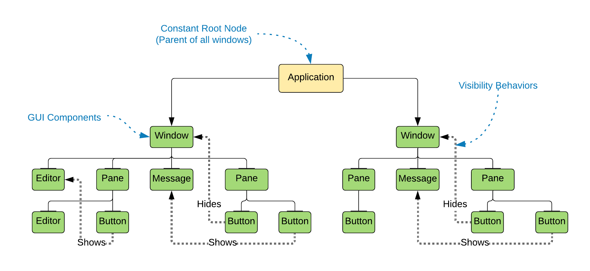
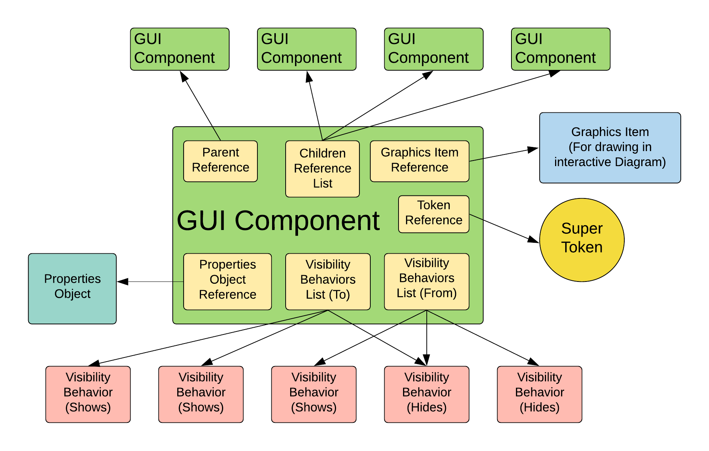
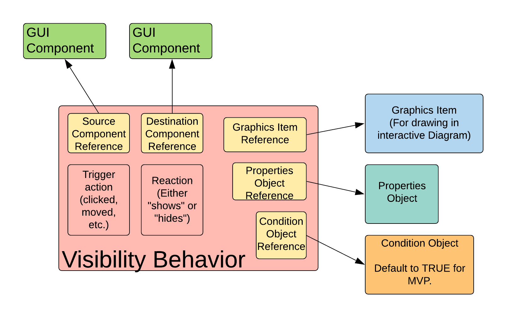
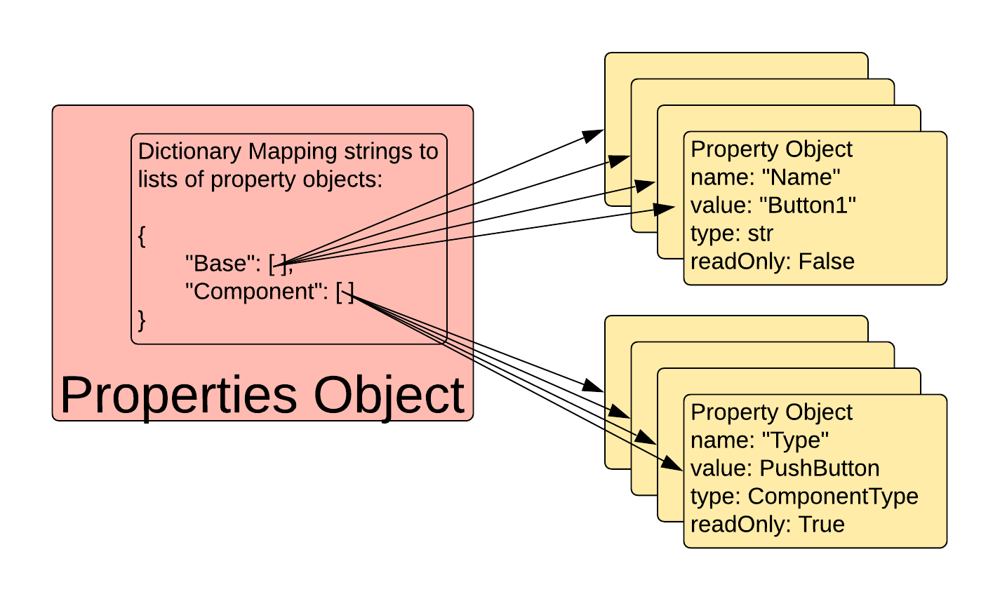
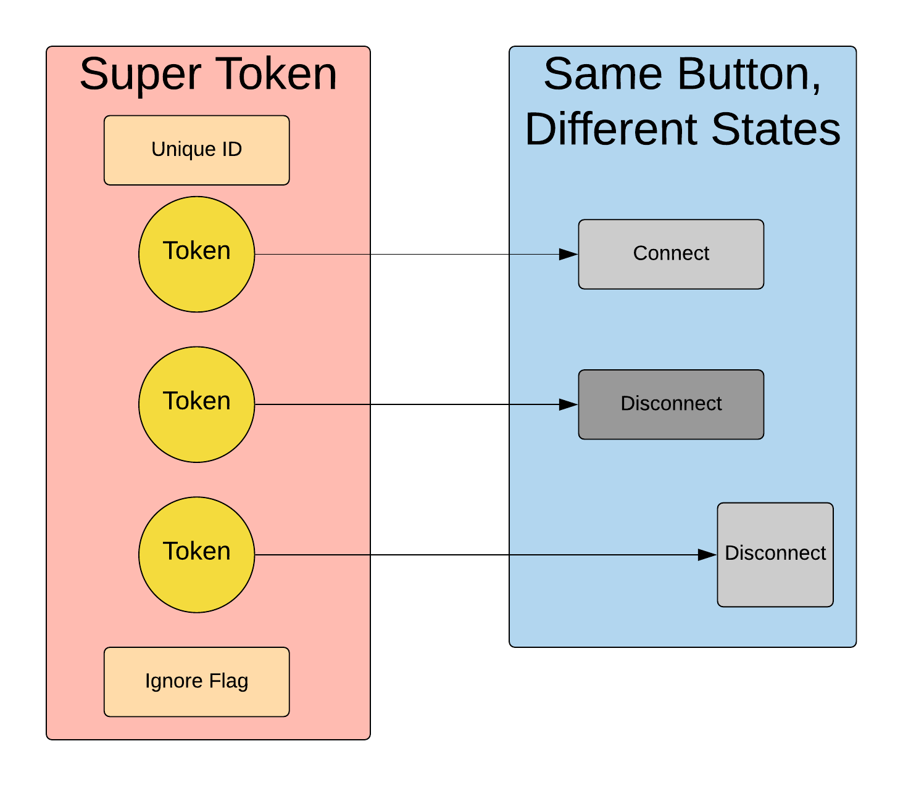
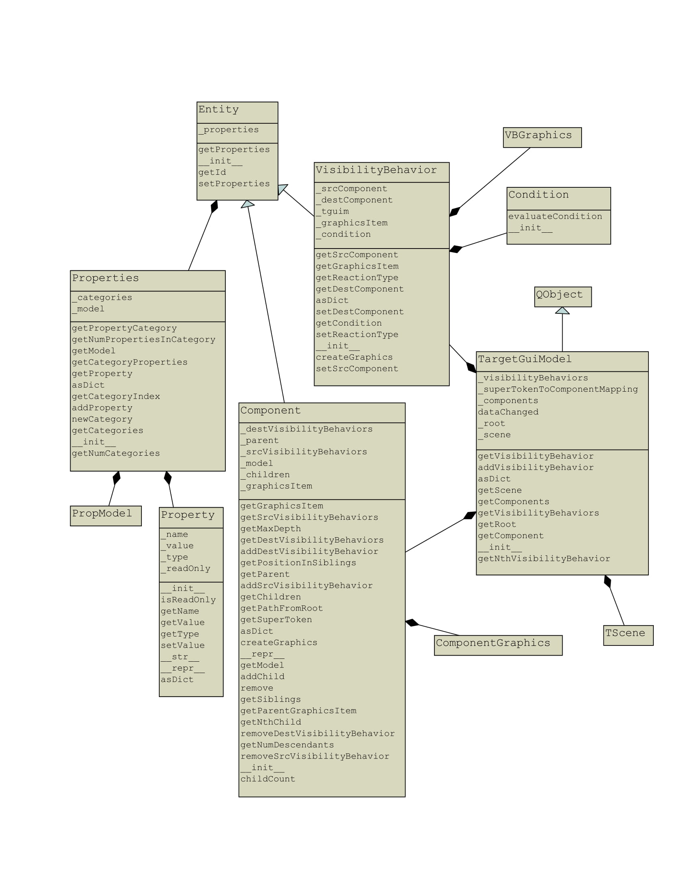

***************
Data Structures
***************

This section describes the critical data structures that Facile uses. The two primary data
structures are:

- Target GUI Model
- API Model

These data structures are compositions of many other data structures that will be discussed in
this section.

------------------------
Target GUI Model (TGUIM)
------------------------

The TargetGuiModel class models the structure and behavior of the target GUI.  It contains GUI
components (from the Component class) organized in a tree structure, and visibility
behaviors (from the VisibilityBehavior class) which act as edges between arbitrary components.
See :num:`Fig. #targetguimodel`.

.. note::
    The root node of the Component tree is constructed at the time the TargetGuiModel object
    is constructed and remains constant through the TargetGuiModel object’s lifespan.  New components
    are constructed and added to the tree when it receives new SuperTokens from the Observer.

.. _targetguimodel:

    The Target GUI Model.

.. raw:: latex

    \newpage

The TargetGuiModel Class is composed of the following classes. See the UML class diagram:
:num:`Fig. #tguimclassdiagram`.

======
Entity
======

The Entity class is the abstract class that the Component and Visibility Behavior classes inherit
from.  Every Entity subclass instance has a unique id accessible via the getId() method.
Entities have a Properties object (see the Properties class).  The Properties object associated
with an Entity is instantiated in the constructor of the Entity subclass and then added to the
Entity using the setProperties() method.

=========
Component
=========

The Component class models an individual GUI component in the target GUI.  Components are organized
in a tree in the TargetGuiModel class. See :num:`Fig. #component`.

.. _component:

    A diagram of the Component class.

==================
VisibilityBehavior
==================

The VisibilityBehavior class describes a visibility behavior in the target GUI - how a component
becomes visible or invisible to the user. E.g. clicking a button (the "source" component) causes
a window (the "destination" component) to be shown. See :num:`Fig. #visibilitybehavior`. A Condition object associated with the
visibility behavior defines when the visibility behavior does or does not happen.
(See the Condition class.)

.. _visibilitybehavior:

    A diagram of the VisibilityBehavior class.

=========
Condition
=========

The Condition class defines when a VisibilityBehavior should be honored or not.  E.g. Certain
conditions in the target application might need to be met for a certain button click to cause a
new window to appear.

==========
Properties
==========

The Properties class holds the properties of a given Entity (a VisibilityBehavior or Component
object).  It consists of an ordered dictionary where the keys are strings describing a category
of properties, and the values are lists of Property objects (See the Property class).
See :num:`Fig. #properties`.

.. note::
    Properties objects are created in the VisibilityBehavior and Component class constructors
    using the static method Properties.createPropertiesObject() instead of the normal constructor.

Predefined categories of properties include: “Base”, “Visual”, “GUI Component”, and “Visibility
Behavior”.  Note that it is possible to add custom categories using the
Properties.createPropertiesObject() method.

.. _properties:

    A diagram of a Properties Object.

========
Property
========

The Property class defines an individual property of an Entity.  A Property consists of a name, a
value, and a type.  Properties can optionally be made read only.

==========
SuperToken
==========

The SuperToken class contains all the identifying information associated with a particular target GUI
component. Every Component object has one SuperToken. The state of a target GUI component may change
over time, and so information about all observed states of the component are stored in its associated
SuperToken. The information of any one observed state is captured in a Token (see the Token class),
and so a SuperToken is essentially an aggregation of Tokens.

SuperTokens are created by the Observer and passed to the TargetGuiModel, which will create a Component
object based on the new SuperToken.  The SuperToken acts as an identifier for a Component in the
TargetGuiModel so that the Component can be re-associated with the actual component in the target GUI
later. See :num:`Fig. #supertoken`.

.. _supertoken:

    How a SuperToken relates to a single component in the target GUI.

=====
Token
=====

The Token class contains the identifying information associated with an individual target GUI component
in a particular state. One or more Tokens will belong to an individual SuperToken. Some of the pieces of
identifying information, which are stored as data members in the Token class, are assigned weights
determining the relative importance of that piece of information in reidentifying the component in the
target GUI. The Token class contains methods for deciding whether an observed component matches
(or matches closely enough) a Component in the TargetGuiModel.

.. todo::
    Update figure below to be most recent version.

.. _tguimclassdiagram:

    This class diagram depicts the structure of the Target GUI Model data structure. This is a
    highly critical part of Facile.

----------------
API Model (APIM)
----------------

The APIModel class is currently under construction.

