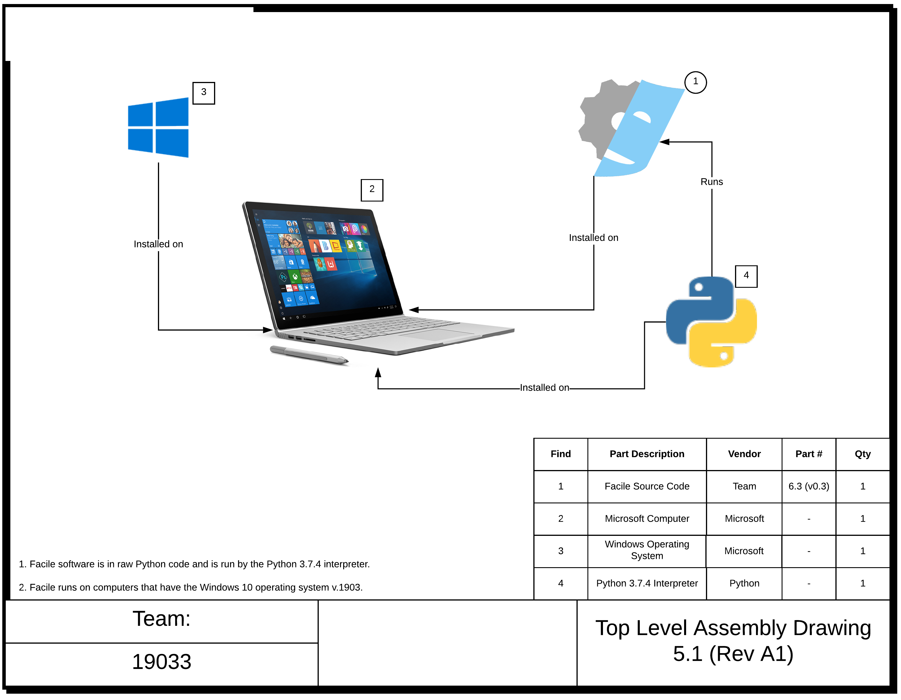

**************************
Software Drawings Package
**************************

------------------
Change Control Log
------------------

.. table:: Software Drawings Package Current Release Current Release

    +-----------------+------------------+--------------+------------------------------+
    | Release Version | Internal Version | Last Updated | Approved By                  |
    +=================+==================+==============+==============================+
    | B               | 1                | 02/28/2020   | Nikhith Vankireddy           |
    +-----------------+------------------+--------------+------------------------------+

.. table:: Verification Document Change Log
    :widths: 5 40 23 8 12 12

    +----------------+--------------------------------------------+--------------------------------------------+--------------+-------------+------------+
    | Change Log No. | Change Description                         | Rationale                                  | Class Change | Approved By | Date       |
    +================+============================================+============================================+==============+=============+============+
    | 1              | The name was changed from "Drawings" to    | Our project doesn't have any hardware and  | 1            | Nikhith     | 03/03/2020 |
    |                | "Software Drawings Package".               | the updated rubric calls for a hardware    |              | Vankireddy  |            |
    |                |                                            | drawings package.                          |              |             |            |
    +----------------+--------------------------------------------+--------------------------------------------+--------------+-------------+------------+

------------
Introduction
------------

Because Facile is a purely software system, this document is called "Software Drawings Package" instead of "Hardware
Drawings Package".

This document contains only one drawing - the Top Level Assembly Drawing, which gives context as to what environment
Facile will be used in as well as version numbers, checksums, part numbers, and descriptions.

=========================================
Top Level Assembly Drawing
=========================================

:numref:`TLAD` gives context as to what environment Facile will be used in. To avoid clutter in the drawing, more
information regarding all software components have been exported to :numref:`SOFTWARE-DRAWING`.

    Top Level Assembly Drawing of Facile

==========================================
Software Drawing
==========================================

The Software Drawing for Facile is shown in :numref:`SOFTWARE-DRAWING` below. The software drawing describes the files
needed to run Facile including their checksum values. Note that Python is an interpreted programming language (doesn't
require compiling). As such, we do not currently need or have an executable file for Facile. By FAR, we will have an
executable file for Facile. Because Python and Windows are such widely used products, it isn't necessary to assign them
a part number.

.. table:: Facile Software Drawing
    :name: SOFTWARE-DRAWING

    +------+-------------------------------------+----------------------------------------+----------+-----------------------------------+----------+
    | Find | Filename                            | Description                            | Version  | Checksum                          | Part no. |
    +======+=====================================+========================================+==========+===================================+==========+
    | 1    | facile.py                           | The Python source code for Facile. We  | 0.3.0    | N/A                               | 6.3      |
    |      |                                     | are currently running the source code  |          |                                   |          |
    |      |                                     | instead of an executable because       |          |                                   |          |
    |      |                                     | Python is an interpreted language.     |          |                                   |          |
    +------+-------------------------------------+----------------------------------------+----------+-----------------------------------+----------+
    | 3    | en_windows                          | Windows 10 disk image for installing   | 1903     | 07c929652db                       | N/A      |
    |      | 10_home_1903                        | Windows 10 Home 64-bit.                |          | 2d5b056e64a                       |          |
    |      | x64_dvd.iso                         |                                        |          | aeda92dff5                        |          |
    +------+-------------------------------------+----------------------------------------+----------+-----------------------------------+----------+
    | 4    | python.exe                          | The Python interpreter runs Facile.    | 3.7.4    | 808bd9c5da7                       | N/A      |
    |      |                                     |                                        |          | 9155f389b11                       |          |
    |      |                                     |                                        |          | fc52fc1f30                        |          |
    +------+-------------------------------------+----------------------------------------+----------+-----------------------------------+----------+
