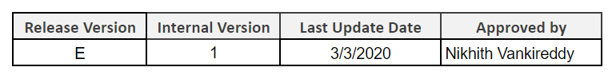
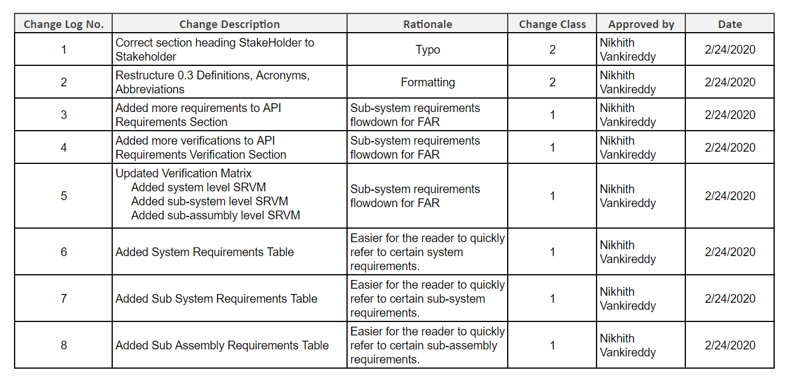
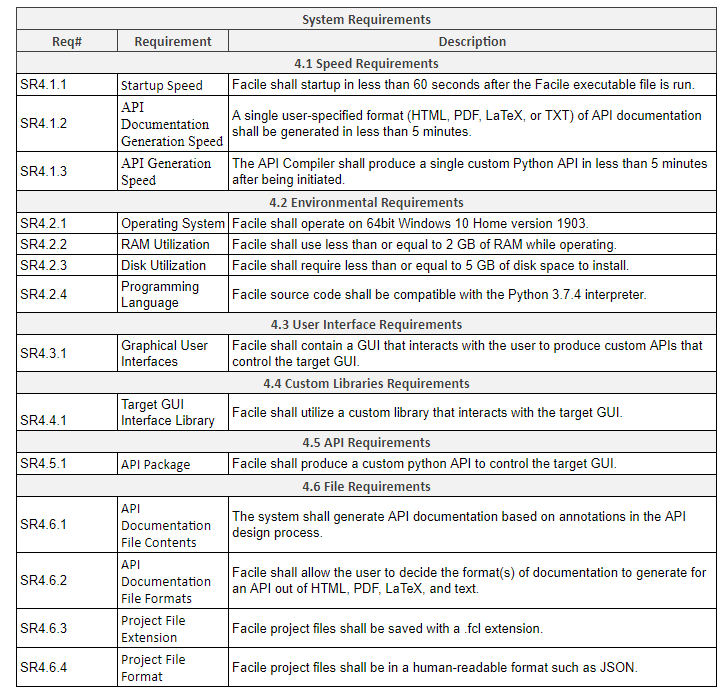
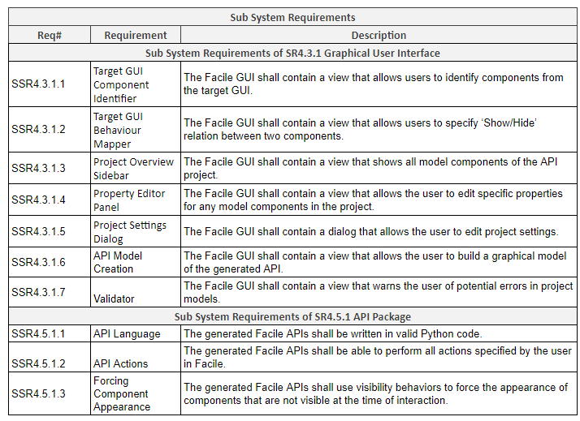
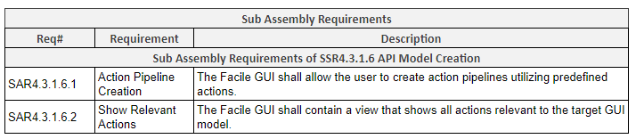
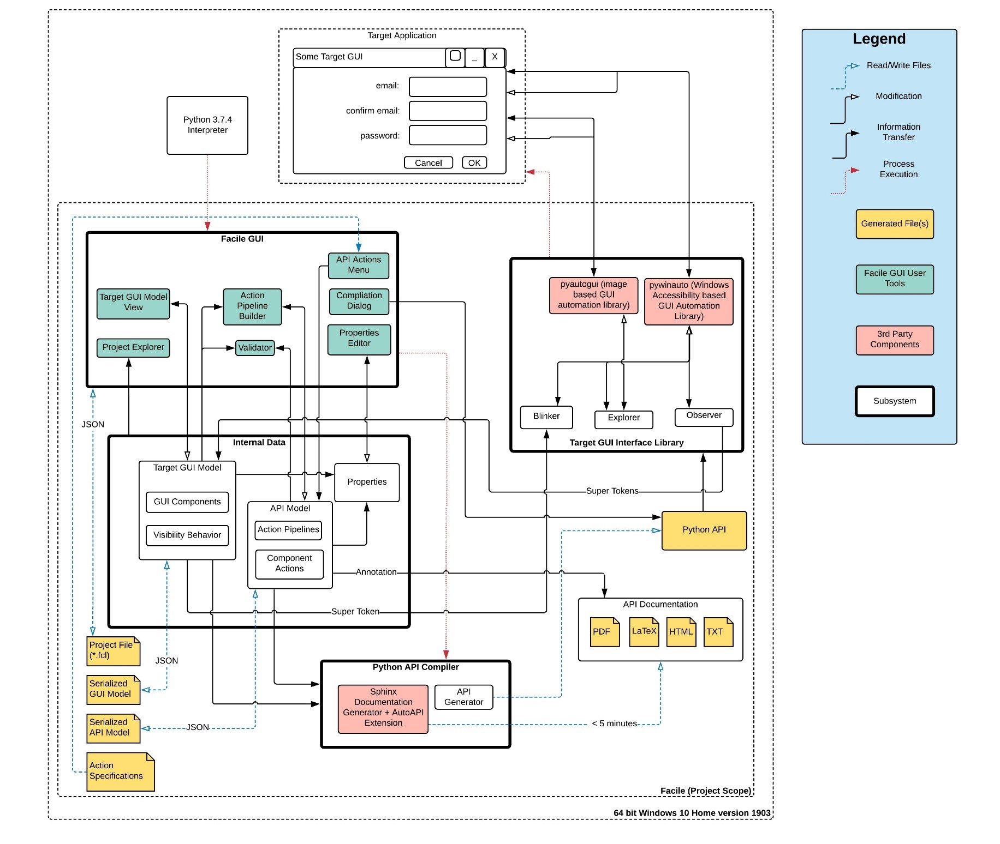
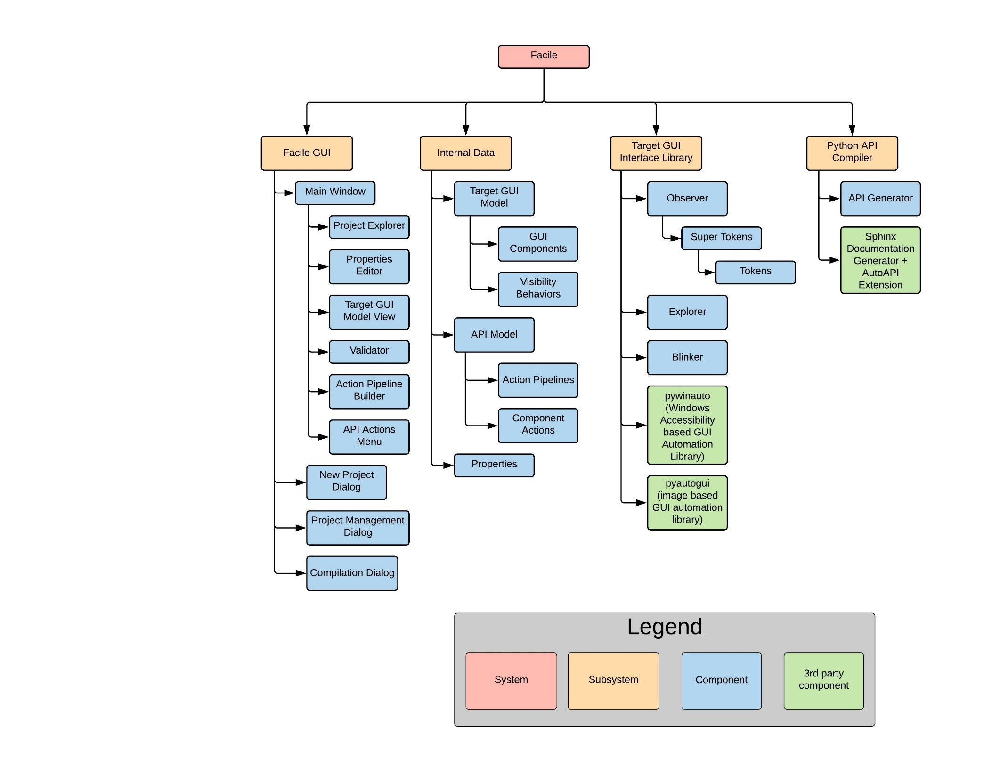
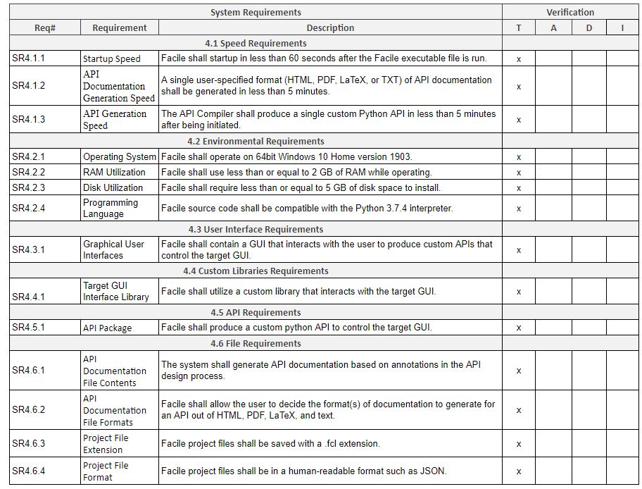
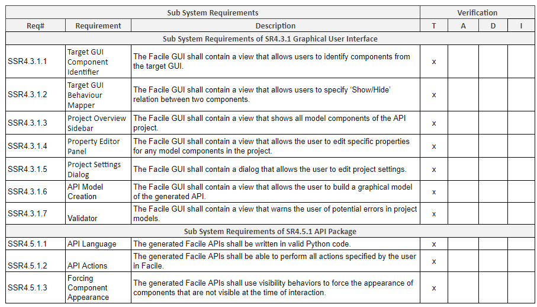
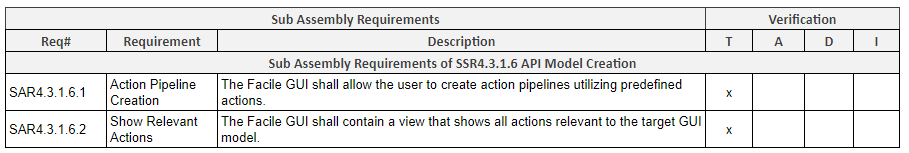

------------------------
Change Log
------------------------

----------------------
Introduction and Scope
----------------------

Many software products have been designed to solely interact with the user through a graphical user
interface (GUI). This is convenient for the user, but it places an upper limit on the usefulness of
the software. The most significant limitations are speed of use (imposed by user) and functionality
(imposed by developers). There are products on the market which aim to mimic the user by recording a
sequence of actions and replaying them, but these solutions lack flexibility.

The goal of this project is to develop a system that can produce custom Python application
programming interfaces (APIs) to control existing GUIs (target GUIs) based on their behavior. This
GUI automation solution will provide a high degree of flexibility to the user by giving them the
ability to make decisions about what to automate at multiple levels of API development. An API that
controls a GUI would allow operations to be performed much faster within the GUI (opposed to user
interactions) and allow functionality not supported by the GUI to be developed in the program that
uses the API.

==============
Identification
==============

Façade Technologies Inc. needs a system that produces custom application programming interfaces that
control existing graphical user interfaces based on their behavior. The APIs will be versatile and
will be used for many purposes such as automated GUI testing, task automation, or extending an
application’s functionality.

============
Intended Use
============

The system should be able to be used by people with little-to-no programming experience. When the
user launches the system executable, there should be options to either create a new project or load
an existing one. Each project will hold the user’s work when developing a single API. Once the user
decides to work on a project, they are in the API design process. The user should be able to click a
button that generates an API that can perform all of the tasks specified in the API design process.

==========
Background
==========

There are many software products on the market focused on automating tasks through the target GUI,
but they require the user to choose very specific tasks that they want to perform. By capturing the
behavior of the GUI of interest, an API could be generated that provides more robust, flexible, and
fine-grained control of the target GUI.

Uses of an API with such capabilities may include, but are not limited to:

- Hiding the target GUI off the screen but using the target software as an engine for other
  applications. (This is where the name “Facade” comes from).

- Creating a form of inter-process communication (IPC) where one application can easily use data
  from another application (by creating multiple APIs and tying them together via python script).

- Extending functionality of the target software on the fly without requesting new features from
  developers or changing source code.

- Automating redundant GUI tasks.

=========================
Document Overview and Use
=========================

The intent of this document is to list and explain the requirements pertaining to the system known
as “Facile” in Facade Technologies Inc. The requirements described in this document are
preconditions for a successful completion of the Facile project.

============
Stakeholders
============

The stakeholders of this project are:
- Façade Technologies Inc.
- Façade Technologies Inc.’s shareholders.
- Façade Technologies Inc.’s customers.
- The senior design team.

--------------------
Referenced Documents
--------------------

There are no applicable or referenced documents for this project.

----------------------------------------
Definitions, Acronyms, and Abbreviations
----------------------------------------

Action Pipeline
    A component created during the design process that describes a set of actions to perform
    in the target GUI. An action pipeline has inputs, outputs and a description. Each action
    pipeline is directly translated into a Python function and included in the API by the API
    Compiler.

Audacity
    An open source audio editing program. It's used as one of the example target applications.

Application Programming Interface (API)
    Generic term for a software library that allows developers to interface with an existing
    software system.

API Compiler
    The component of Facile responsible for generating custom Python APIs that will control
    the target GUI.

API Design Process
    The sequence of actions performed in the Facade builder by the user to create a custom
    API. This is a two-phase process where the user must:

    1. Identify GUI components and visibility behaviors
    #. Connect action pipelines to describe high levels of functionality that will be \
       manifested in the generated API.

Facile
    The application for which this documentation was created. It is used to generate custom
    APIs for programs that provide a graphical user interface.

Facile Project
    To generate an API, a project must be created. Projects store the models and settings
    associated with the API of interest.

Graphical User Interface (GUI)
    A part of an application that is displayed to the user and can be interacted with using
    the keyboard and mouse.

GUI Component
    A generic term for any part of a GUI. They can be components that the user can see and
    interact with such as:

    .. hlist::
        :columns: 3

        * Labels
        * Buttons
        * Text Edit Fields
        * Sliders
        * Radio Buttons
        * Check Boxes

    GUI Components can also be elements can also be containers of various types that the user
    may not notice.

PyAutoGUI
    A cross-platform Python package that uses image recognition and screen placement to
    interact with GUI components. This package is used by Facile to detect and interact with GUI
    components. It is used by both Facile and the APIs produced by Facile.

PyWinAuto
    A Python package for the Windows operating system that uses Windows accessibility
    technology to interact with GUI components. This package is used by Facile to detect and
    interact with components. It is also used by the APIs produced by Facile.

Target Application
    The application to be controlled by a Facile-generated API. Only applications developed
    with the following technologies can be controlled:

    .. hlist::
        :columns: 3

        * MFC
        * VB6
        * VCL
        * Legacy
        * WinForms
        * WPF
        * Qt5
        * Store App
        * Browser

Target GUI
    The graphical user interface of the target application

Visibility Behavior
    A term used to describe the visibility characteristics of specific components of the
    target GUI.

    When the user clicks component 1, component 2 ensues. Component 2 could be hidden or open
    a new window(s), panel(s), or GUI components(s).

    Visibility behaviors manifest themselves visibly in the Facade Builder in the form of labeled arrow in a
    directed graph. They are critical to the functionality of the API compiler because to interact with a GUI
    component, the API first has to know how to make the component visible.

Win32API
    Microsoft's core set of application programming interfaces (APIs) available in the Microsoft Windows operating
    systems. Almost all Windows programs interact with the Windows API. The existence of this library allows Windows
    applications to be controlled by custom APIs generated by Facile.

------------
Requirements
------------

The following figures represent all system (:numref:`SYS_REQ`), sub-system (:numref:`SUBSYS_REQ`), and sub-assembly (:numref:`SUBASS_REQ`) requirements for this project.

    System Requirements of Facile.

    Sub-system Requirements of Facile.

    Sub-assemply Requirements of Facile.

-------------------------------------
System Block Diagram and Architecture
-------------------------------------

====================
System Block Diagram
====================

The System Block Diagram in :numref:`SBD` shows the relationships between different sub systems and components.
This diagram is crucial towards explaining the basic software structure of Facile. The Facile (Project Scope) block
gives insight into how the Subsystems, components, Facile GUI User Tools, Generated Files, and 3rd Part Components of
the system, interact with each other. The 64-Bit Windows 10 Home version 1903 block shows the entire scope of the
project for how Facile (Project Scope) will interact with an arbitrary target application’s GUI.

The Facile GUI, being the subsystem that interacts with the user, provides user tools to build and API that controls
existing user interfaces. All User Tools are the teal blocks. All user tool that are “views” and interacts directly
with Internal Data, such as Target GUI Model View, Project Explorer, Action Pipeline Builder, Validator, and Properties
Editor. A lot of the views are models wrapped around data; thus, the Information Transfer is the data being taken from
Internal Data and being presented in a view in the Facile GUI. A few views will in return modify the data as the user
manipulates the view, so a Modification arrow is used as well.  There are two Process Executions, one from Python 3.7.4
interpreter to Facile GUI, and from Facile GUI to Python API Compiler. The Python 3.7.4 interpreter runs Facile. The
Facile GUI executes the process to run the Python API Compiler which ultimately generates the Python API.

The Target GUI Interface Library is the intermediate layer between the API, Internal Data, and Target GUI. It directly
communicates with the Target GUI with the two automation libraries Pywinauto and Pyautogui. Both libraries are used by
the Blinker, Observer, and Explorer components so they can modify the target GUI.  The Observer takes information from
the Target GUI through Pywinauto, when initialized by the user, and makes Super Tokens. The Super Tokens are then
passed to the Target GUI Model in until user stops exploration.

The Python API Compiler is the final step in generating the Python API. It receives Information from the API Model and
Target GUI Model. Python API files are written and then Sphinx Documentation + Auto API Extension will produce those
files as LaTex, HTML, PDF, and/or TXT files. At the same time, the API Generator will read those files to the Python
API.

    The system block diagram for Facile.

====================
Architecture Diagram
====================

The System Architecture Shown in :numref:`ARCH` refers to the fundamental structures of our software’s systems at a high level, whereas shown
in the legend, the tan pink block is our System block, which is Facile. Each subsystem is a in a designated beige
Subsystem block that describe the main software elements of our application. Below each subsystem there is a variety of
blue blocks that name the components to the project. There are a few components, provided for, that are necessary to
build the application, so we put those in a separate green block named 3rd Part Components to show their use within the
architecture.

The four subsystems Facile GUI, Internal Data, Target GUI Interface Library, and Python API Compiler are the four main pillars
of this project. The Facile GUI, the view the user interacts with. The Target GUI Interface Library is the middleman
between the data and API that communicates with the target GUI. The Internal Data is the backend to the project, the
functionality of the Target GUI Model, API Model, and Properties. Finally, the Python API Compiler is used to generate the
Python API and API Documentation.

    A hierarchical view of the system architecture of Facile.

-------------------------
Verification Requirements
-------------------------

The following sections match up with the Requirements section, but describe how to verify the
requirements instead. All of the requirements are verified by test.

===============================
Speed Requirements Verification
===============================

SR4.1.1 Startup Speed
    **Test**: The startup speed for facile shall be tested by running the Facile executable file and
    recording the time before any graphical user interface is shown. The test will show that the
    time required is under 30 seconds.

SR4.1.2 API Documentation Generation Speed
    **Test**: The API Documentation Generation speed for facile shall be tested by generating an API
    documentation based on user preference and recording the time required for the documentation to
    be created. The test will show that the time needed is under 5 mins.

SR4.1.3 API Generation Speed
    **Test**: The API Generation speed for facile shall be tested by generating a customized API and
    recording the time required for the API to be created. The test will show that the time
    needed is under 5 minutes.

=======================================
Environmental Requirements Verification
=======================================

SR4.2.1 Operating System
    **Test**: Operating system requirement shall be verified by testing if Facile can
    successfully run on 64bit Windows 10 Home version 1903.

SR4.2.2 RAM Utilization
    **Test**: RAM Utilization requirement shall be verified by testing if Facile can run on a
    computer with the specified amount of memory.

SR4.2.3 Disk Utilization
    **Test**: Disk Utilization requirement shall be verified by installing Facile and
    testing that the amount of disk space consumed is less than the allowed amount.

SR4.2.4 Programming Language
    **Test**: Programming Language requirement shall be verified by running Facile with the Python
    3.7.4 interpreter.

========================================
User Interface Requirements Verification
========================================

SR4.3.1 Graphical User Interface (GUI)
    **Test**: The Graphical User Interface requirement shall be verified by creating an API for
    IntelliWave using the Facile GUI.

SSR4.3.1.1 Target GUI Component Identifier
    **Test**: The Target GUI Component Identifier requirement shall be verified by using Facile's
    *observer* feature to identify all components of the Notepad application.

SSR4.3.1.2 Target GUI Behavior Mapper
    **Test**: The Target GUI Behavior Mapper requirement shall be verified by using the *add behavior*
    feature of Facile to show a relationship between clicking a menu item and a window opening
    because of the click.

SSR4.3.1.3 Project Overview Sidebar
    **Test**: The Project Overview Sidebar shall be verified by using the observer to discover
    components of the target GUI and verifying that the components show in a hierarchical structure
    in the Project Explorer view.

SSR4.3.1.4 Property Editor Panel
    **Test**: The Property Editor Panel requirement shall be verified by clicking on a component
    in the model and verifying that the properties appear in the Property Editor Panel.

SSR4.3.1.5 Project Settings Dialog
    **Test**: The Project Settings Dialog requirement shall be verified by changing project
    settings through the project settings dialog and verifying that the settings saved correctly.

SSR4.3.1.6 API Model Creation
    **Test**: The API Model Creation requirement shall be verified by successfully creating a
    model of the API that will be generated.

SAR4.3.1.6.1 Action Pipeline Creation
    **Test**: The Action Pipeline Creation requirement shall be verified by testing that the API
    model can be made of multiple action pipelines.

SAR4.3.1.6.2 Show Relevant Actions
    **Test**: The Show Relevant Actions requirement shall be verified by testing that only the
    relevant actions for any component are shown in the actions menu.

SSR4.3.1.7 Validator
    **Test**: The Validator requirement shall be verified by testing that the validator warns the
     user about circular logic in the API model if it exists.

========================================
Custom Library Requirements Verification
========================================

SR4.4.1 Target GUI Interface Library
    **Test**: The Target GUI Interface Library requirement shall be verified by inspecting that
    all components in Notepad GUI can be identified.

=============================
API Requirements Verification
=============================

SR4.5.1 API Package
    **Test**: The API Package requirement shall be verified by using Facile to produce an API that
    controls the Audacity audio player.

SSR4.5.1.1 API Language
    **Test**: The API Language requirement shall be verified by using API functionality in a user-written Python script
    and verifying the program runs as expected.

SSR4.5.1.2 API Actions
    **Test**: The API Actions requirement shall be verified by creating an API that can perform specific actions and
    using the API in another program to perform the actions through the API.

SSR4.5.1.2 Forcing Component Appearance
    **Test**: The Forcing Component Appearance requirement shall be verified by using an API to interact with components
    that aren't shown in the GUI at the time of interaction.

==============================
File Requirements Verification
==============================

SR4.6.1 API Documentation File Contents
    **Test**: API Documentation File Contents requirement shall be verified by generating an API
    documentation and inspecting if it matches the annotations in the API design process.

SR4.6.2 API Documentation File Formats
    **Test**: API Documentation File Formats requirement shall be verified by generating an API
    documentation based on user preference and inspecting its format.

SR4.6.3 Project File Extension
    **Test**: Project File Extension requirement shall be verified by saving Facile project files
    and inspecting their extensions.

SR4.6.4 Project File Format
    **Test**: Project File Format requirement shall be inspected by reading through project files.

-------------------
Verification Matrix
-------------------

:numref:`SRVM_SL` shows the system requirements verification matrix.

    The simplified system requirements verification matrix for the Facile system.

:numref:`SRVM_SSL` shows the sub-system requirements verification matrix.

    The simplified sub-system requirements verification matrix for the Facile system.

:numref:`SRVM_SAL` shows the sub-assembly requirements verification matrix.

    The simplified sub-assembly requirements verification matrix for the Facile system.

-----
Notes
-----

=====================
Design Considerations
=====================

The following components should exist in the Facile application to aid in the design process of an
API:

~~~~~~~~~~~~~~~~~~~~~~~~~~~~~~~
Target GUI Component Identifier
~~~~~~~~~~~~~~~~~~~~~~~~~~~~~~~

The Facade Builder should contain a view that allows the user to identify GUI components in the
target GUI.

~~~~~~~~~~~~~~~~~~~~~~~~~~
Target GUI Behavior Mapper
~~~~~~~~~~~~~~~~~~~~~~~~~~

The Facade Builder should contain a view that allows the user to map out visibility behaviors of the
target GUI.

~~~~~~~~~~~
API Builder
~~~~~~~~~~~

The Facade Builder should contain a view that allows the user to declare sequences of actions to be
performed by the generated API.

~~~~~~~~~
Annotator
~~~~~~~~~

The Facade Builder should allow the user to annotate inputs and outputs of the generated API entry
points.

~~~~~~~~~
Validator
~~~~~~~~~

The Facade Builder should contain a view that validates the user’s work by showing error/warning
messages when an invalid structure is created anywhere in the design process.

~~~~~~~~~~~~~~~
API Compilation
~~~~~~~~~~~~~~~

The Facade Builder should contain a mechanism that runs the API Compiler using the internal data
structures produced by the Facade Builder that were created by the user in the design process.

=======================
Security Considerations
=======================

Facile should be designed with the following security considerations in mind:

~~~~~~~~~~~~~~~~
Builder Autonomy
~~~~~~~~~~~~~~~~

Facile should only explore the target GUI autonomously with explicit user
consent.

~~~~~~~~~~~~~~~~
API Restrictions
~~~~~~~~~~~~~~~~

Generated APIs should only have the capability to perform actions on the target GUI that have been
specified by the creator of the API (i.e. the person who designed the API using Facile).

~~~~~~~~~~~~
Data Storage
~~~~~~~~~~~~

Facile should only store data from the target application locally in RAM (i.e. the data disappears
when Facile stops running).

~~~~~~~~~~~~~~~~~~~
Unexpected Behavior
~~~~~~~~~~~~~~~~~~~

During execution of the generated API, in the event that a specified action cannot be performed, an
exception should be raised.
