.. raw:: latex

    \setcounter{page}{1}

-----------------------
Change Log
-----------------------

.. table:: System Report Current Release

    +-----------------+------------------+--------------+------------------------------+
    | Release Version | Internal Version | Last Updated | Approved By                  |
    +=================+==================+==============+==============================+
    | B               | 1                | 03/02/2020   | Nikhith Vankireddy           |
    +-----------------+------------------+--------------+------------------------------+

.. table:: System Report Change Log
    :widths: 5 40 23 8 12 12

    +-----+--------------------------------------------+--------------------------------------------+-------+-------------+------------+
    | No. | Change Description                         | Rationale                                  | Class | Approved By | Date       |
    +=====+============================================+============================================+=======+=============+============+
    | 1   | Renamed document from "Technical Data      | Submitting the document for iteration      | 2     | Samuel      | 03/01/2020 |
    |     | Package" to "Iteration Documentation       | review.                                    |       | Badger      |            |
    |     | Package (ISR)"                             |                                            |       |             |            |
    +-----+--------------------------------------------+--------------------------------------------+-------+-------------+------------+
    | 2   | Completely restructured and reworked the   | The CDR Report did not adhere to the       | 1     | Samuel      | 03/02/202  |
    |     | System Report to incorporate mentor        | rubric.                                    |       | Badger      |            |
    |     | feedback.                                  |                                            |       |             |            |
    +-----+--------------------------------------------+--------------------------------------------+-------+-------------+------------+

---------------------
Terms and Definitions
---------------------

Action
    A specific operation that the user of a Facile API wishes to perform in the Target GUI such as
    "Click button A", "Read radius of curvature", or "Login to account".

Action Pipeline
    An action that is comprised of multiple smaller actions. A "Login to account" action would be an action pipeline
    that consists of actions to write the username, write the password, and click the login button.

API (Application Programming Interface)
    A set of functions and procedures allowing the creation of applications that access the features or data of an
    operating system, application, or other service.

API Model
    A data structure built in Facile that describes all actions that will be performed in the generated Facile API.

Compile
    Convert into a machine-code or lower-level form in which the program can be executed. In Facile, we compile the
    Target GUI Model and API Model into a Facile API.

Component Action
    An action that is to be performed on a specific component in the target GUI such as "Click submit button".

Facile
    The product of this project. Facile is a desktop application designed to run on Windows 10 v1903 that produces
    Facile APIs.

Facile API
    The product of Facile. The creator of the Facile API uses Facile to build a Target GUI Model and an Action Pipeline
    Model. These models get compiled into a Facile API when the user invokes the API compiler.

    Facile APIs can be used by Python programs to control the graphical user interfaces of other applications.

GUI (Graphical User Interface)
    A visual way of interacting with a program using items such as windows, icons, and menus.

Interferometer
    An instrument in which the interference of two beams of light is employed to make precise measurements.

IPC
    The mechanisms that allow multiple processes to manage shared data. Typically, applications can use IPC, categorized
    as clients and servers, where the client requests data and the server responds to client requests.

    Facile APIs can provide a somewhat ad hoc form of IPC by creating another process (the automation program) that can
    retrieve data from a graphical user interface and pass it to another program or vice versa.

Python
    An interpreted, high-level, general-purpose programming language.

Qt Creator
    A tool development environment used to generate code that makes graphical user interfaces.

Target Application
    The application to be controlled with a Facile API.

Target GUI Model
    A data structure built in Facile that describes the constituent components of the target GUI as well as information
    about how the GUI reacts to specific reactions.

-----------------------
Deliverable Description
-----------------------

This chapter provides a full description of the delivered project including rationale and scope of the ISR delivery due
to requirements, critical technology, and use cases. A description of the concept of operations is also provided for the
for the system as built at ISR.

~~~~~~~~~~~~~~~~~~~~
As-Built Description
~~~~~~~~~~~~~~~~~~~~

The deliverables for ISR are:

    - Facile source code v0.3 (Can generate simple Facile APIs)
    - ISR Presentation
    - Iteration Documentation Package vB1 (this document)

The goal of iteration two was to implement features in Facile that allow the user to produce a simple Facile API through
the Facile GUI. The selected API was chosen to provide proof of concept rather than practicality. The generated API that
that was produced has the ability to read and write text from/to the main text editor in the Notepad application. A
program that uses the generated API was created to starts Notepad, write "Hello World!" to the main editor, read the
message back, and print it to the console. This small program is shown below:

.. code-block:: python

    from notepadAPI.application import Application
    notepad = Application()
    notepad.start()
    readVal = notepad.writeThenRead("Hello ", "World!")
    print(readVal)
    myApp.stop()

To generate the API, the user first had to build a model of the target GUI (Notepad) in Facile, then build a model of
the API. The reason for this is described in more detail in the :ref:`Description of Concept of Operations`.
Requirements allowing the user to build a model of the target GUI was verified in the first iteration. This left
requirements which allow the user to build a model of the API to be verified in the second iteration.

At ISR, the following requirements were verified:

- SAR4.3.1.6.1 Action Pipeline Creation
- SAR4.3.1.6.2 Show Relevant Actions
- SSR4.3.1.6 API Model Creation
- SSR4.3.1.7 Validator
- SR4.3.1 Graphical User Interfaces

**SAR4.3.1.6.1 Action Pipeline Creation** allows the user to build compound sequences of actions (action pipelines) to
describe actions they would like to perform in the API.

**SAR4.3.1.6.2 Show Relevant Actions** allows the user to select a component from the target GUI model and choose an
action such as *click*, *read*, or *write* to interact with it in the API.

**SSR4.3.1.6 API Model Creation** allows the user to build a complete model of the API by creating component actions
that are comprised of actions relevant to a component in the Target GUI Model.

**SSR4.3.1.7 Validator** allows the user to run a tool that detects errors and warnings in the Target GUI Model and the
API Model.

**SR4.3.1 Graphical User Interfaces** was verified because all major portions of the GUI necessary to produce a Facile
API have been verified.

.. note:: **SR4.5.1 API Package** was not verified because although Facile can generate a simple proof of concept API,
    an API with practical applications has not been generated yet.

The two critical technologies developed in the second iteration were the API Model data structure and the API Compiler.
The role of boh of these technologies is discussed in the :ref:`Description of Concept of Operations`.

Because there is no practical use case for a program that writes "Hello World!" and reads back the value, the use cases
discussed in this section are geared toward FAR. Because of the convoluted nature of this project and mentor feedback
from the first iteration, the use cases included give insight as to how a practical Facile API may be used in Industry.

~~~~~~~~~~~~~~~~~~~~~~~~~~~~~~~~~~~~
Description of Concept of Operations
~~~~~~~~~~~~~~~~~~~~~~~~~~~~~~~~~~~~
The Facile system is used to create custom Python APIs (Facile APIs) that have the ability to control existing graphical
user interfaces. The generated APIs have a variety of uses, allowing users of the API to write programs that:

- Automate repetitive tasks.
- Automate the GUI testing process.
- Make multiple applications communicate that use Facile APIs as an ad hoc form of IPC.
- Create new user interfaces that are bound to the old user interface via a Facile API.

Because Facile APIs have a variety of uses, they are more flexible than existing automation solutions that are either
focused on automating repetitive tasks, or automating the GUI testing process. Furthermore, existing automation
solutions are either code-less meaning they can't easily be integrated into other software products, or they involve so
much coding to use that someone without programming experience can't use them easily.

Facile APIs provide a happy medium; they're easy for someone with little or no programming experience to create and
use, and they're flexible enough to be integrated into larger software products. Ease of use is achieved by producing
an API that is tailored both to the target application and to the user's needs. This allows the user of Facile APIs to
bypass the significant learning curve associated with other code-based automation frameworks.

How do we allow the user to create a custom API that's tailored both to the target application and the user's needs?
We build two models; the first is called the **Target GUI Model** and the second is called the **API Model**.

The Target GUI Model describes what components make up the target GUI and how the target GUI behaves. This model is
built semi-automatically by analyzing the target GUI to identify its constituent components (such as windows, buttons,
editors, etc.), then allowing the user to describe how the GUI responds to specific actions (such as clicking a button).

The API Model describes actions that the user wants to perform in the target GUI. This is done by creating a set of
*action pipelines* which have inputs, outputs, and internal logic. The internal logic of the action pipelines can
directly link to components in the Target GUI Model, which in turn describe an actual component in the target GUI.
A more detailed description of this will be given later, but it's important to note that functions in most programming
languages also have this same structure (inputs, logic, and output) - indeed the action pipelines will be translated
directly to Python code in the generated API.

Upon sufficient description of the API, the user may elect to generate the custom API by running the **API Compiler**.
Performing this action will generate the API in a specified directory and install the API as a Python package in a
local Python interpreter. The generated API code structure is merely a reflection of the API Model with enough generic
backbone structure to make the API work seamlessly in other Python programs. Data from the Target GUI Model is stored
with the API and is used by the API to interact with the correct components. The API also comes with complete
documentation that's generated using annotations given by the user.

From this description, the process to build a Facile API can be broken down into three steps shown in figure :num:`Fig. #conopsflow` :

1. Build the Target GUI Model (with annotations).
#. Build the API Model (with annotations).
#. Compile the Facile API.

.. _ConOpsFlow:

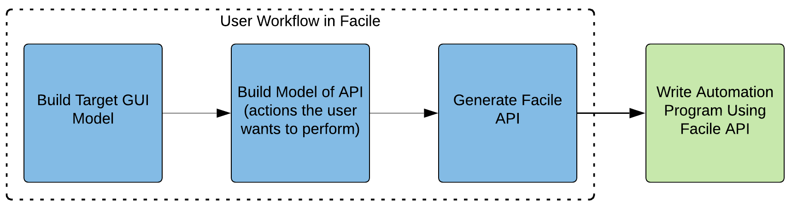

    ConOps Flow Rev B: A high-level workflow for the user of Facile.

~~~~~~~~~
Use Cases
~~~~~~~~~

In the :ref:`Description of Concept of Operations`, it was claimed that Facile APIs have the following uses:

- Automate repetitive tasks.
- Automate the GUI testing process.
- Make multiple applications communicate that use Facile APIs as an ad hoc form of IPC.
- Create new user interfaces that are bound to the the old user interface via a Facile API.

:num:`Fig. #usecase` clearly shows these options for the Facile API User. :num:`Fig. #usecase` also shows the steps to
create a Facile API. Although the Facile API Creator is shown separate from the Facile API User, the two actors are
often the same person.

.. _UseCase:

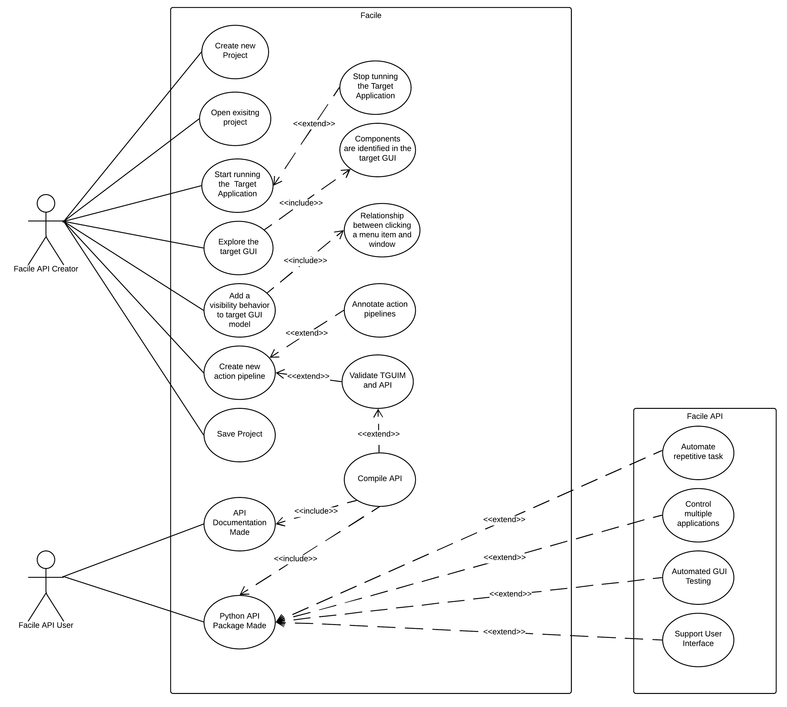

    Use Case Diagram Rev A: A UML diagram showing both the Creator of the Facile API and the

*Mahr Metrology Inc.* (Mahr) will be used as the subject to demonstrate both the practicality and value of each of these
uses of Facile APIs. To understand why Mahr would use a Facile API, Mahr's background and current position must be
understood.

Mahr is a company based in Germany that has a small optics branch (Mahr Opto) located in Tucson. This branch was formed
during the acquisition of a small company called Engineering Synthesis Design Inc., which produced interferometers and
software called *IntelliWave* that was used to interface with their interferometers but was also compatible with their
competitor's interferometers. IntelliWave was developed by just a handful of engineers who didn't have formal software
development training over the course of about 20 years. As such, IntelliWave has grown into an unintuitive product that
has many bugs - in fact, Mahr is unsure of IntelliWave's accuracy. This has caused many customers to leave Mahr and go
to their competitors such as Zygo that have products which perform better and have more trusted results. The customers
that stay with Mahr mostly stay because Mahr's pricing points are significantly lower than Mahr's competitors.

Because IntelliWave was created by a few engineers who didn't put the effort into documenting their code or verifying
the accuracy of its results, Mahr is having a hard time making fixes and has decided that continually making fixes to an
outdated technology is not sustainable and not worth the time in the long run. Doing so would be fighting an uphill
battle. This leaves Mahr with three possible options:

1. Mahr doesn’t change IntelliWave. They’ll continue to lose customers to their competitors and Mahr Opto will die
   slowly.

#. Mahr can rebuild IntelliWave. This will cost millions of dollars and many years to complete given their small
   software engineering team. They also run the risk of making another product that can’t keep up with competitors and
   won’t put them in a better position. If successful, they'll have a new product to add to their product line, but at a
   high cost.

#. Mahr can get creative with 3rd party solutions to hide IntelliWave’s flaws, test its results, and provide new
   functionality.

Option #3 is where Facile comes into play. Using a Facile API, Mahr can do quite a bit:

1. **Automate Repetitive Tasks**: IntelliWave already has a built-in automation feature that allows the user to write
   scripts in a custom environment and then replay those same actions. For instance, the user could write a script to
   read in a file containing fringe data for a lens that was measured previously, fetch the aberration data, export the
   data, then repeat with a different lens profile. This feature is incredibly buggy in IntelliWave, but it does allow
   users to
   automate simple actions. The major drawbacks of this feature are:

   a. It requires the user to become familiar with IntelliWave's automation platform - it's like learning a new
      language, and it doesn't always behave as expected.

   #. It doesn't allow other programs to automate actions in IntelliWave very easily. To get around this, IntelliWave
      has a built-in server that will accept commands, but this feature has countless bugs as well!

   A user of IntelliWave would benefit from having a Python API to control IntelliWave. This would let the user program
   in a widely used language with much more support and bypass the bugs in the automation platform. Mahr is currently
   working on their own Python API that controls the user interface of IntelliWave, but the single API has been in the
   making for over a year and has some performance drawbacks. Mahr is deciding whether to release the API to its
   customers or keep it for internal use. This will be discussed more in point 4 (Creating New User Interfaces).

   The drawbacks of Mahr's Python API is that it has to be maintained by developers since it's been manually crafted.
   This is expensive and could be mostly automated through Facile. Although a Facile API could replace Mahr's current
   API and would only take a few days to create, Mahr may not want to get rid of all their hard work. For this reason,
   Facile APIs are designed to work in cooperation with APIs like Mahr's.

   An example of an operation that could be performed automatically is measuring the radius of curvature of a lens. To
   do this manually, an engineer must place the lens, then click a series of buttons to open a dialog that shows the
   radius of curvature along with some other statistics. A Facile API could be used to perform all of the button clicks
   and obtain the desired data from the GUI. This would allow the user to simply position a lens and run a script. If
   they're measuring lenses all the time, this could save a lot of time.

#. **Automated GUI Testing**: With an application as large as IntelliWave, testing can be very costly and take a long
   time to perform thoroughly. Ideally, IntelliWave should be tested thoroughly after any changes, but it's too
   expensive for Mahr to do. Facile APIs could greatly help in this matter. By writing testing scripts that use a Facile
   API to perform user interactions, Mahr could more easily identify whether IntelliWave is behaving correctly which
   would allow them to deliver better products to their customers more confidently.

   Mahr is very interested in performing automated tests. This was one of the factors that led them to build their own
   API for IntelliWave. Mahr is considering doing a complete rebuild of IntelliWave, but they want to know which
   calculations IntelliWave performs correctly so that they can figure out which algorithms can be copied, and which
   ones need to be reworked. Of course, this requires someone with a lot of knowledge of optics to build the testing
   scripts, but any testing method requires this.

   Automating the GUI testing process has more advantages than simply running tests fast - it also allows for types of
   tests to be done that a human wouldn't be able to perform easily. For instance, if Mahr would like to verify the
   accuracy of IntelliWave's radius of curvature measurements, they could do a sweep of various parameters, obtain
   thousands of measured values, plot them for the testing engineer to see, and make a decision about whether the
   results are within the specified tolerances or not. Going even further, Mahr could buy a license to Zygo's software,
   perform the same sweep with a Facile API meant for the Zygo application, and compare the results.

#. **Making Multiple Applications Communicate**: IntelliWave generates a lot of statistics about lenses being measured
   that are useful to many of Mahr's customers. Often the customers wish to have the data exported into specific formats
   to they can be loaded into various programs easier. Since IntelliWave's data formats are very limited, it may be
   reasonable to make 2 Facile APIs that are used by the same automation programs; one for IntelliWave and one for
   the statistics software that the user would like to transport the data over to. The automation program would act as a
   sort of ad hoc IPC between the two applications by pulling data from IntelliWave and putting it into the statistics
   program. Alternative methods of cooperation between IntelliWave and the statistics software would most likely require
   changing the source code of either program, which Mahr does not want to do.

#. **Create new user interfaces**: A Facile API could be a partial remedy for IntelliWave’s unintuitive user interface;
   not by changing it directly, but by acting as the bond between it and a different user interface. Mahr can satisfy
   their customers’ needs more directly by providing custom graphical user interfaces that simply use IntelliWave as a
   backend. These custom graphical user interfaces can be developed extremely quickly (in a matter of days possibly)
   using tools such as Qt Creator. Mahr is already cleverly using their custom API for this purpose, but once again;
   their API is developed manually making it more difficult to maintain.

-------------------------------
System Verification Plan / SRVM
-------------------------------

This chapter contains an overview of how requirement verification will be performed in Facile.

~~~~~~~~~~~~~~~~~
SRVM System Level
~~~~~~~~~~~~~~~~~
As highlighted in :numref:`SRVM-SL`, for this iteration, the team fully verified SR4.3.1 Graphical User Interfaces by
verifying all the sub-system requirements and sub assembly requirements associated with the SR4.3.1 Graphical User
Interfaces.

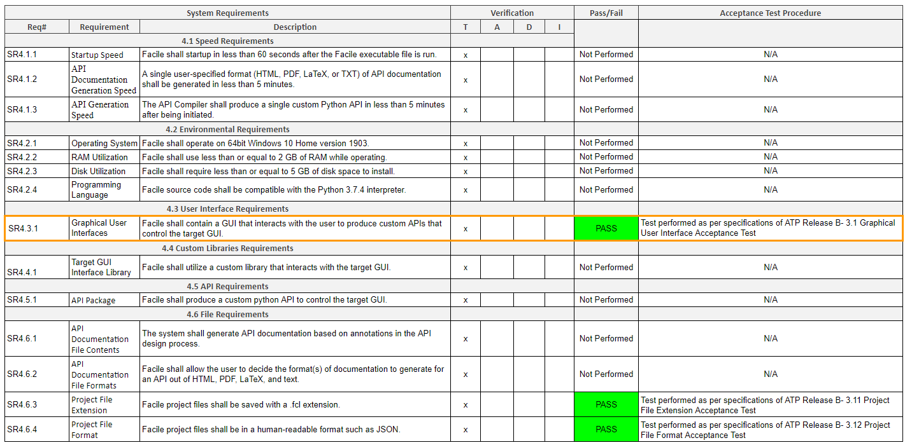

    Facile's system level SRVM

~~~~~~~~~~~~~~~~~~~~~
SRVM Sub System Level
~~~~~~~~~~~~~~~~~~~~~
As highlighted in :numref:`SRVM-SSL`, for this iteration, the team fully verified SSR4.3.1.6 API Model Creation and
SSR4.3.1.7 Validator. SSR4.3.1.6 API Model Creation was verified by fully verifying all the sub-assembly requirements
associated with SSR4.3.1.6 API Model Creation.

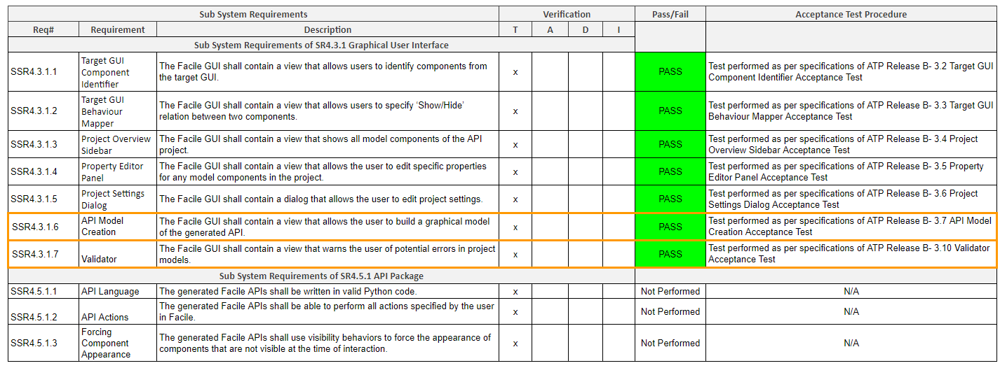

    Facile's subsystem level SRVM

~~~~~~~~~~~~~~~~~~~~~~~
SRVM Sub-Assembly Level
~~~~~~~~~~~~~~~~~~~~~~~
As highlighted in :numref:`SRVM-SAL`, for this iteration, the team fully verified all the sub-assembly requirements
for the project. The verified sub-assembly requirements correspond to the SSR4.3.1.6 API Model Creation sub-system
requirement.

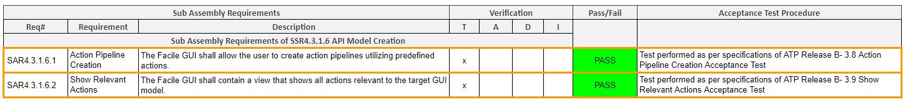

    Facile's subassembly level SRVM

~~~~~~~~~~~~~~~~~~~~~~~~~
Verification Flow Diagram
~~~~~~~~~~~~~~~~~~~~~~~~~
The above verification flow diagram gives an overview of when a certain requirement shall be fully verified,
:numref:`REQ-FLOW` also includes a flow which represent the order in which requirements shall be verified.

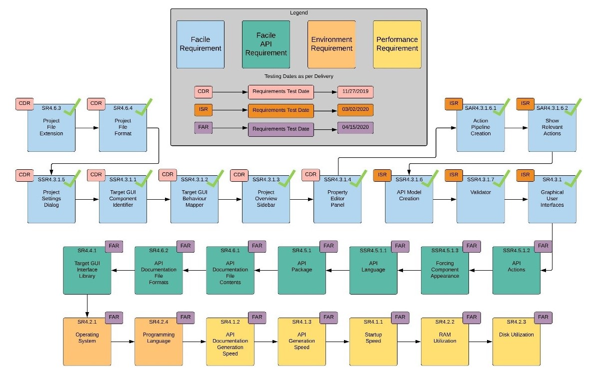

    Facile's verification flow diagram

~~~~~~~~~~~~~~~~~~~~~~~~~~~~~~~~~~
Verification Delivery System Level
~~~~~~~~~~~~~~~~~~~~~~~~~~~~~~~~~~

:numref:`SDSL` represents the verification delivery plan at system level. There are two major changes that have been
incorporated in this iteration- SR4.2.1 Operating System and SR4.2.4 Programming Language verification has been
rejected. Originally, the verification for these two requirements were performed during CDR, however, the team
determined that to accurately test these system requirements, a fully working Facile executable file is necessary.
Hence, the verification delivery for SR4.2.1 and SR4.2.4 have been postponed till FAR as that is the iteration during
which the team shall have a fully working Facile executable file.

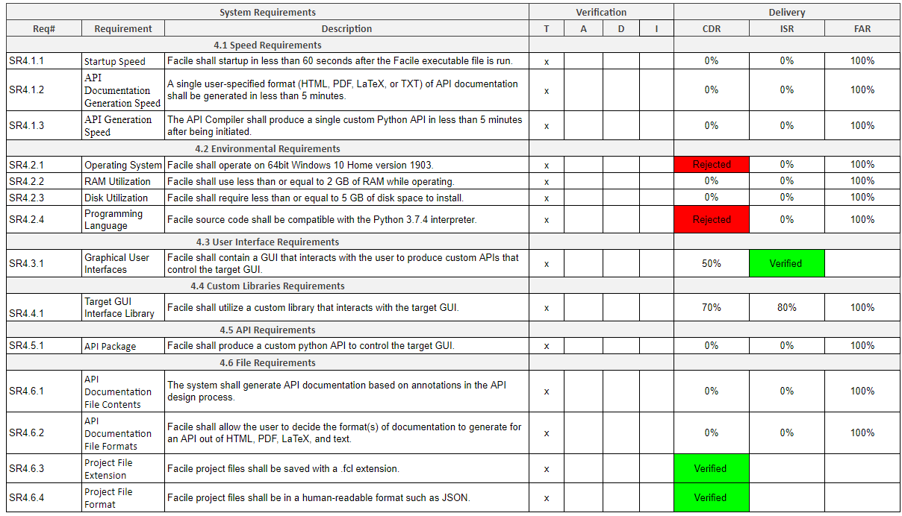

    Facile's verification delivery at the system level

~~~~~~~~~~~~~~~~~~~~~~~~~~~~~~~~~~~~~~
Verification Delivery Sub System Level
~~~~~~~~~~~~~~~~~~~~~~~~~~~~~~~~~~~~~~

:numref:`SDSSL` represents the verification delivery plan at sub-system level. All the sub-system requirements
pertaining to the SR4.3.1 Graphical User Interfaces have been fully verified. A new set of sub-system requirements have
been flowed down for the next iteration, the new sub-system requirements correspond to the SR4.5.1 API Package, which is
the primary goal in terms of development for the next iteration.

.. figure:: ../images/verification_delivery_SSL.png
    :name: SDSSL
    :alt: Verification Delivery Subsystem Level

    Facile's verification delivery at the subsystem level

~~~~~~~~~~~~~~~~~~~~~~~~~~~~~~~~~~~~~~~~
Verification Delivery Sub Assembly Level
~~~~~~~~~~~~~~~~~~~~~~~~~~~~~~~~~~~~~~~~

:numref:`SDSAL` represents the verification delivery plan at sub-assembly level. All the sub-assembly requirements
pertaining to the SSR4.3.1.6 API Model Creation have been fully verified in this iteration.

Overall, in the delivery plan across all levels of system requirements, the team has a 100% delivery target for all the
remaining requirements at FAR iteration, this would essentially leave no open actions by the end of the final iteration.

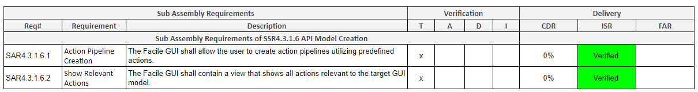

    Facile's verification delivery at the subassembly level

-----------------------------
Configuration Management Plan
-----------------------------

The configuration management describes how changes in the Facile system are handles internally and how we track changes.

~~~~~~~~~~~~~~~~~~~~~
Configuration Process
~~~~~~~~~~~~~~~~~~~~~

The team has implemented a comprehensive configuration process for this project to keep track of all the changes that
are made in various parts and phases of the project. The configuration process for this project is as follows:

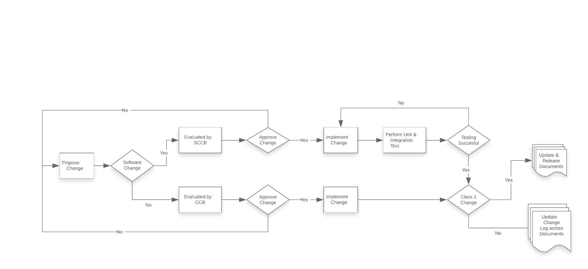

    Facile's configuration management plan.

As shown in :numref:`CMP-FLOW` he first step is to propose a change, once a formal request is made, the change request
will be evaluated to determine
whether it is a software change or not. If the requested change is software, it shall be evaluated by the Software
Change Control Board (SCCB), the board shall hold the power to approve or reject the requested change. If the board
approves the change, the development team will proceed to implement the change into the program. Once the
implementation, integration and testing has been performed as per the change request, there will be an evaluation to
determine the impact of the change on the overall program. If the change is determined as a class 1, the configuration
manager shall update all the necessary documents and immediately release them to keep the  stakeholders of the project
informed. The other process flow would be for non software changes, any non software change will be evaluated by the
Change Control Board (CCB), the change control board shall hold the power to approve or reject the requested change, if
approved, the change will be implemented and an impact evaluation will be conducted to determine if the change is class
1. If the requested change is class 1, the configuration manager shall update all the necessary documents and
immediately release them to keep the stakeholders of the project informed.

~~~~~~~~~~~~~~~~~~~~~~~
Configuration Authority
~~~~~~~~~~~~~~~~~~~~~~~

This section describes the different roles referenced in the configuration management plan. The configuration role
assignments have been made in :numref:`CONF-ROLES`.

.. table:: Configuration Role Assignments
    :name: CONF-ROLES

    +-----------------------+--------------------------+
    | Authority             | Person                   |
    +=======================+==========================+
    | SCCB                  | Samuel Badger            |
    +-----------------------+--------------------------+
    | CCB                   | Andrew Kirima            |
    +-----------------------+--------------------------+
    | Configuration Manager | Nikhith Vankireddy       |
    +-----------------------+--------------------------+

Software Change Control Board (SCCB)
####################################

The SCCB is a committee of Subject Mater Expert(s) (SME) who will make the decision regarding the implementation of a
software change request. Any changes to the established Project Baseline agreed upon by sponsor will need the approval
of SCCB. SCCB will consider multiple factors such as project phase, time constraint, resource constraint, and necessity
of the change while making approval decision. The SCCB is the sole point of contact to the configuration manager, the
SCCB must inform the configuration manager as soon a change is approved.

It is herby noted that the SCCB shall be held accountable for any uninformed changes to the software baseline.

Change Control Board (CCB)
###########################
The CCB is a committee of Subject Mater Expert(s) (SME) who will make the decision regarding the implementation of a
non-software (system) change request. Any changes to the established Project Baseline agreed upon by sponsor will need
the approval of CCB. CCB will consider multiple factors such as project phase, time constraint, resource constraint, and
necessity of the change while making approval decision. The CCB is the sole point of contact to the configuration
manager, the CCB must inform the configuration manager as soon as a change is approved.

It is herby noted that the CCB shall be held accountable for any uninformed changes to the project baseline.

Configuration Manager
#####################

The configuration manager is the primary entity responsible for implementing and keeping track of all the changes in the
project. Both SCCB and CCB will report to the configuration manager. The configuration manager in consultation with the
SCCB and CCB will update all necessary documentation when a change has been implemented into the program. The
configuration manager is responsible for facilitating communication between the development team, project manager, and
the sponsor regarding any changes that are approved/implemented. It is the duty of configuration manager to perform
impact evaluation of the change on the project and determine whether the change is class 1 or class 2.

It is herby noted that the configuration manager shall be held accountable for not updating and releasing documentation
to all stakeholders as soon as a class 1 change is implemented in the project.

~~~~~~~~~~~~~~~~~~~~~~~~
Classification of Change
~~~~~~~~~~~~~~~~~~~~~~~~

**Class I Change:** A class 1 change is categorized as a change whose impact affects the system(s) “form, fit, or function”
such as the core functionality, performance or specifications like weight, interfaces or reliability. Any change that
impacts/alters baseline project system requirements is categorized as a class 1 change. Project schedule, budget, and
necessary resource availability are also considered class I changes. The configuration manager shall perform impact
evaluation to determine if a change is class 1.   The established protocol for class 1 changes is that all necessary
documentation shall be immediately updated and released to the project stakeholders.

**Class II Change:** A class 2 change is categorized as a change whose impact does not affect the system(s) “form, fit, or
function” such as the changes made to correct or alter documentation regarding typos, formatting, additional info., and
things of that nature. Any change determined to not be a Class I change is defined as a Class II change. These chases
are often referred to as “redline” changes. The configuration manager shall perform impact evaluation to determine if a
change is class 2. The established protocol for class 2 changes is that all necessary documentation shall be updated and
changes shall be tracked via a change log. A class 2 update is marked as an internal release.

~~~~~~~~~~~~~~~~~~~~~~~~~~~~~~~~~~
Documentation Release Nomenclature
~~~~~~~~~~~~~~~~~~~~~~~~~~~~~~~~~~

All the documents pertaining to this project will follow a release protocol depending on the degree of the change.
:numref:`NOMENCLATURE` describes the difference between Class 1 and Class 2 changes.

.. table:: Documentation Release Nomenclature
    :name: NOMENCLATURE

    +--------------------+-------------------------------------------------------------------------------------------------+
    | Type of Change     | Nomenclature Description                                                                        |
    +====================+=================================================================================================+
    | Class 1 Change     | When a class 1 change occurs, the documents are immediately released to the project             |
    |                    | stakeholders with a revision nomenclature that iterates from A through Z. If the revision of a  |
    |                    | given document reaches Z, then the updated revision nomenclature iterates from AA through AZ.   |
    |                    |                                                                                                 |
    |                    | Example:                                                                                        |
    |                    |                                                                                                 |
    |                    | - Doc Release A0 shows that a new document has been released.                                   |
    |                    | - Doc Release B0 shows that class 1 changes to the original document have been amended.         |
    +--------------------+-------------------------------------------------------------------------------------------------+
    | Class 2 Change     | When a class 2 change occurs, the documents are updated and its changes are tracked via a       |
    |                    | change-log. Once all the necessary class 2 changes have been amended, the document is marked as |
    |                    | an internal release via revision nomenclature that iterates from 0-infinity.                    |
    |                    |                                                                                                 |
    |                    | Example:                                                                                        |
    |                    |                                                                                                 |
    |                    | - Doc Release A1 shows that class 2 changes to the original document have been amended.         |
    +--------------------+-------------------------------------------------------------------------------------------------+

~~~~~~~~~~~~~~~~~
Change Log Format
~~~~~~~~~~~~~~~~~

The change log is a sheet that keeps track of all the changes, irrespective of them being class 1 or class 2. The change
log will display all the crucial elements pertaining regarding any/all changes that have historically been made inside a
given document. The change log template for this project will be as follows. Both :numref:`RELEASE-TEMPLATE` and
:numref:`LOG-TEMPLATE` are included at the beginning of all controlled documents.

.. table:: Current Release Information Template
    :name: RELEASE-TEMPLATE

    +-----------------+------------------+--------------+------------------------------+
    | Release Version | Internal Version | Last Updated | Approved By                  |
    +=================+==================+==============+==============================+
    | A-Z             | 1 - infinite     |              | Configuration Manager        |
    +-----------------+------------------+--------------+------------------------------+

.. table:: Change Log Template
    :name: LOG-TEMPLATE
    :widths: 5 40 23 8 12 12

    +-----+--------------------------------------------+--------------------------------------------+-------+---------------+------------+
    | No. | Change Description                         | Rationale                                  | Class | Approved By   | Date       |
    +=====+============================================+============================================+=======+===============+============+
    | #   | Comprehensive description of the change    | Reasoning for why the particular change    | 1 or  | Configuration |            |
    |     | that has been made.                        | was made.                                  | 2     | Manager       |            |
    +-----+--------------------------------------------+--------------------------------------------+-------+---------------+------------+

~~~~~~~~~~~~~~~~~~~
Configuration Tools
~~~~~~~~~~~~~~~~~~~

The team uses Git for software version control. The team performs all development related integration on the development
branch, once the integration is successful, the team proceeds to perform system level tests, once the system level tests
are successful, the development branch is merged into master branch. The merging of development branch into master
branch is marked as a release version. There shall be a minimum of three release versions for Facile at each iteration:

- Critical Design Review (CDR): Facile 0.2.0 (1st MVP)
- Iteration Status Review (ISR): Facile 0.3.0 (2nd MVP)
- Final Iteration Review (FAR): Facile 1.0.0 (Executable Software)

In case bug(s) are found on the released software, a hotfix will be implemented and merged directly into the master
branch prompting a release, I.E. Facile 0.2.1.

A more detailed account of each of the software versions will be given in the Software Version Description Document
(SVDD Release A)

~~~~~~~~~~~~~~~~~~~~~~~~
Agile Management Process
~~~~~~~~~~~~~~~~~~~~~~~~

The team is following the agile framework in developing the software. Unlike the traditional “V” method where all of the
project plan/design is completed before proceeding to development and testing, in agile, our team will be looping
through the traditional “V” method at least 3 times (see :numref:`V-METHOD`) - The team shall create a Minimum Viable Product (MVP) at each
iteration. In each iteration the team will create a small working subset of the project (MVP), the MVP is then evaluated
during the iteration design review, the goal of the review is to get critical feedback regarding the existing MVP so
that the team can improve on the next MVP and tailor the next MVP more towards the feedback that has been received in
the prior review. This process conforms to the underlying ethos of agile as being a methodology that is used to adapt
the end product to the exact needs of the customer.

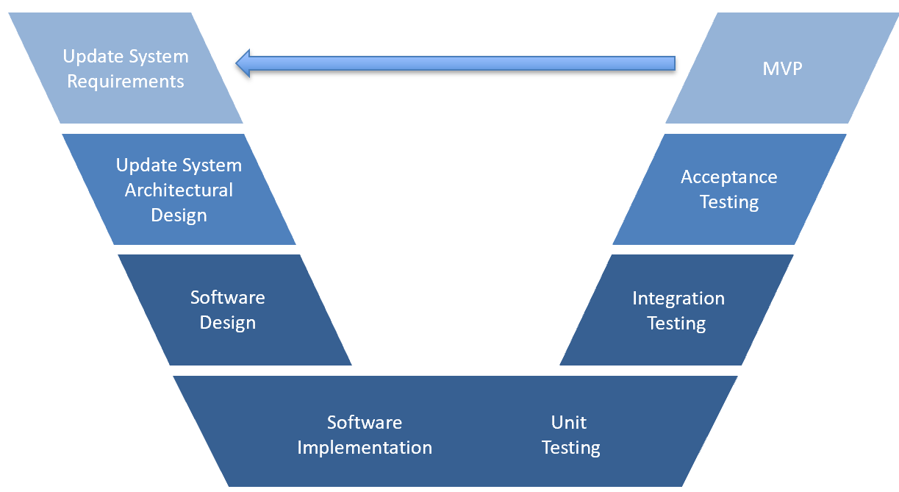

    The agile method that the team is following when designing Facile.

In this project, the team is following the SCRUM methodology within the agile framework.

Each iteration consists of multiple sprints with a cadence of 2 weeks. Beginning of every sprint, the development team,
scrum master and the sponsor meet to set certain goals for the sprint and decide on what needs to be achieved for the
next 2 weeks. After the end of the sprint, the team holds a retrospective to analyze performance and come up with
lessons learned so that the team can improve their performance for the next sprint. Our team decided to also use the
stand-up meetings process which is part of scrum methodology, however, instead of daily stand-ups, the team does
stand-up meetings thrice a week.

~~~~~~~~~~~~~~~~~~~~~~~~~~~~~~~~
System Requirement Burndown Plan
~~~~~~~~~~~~~~~~~~~~~~~~~~~~~~~~

:numref:`BURNDOWN` the team’s burndown plan for all the system requirements associated with the project. All
the requirements highlighted in green have been fully verified while the requirements highlighted in orange are
partially verified. One of the reason this burndown plan is skewed, as in- a large proportion of requirements are being
verified in the end at FAR, is because most of the requirements at FAR are Environment and Performance related, a
complete Facile executable file is necessary to fully verify these requirements.

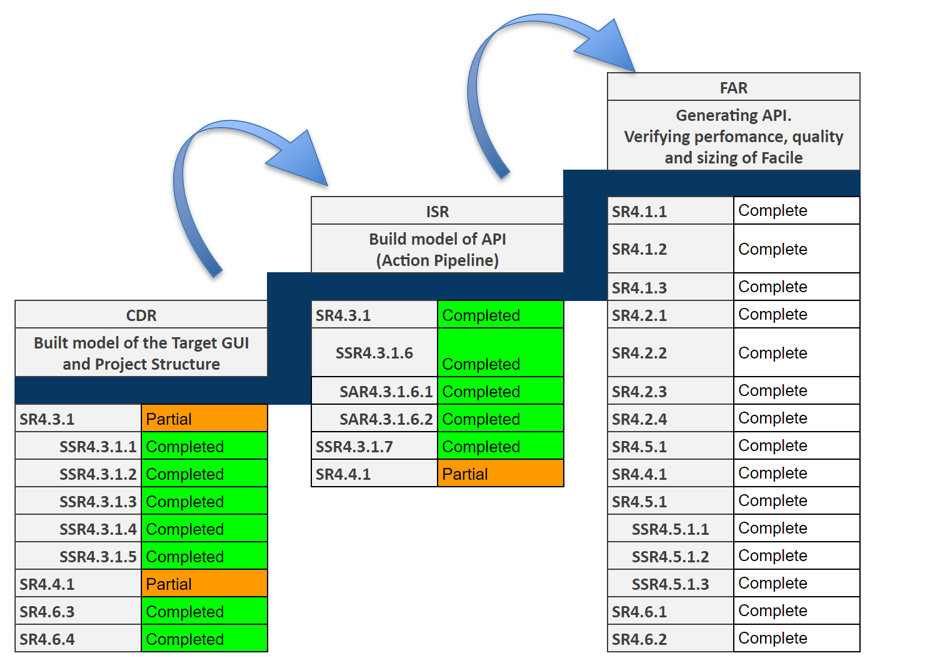

    The System Requirement Burndown Plan for the Facile project.

..
    -----------------------------
    Indentured Document List
    -----------------------------

    .. raw:: latex

        INSERT_DOC=IDL

    -----------------------------
    System Requirements Document
    -----------------------------

    .. raw:: latex

        INSERT_DOC=SRD

    --------------------------
    Verification Documentation
    --------------------------

    .. raw:: latex

        INSERT_DOC=Verification

    ------------------------
    Software Drawing Package
    ------------------------

    .. raw:: latex

        INSERT_DOC=HDP

    -------------------------------------
    Software Version Description Document
    -------------------------------------

    .. raw:: latex

        INSERT_DOC=SVDD

    --------------------------
    Software Design Document
    --------------------------

    .. raw:: latex

        INSERT_DOC=SDD

    -----------
    Models
    -----------

    .. raw:: latex

        INSERT_DOC=Models

    -----------
    User Manual
    -----------

    .. raw:: latex

        INSERT_DOC=UserManual

