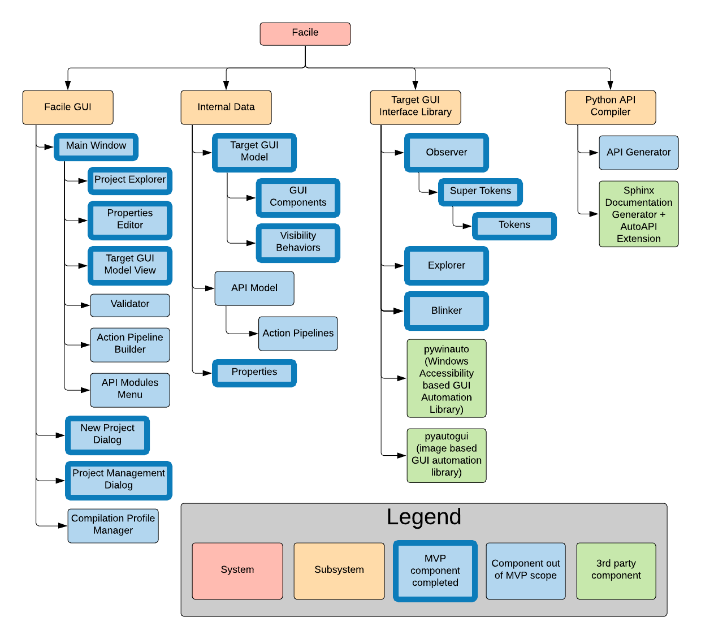

.. raw:: latex

    \setcounter{page}{1}

----------------------
Technical Data Package
----------------------

This document and the associated documents contained within serve as a
complete reference for the "Custom Python API Generator for controlling existing user interfaces"
- we call it *Facile*. This design was commissioned by Facade Technologies Inc. by way of the
University of Arizona Senior Design Program within the College of Engineering. This reference,
referred to as the Technical Data Package (TDP) contains all of the relevant information pertaining
to Facile. This includes proprietary requirements, design information, cost, schedule, risk
analysis, diagrams, API reference, testing procedures, and data sheets. Each document contained
is summarized in the following sections.

The purpose of Facile is to generate a Python library (API) that can be used to control graphical
user interfaces on a Windows 10 environment with minimal effort on the user's part. Despite
keeping it simple, the user should be able to provide a high degree of customization to the
generated API if desired. Some practical applications of Facile are listed below:

1. Automated GUI testing. This can be very complicated because GUIs by definition are meant to
   interact with users. Facile generates code that can take the place of the user and close the
   CI/CD loop of applications that have GUIs.

#. Creating applications that piggyback off of existing user interfaces. Imagine you're using
   some software that does something unique and you want to use it as an engine for some other
   application. An API would allow you to do this with minimal effort.

#. Creating an after-the-fact method for IPC without sharing memory. Companies that use
   non-cooperative software for expense reporting, inventory, invoices, etc. may want to develop
   a simple program to analyze data from all programs or to transfer data from one application to
   another. This could be done by creating multiple APIs generated by Facile and using them as
   the glue to connect programs together as an afterthought.

#. Creating additional functionality without changing application source code. For example, it
   may be possible to create a program that transposes a song into notes using the Audacity audio
   editing program.

=====================================================
Relevant Personnel Experience and Contact Information
=====================================================

The team includes four software engineers, one information scientist, one project manager and one
systems engineer. Aside from the relevant subject matter learned at the University of Arizona,
the team has the following experience:

- Sean Farris, a software engineer, has interned at Realize51, a sub-contractor for Raytheon,
  working with one of Raytheon’s Algorithm teams where he wrote Python scripts and developed
  technical documentation.

- Brandi Diesso, an information scientist, interns with Microsoft TEALS philanthropies. She is
  responsible for teaching about 20 high-school students Python and Block code.

- Sam Badger, a software engineer, has interned with Mahr Metrology where he developed GUI
  automation tools and has interned with Raytheon where he developed a custom continuous
  integration system implemented in Python.

- Philippe Cutillas, a software engineer, has experience working for IT at the University of
  Arizona’s College of Nursing.

- Ramos Chen, a software engineer, has interned with a few of start-up companies where he worked on
  platform development and web development as a test engineering.

- Andrew Kirima, a systems engineer with software background, has some experience with Python
  programming and has implemented a Smart Park Insight system on an SCRD.

.. tabularcolumns:: |p{80pt}|p{80pt}|p{150pt}|p{70pt}|
.. table:: Key Personnel Roles and Contact

    ================== ======================= =============================== ================
     Name               Role/Position           E-Mail                          Phone
    ================== ======================= =============================== ================
    Nikhith Vankireddy Project Manager         nvankireddy@email.arizona.edu   (480) 469 - 5996

    Sam Badger         Team Lead               smalbadger@email.arizona.edu    (520) 275 - 9786

                       Software Engineer

    Philippe Cutillas  Software Engineer       pcutillas@email.arizona.edu     (520) 302 - 8730

    Ramos Chen         Software Engineer       jiuruchen@email.arizona.edu     (469) 954 - 2872

    Sean Farris        Software Engineer       sfarris@email.arizona.edu       (520) 591 - 0345

    Andrew Kirima      Software Engineer       andrewkirima@email.arizona.edu  (509) 619 - 3496

                       Systems Engineer

    Brandi Diesso      Information Scientist   bdiesso@email.arizona.edu       (516) 330 - 4944

    Claude Merrill     Mentor                  claudemerrill@email.arizona.edu (520) 444 - 3000

    Catherine Merrill  Mentor                  cdmerrill@email.arizona.edu     (520) 445 - 9902

    Sharon ONeal       Reviewer                sharononeal@email.arizona.edu   (520) 822 - 4040
    ================== ======================= =============================== ================

==========================
Acronyms and Abbreviations
==========================

.. note::
    This section only contains acronyms and abbreviations that are relevant to the TDP wrapper
    document. All sub-documents will define their own acronyms and abbreviations.

+-------------------+----------------------------------------------------------+
| API               | Application Programming Interface                        |
+-------------------+----------------------------------------------------------+
| GUI               | Graphical User Interface                                 |
+-------------------+----------------------------------------------------------+
| CI/CD             | Continuous Integration / Continuous Deployment           |
+-------------------+----------------------------------------------------------+
| IPC               | Inter-Process Communication                              |
+-------------------+----------------------------------------------------------+
| TGUIM             | Target Graphical User Interface Model                    |
+-------------------+----------------------------------------------------------+
| APIM              | Application Programming Interface                        |
+-------------------+----------------------------------------------------------+

===============
System Overview
===============

Facile provides a GUI for users to perform the necessary steps to generate an API to control an
existing user interface. Generating an API is a 3-phase process:

1. Build a model of the target GUI (TGUIM).
#. Build a model of the desired API (APIM) and define any logic.
#. Generate the API using the models from the previous two steps.

The *Target GUI Model* is primarily made up of *Components* and *Visibility Behaviors*

The user interacts with the Facile GUI extensively to taylor the two models to their liking, then
the Facile API compiler generates runnable Python code in accordance with the user's compilation
settings. While the user is creating the models, they can annotate certain aspects of them.
These annotations will be converted into clean documentation in the format of the user's choosing
(HTML, PDF, or epub).

~~~~~~~~~~~~~~~~~~~~
System Block Diagram
~~~~~~~~~~~~~~~~~~~~

Please refer to :num:`Fig. #sbd`

.. _SBD:

.. figure:: ../../SRD/images/system_block_diagram.png
    :alt: System block diagram

    This is the system block diagram for Facile.

~~~~~~~~~~~~~~~~~~~
System Architecture
~~~~~~~~~~~~~~~~~~~

Please refer to :num:`Fig. #sad`

.. _SAD:

    This is the system architecture diagram for Facile.

~~~~~~~~~~
Subsystems
~~~~~~~~~~

As seen in :num:`Fig. #sad`, the following subsystems are the Facile GUI, internal data, target
GUI interface library, and the Python API Compiler. A brief description of each subsystem is
given in the following sections.

##########
Facile GUI
##########

The Facile GUI is made using the ``PySide2`` package which is a Python binding for the Qt5
framework. The main features of the Facile GUI are the *Project Explorer* view, *Properties
Editor* view, *Target GUI Model* view, *API Model* view, *Validator* view, and the *Modules* view.
These will be discussed in the Software Design Document.

#############
Internal Data
#############

The Facile GUI is used to operate on two main data structures - the TGUIM and the APIM. These
data structures in combination are used to produce the Python API. Both of these data structures
are discussed in the *Data Structures* section of the Software Design Document.

############################
Target GUI Interface Library
############################

The target GUI interface library is used to communicate with the target GUI. It's used both in
the process of building the API and while using the API. It allows other parts of the program to
send data to send data, retrieve data, or interact with the target GUI.

###################
Python API Compiler
###################

The Python API compiler is used to generate the Python API from the TGUIM and APIM. It has not
been developed yet.

==============
Cost Breakdown
==============

The budget for this project is $4,000.00

.. table:: Project Cost

    +---------------------+--------------+----------------+-----------+-----------+
    | Item                | Development  | Units / Months | Unit Cost | Cost      |
    +=====================+==============+================+===========+===========+
    | JIRA                | Development  | 8              | $7.00     | $56.00    |
    +---------------------+--------------+----------------+-----------+-----------+
    | GitHub              | Development  | 8              | $43.00    | $344.00   |
    +---------------------+--------------+----------------+-----------+-----------+
    | Windows 10 Home     | Development  | 1              | $151.00   | $151.00   |
    +---------------------+--------------+----------------+-----------+-----------+
    | 128GB Pen Drive     | Development  | 1              | $21.00    | $21.00    |
    +---------------------+--------------+----------------+-----------+-----------+
    | Team Shirts         | Presentation | 7              | $61.56    | $430.92   |
    +---------------------+--------------+----------------+-----------+-----------+
    | PDR Slide Handout   | Presentation | 4              | $2.75     | $11.00    |
    +---------------------+--------------+----------------+-----------+-----------+
    | CDR Slide Handout   | Presentation | 5              | $2.75     | $13.75    |
    +---------------------+--------------+----------------+-----------+-----------+
    | ISR Slide Handout   | Presentation | 5              | $2.75     | $13.75    |
    +---------------------+--------------+----------------+-----------+-----------+
    | Design Day Material | Presentation | 1              | $500.00   | $500.00   |
    +---------------------+--------------+----------------+-----------+-----------+
    | Total Estimated Project Cost                                    | $1,541.42 |
    +-----------------------------------------------------------------+-----------+

=================================
Project Deliverables and Timeline
=================================

The team will build the system according to the senior design project milestones and will deliver
all according to this schedule:

.. tabularcolumns:: |p{50pt}|p{110pt}|p{180pt}|p{90pt}|
.. table:: Milestones and Deliverables

    ========== ========================= =========================================== ===================
     Date       Milestone                 Description                                 Deliverables
    ========== ========================= =========================================== ===================
    09/12/2019 Unsolicited Proposal      Sponsor approval to continue with rough     Document
                                         plan for project
    ---------- ------------------------- ------------------------------------------- -------------------
    10/01/2019 System Requirements       System Requirements for MVP are             Document
                                         documented

                                         Verification plan for system requirements
                                         is created.

                                         System Block diagram is created.
    ---------- ------------------------- ------------------------------------------- -------------------
    10/31/2019 Preliminary Design Review Development plan for MVP is presented.      Presentation
    ---------- ------------------------- ------------------------------------------- -------------------
    12/10/2019 Critical Design Review    MVP is presented                            Presentation

                                         Development plan for the next iteration
                                         is presented.
    ---------- ------------------------- ------------------------------------------- -------------------
    01/21/2019 Critical Design Report    Technical data package is released.         Source Code v0.2.0

                                                                                     Document
    ---------- ------------------------- ------------------------------------------- -------------------
    03/03/2020 Integration Status Review Second iteration work is presented.         Source Code v0.3.0

                                         Development plan for the final iteration    Presentation
                                         is presented.
    ---------- ------------------------- ------------------------------------------- -------------------
    04/23/2020 Final Acceptance Review   Final product is presented to the panel.    Presentation
    ---------- ------------------------- ------------------------------------------- -------------------
    05/04/2020 Design Day                Final product is presented to the public.   Poster

                                                                                     Demonstration

                                                                                     Source Code v1.0.0

                                                                                     Executable v1.0.0
    ---------- ------------------------- ------------------------------------------- -------------------
    05/13/2020 Final Report              Full technical data package is submitted.   Document
    ========== ========================= =========================================== ===================

Because this project is being developed using the agile methodology, we don't have a strict
schedule. Instead, we have aligned 3 releases with the major project milestones.

- Iteration 1 is released at CDR. The goal of iteration 1 is to allow the user to develop the model
  of a target GUI.

- Iteration 2 is released at ISR. The goal of iteration 2 is to allow the user to develop the
  model of the API.

- Iteration 3 is released at FAR. The goal of iteration 3 is to allow the compilation of Python
  APIs. The release of this iteration constitutes the end of development for this project.

====================
Summary of Documents
====================

This section gives a brief overview of all the documents found in the Technical Data Package
"wrapper file".

~~~~~~~~~~~~~~~~~~~~~~~~~~~~~
Security Classification Guide
~~~~~~~~~~~~~~~~~~~~~~~~~~~~~

The security classification guide describes what information is protected and at what level.
Anyone who has access to this document must familiarize themselves with the contents of this
document.

~~~~~~~~~~~~~~~~~~~~~
Concept of Operations
~~~~~~~~~~~~~~~~~~~~~

The Concept of Operations describes how Facile works at a high level. The document is evolved as
Facile is produced.

~~~~~~~~~~~~~~~~~~~~
Unsolicited Proposal
~~~~~~~~~~~~~~~~~~~~

The Unsolicited Proposal contains functional requirements that are agreed upon by the sponsor,
the mentor, and the students.

~~~~~~~~~~~~~~~~~~~~~~~~~~~~
System Requirements Document
~~~~~~~~~~~~~~~~~~~~~~~~~~~~

This document keeps track of all system, sub-system, sub-assembly, and component requirements for
the project. It also contains the system block diagram and notes about design suggestions.

~~~~~~~~~~~~~
Risk Analysis
~~~~~~~~~~~~~

This document describes the risks associated with the Facile project and how they are being managed.
They are ranked, tracked, and documented thoroughly.

~~~~~~~~~~~~~~~~~~~~~~~~~~
Acceptance Test Procedures
~~~~~~~~~~~~~~~~~~~~~~~~~~

This document describes in detail the procedure to test Facile. If all tests pass, Facile meets
the requirements.

~~~~~~~~~~~~~~~~~~~~~~~~~~~
Acceptance Test Data Sheets
~~~~~~~~~~~~~~~~~~~~~~~~~~~

This document contains the testing procedures and spaces for the testing engineer to document
their findings. For each procedure, all of the expected results must match the findings for the
test to pass.

~~~~~~~~~~~~~~~~~~~~~~~~
Software Design Document
~~~~~~~~~~~~~~~~~~~~~~~~

This document describes the inner workings of Facile  in complete detail and documents each of the
modules, classes, methods, and functions or the source code. It describes data structures,
algorithms, fonts, colors, icons, and API reference.

~~~~~~~~~~~
User Manual
~~~~~~~~~~~

This document describes how to perform actions in Facile as a user.

=====================
Action Items from CDR
=====================

.. table:: CDR Action Items

    +----------------------+----------------------+--------------+----------------------+
    | Comments             | Action item          | Due Date     | Resolution           |
    |                      | Tracking Number      |              |                      |
    +======================+======================+==============+======================+
    | Slide 14 -- you said | 033_cdr_01           | n/a          | Updated diagram for  |
    | 3 options, diagram   |                      |              | use in ISR.          |
    | only shows 2.        |                      |              |                      |
    +----------------------+----------------------+--------------+----------------------+
    | Use header charts    | 033_cdr_02           | ISR          | Inserted in ISR      |
    | for each section,    |                      |              | presentation.        |
    | viewers are getting  |                      |              |                      |
    | lost as to where you |                      |              |                      |
    | are in the           |                      |              |                      |
    | presentation.        |                      |              |                      |
    +----------------------+----------------------+--------------+----------------------+
    | System requirements  | 033_cdr_03           | CDR Report   | Updated in SRD.      |
    | good, need to show   |                      |              |                      |
    | all subsystem        |                      |              |                      |
    | requirements for MVP |                      |              |                      |
    | system requirements, |                      |              |                      |
    | need conclusions.    |                      |              |                      |
    +----------------------+----------------------+--------------+----------------------+
    | Add in document      | 033_cdr_04           | CDR Report   | Will be fixed in ISR.|
    | number on slide 26.  |                      |              |                      |
    +----------------------+----------------------+--------------+----------------------+
    | I expected to see    | 033_cdr_05           | n/a          | N/A - we feel shame. |
    | more on the ISR      |                      |              |                      |
    | deliverable.         |                      |              |                      |
    +----------------------+----------------------+--------------+----------------------+
    | CDR report not       | 033_cdr_06           | n/a          | Updated in Proposal  |
    | listed as            |                      |              | and will be included |
    | deliverable, nor is  |                      |              | in ISR.              |
    | Design Day poster,   |                      |              |                      |
    | etc.                 |                      |              |                      |
    +----------------------+----------------------+--------------+----------------------+
    | Why 1                | 033_cdr_07	          | ISR          | Makes it easier to   |
    | project/folder?      |                      |              | avoid project file   |
    | What happens if this |                      |              | conflicts and        |
    | is not so? Is this a |                      |              | confusion. Will be   |
    | feature, a           |                      |              | addressed in ISR.    |
    | limitation or a      |                      |              |                      |
    | flaw?                |                      |              |                      |
    +----------------------+----------------------+--------------+----------------------+
    | Where is the user    | 033_cdr_08	          | CDR Report   | See User Manual      |
    | documentation?       |                      |              |                      |
    +----------------------+----------------------+--------------+----------------------+
    | Nik -- Good          | 033_cdr_09           | n/a          | Nikhith says thanks. |
    | understanding of     |                      |              |                      |
    | expected agile       |                      |              |                      |
    | method.              |                      |              |                      |
    +----------------------+----------------------+--------------+----------------------+
    | Sam needs to talk    | 033_cdr_10           | n/a          | Sam says sorry.      |
    | less, not sure the   |                      |              |                      |
    | rest of the team     |                      |              |                      |
    | fully understands    |                      |              |                      |
    | the project.         |                      |              |                      |
    +----------------------+----------------------+--------------+----------------------+

.. table:: CDR Action Items (Continued)

    +----------------------+----------------------+--------------+----------------------+
    | Comments             | Action item          | Due Date     | Resolution           |
    |                      | Tracking Number      |              |                      |
    +======================+======================+==============+======================+
    | Find a use case to   | 033_cdr_11	          | CDR Report   | We're working with   |
    | give context for the |                      |              | Mahr Metrology to    |
    | project, you seem to |                      |              | create a test suite  |
    | be developing a      |                      |              | that uses a Facile-  |
    | solution to a        |                      |              | generated API.       |
    | problem that does    |                      |              |                      |
    | not exist.           |                      |              |                      |
    +----------------------+----------------------+--------------+----------------------+
    | Organization not     | 033_cdr_12	          | ISR          | Will fix by ISR.     |
    | consistent with      |                      |              |                      |
    | lecture/rubric.      |                      |              |                      |
    +----------------------+----------------------+--------------+----------------------+
    | Cannot tell which    | 033_cdr_13           | CDR Report   | Follow the numbers   |
    | subsystem            |                      |              | in SRD.              |
    | requirements go      |                      |              |                      |
    | where.               |                      |              |                      |
    +----------------------+----------------------+--------------+----------------------+
    | Update Jira cost     | 033_cdr_14           | CDR Report   | Fixed in TDP.        |
    +----------------------+----------------------+--------------+----------------------+
    | Deliverables seem to | 033_cdr_15	          | CDR Report   | Deliverables are     |
    | just be what it can  |                      |              | listed in Proposal   |
    | do, needs to be      |                      |              | and TDP.             |
    | consistent with the  |                      |              |                      |
    | delivery.            |                      |              |                      |
    +----------------------+----------------------+--------------+----------------------+
    | Recommend you        | 033_cdr_16           | FAR          | We will start        |
    | capture              |                      |              | documenting the      |
    | retrospective items  |                      |              | retrospectives and   |
    | for final report     |                      |              | include them in the  |
    |                      |                      |              | TDP.                 |
    +----------------------+----------------------+--------------+----------------------+
    | Do not wait to       | 033_cdr_17           | ISR          | We are integrating   |
    | integrate new        |                      |              | as early as possible |
    | capabiity for a      |                      |              | and continuously     |
    | major review         |                      |              | developing with major|
    |                      |                      |              | goals in mind.       |
    +----------------------+----------------------+--------------+----------------------+
    | Really good SBD      | 033_cdr_18           | n/a          | Thanks!              |
    +----------------------+----------------------+--------------+----------------------+
    | Really should show   | 033_cdr_19	          | CDR Report   | Updated and included |
    | exit on your state   |                      |              | in ConOps and SDD.   |
    | machine diagram      |                      |              |                      |
    +----------------------+----------------------+--------------+----------------------+
    | Great to see how     | 033_cdr_20           | n/a          | Thanks, we try!      |
    | much CM control you  |                      |              |                      |
    | are using -- Kudos   |                      |              |                      |
    | to the team.         |                      |              |                      |
    +----------------------+----------------------+--------------+----------------------+

.. todo::
    update activity diagram to show "copy project" path.

.. todo::
    add exit state to state diagram and include in ConOps and SDD

-----------------------------
Change Control Log
-----------------------------

.. raw:: latex

    INSERT_DOC=CCL

-----------------------------
Security Classification Guide
-----------------------------

.. raw:: latex

    INSERT_DOC=SCG

---------------------
Concept of Operations
---------------------

.. raw:: latex

    INSERT_DOC=ConOps

--------------------
Unsolicited Proposal
--------------------

.. raw:: latex

    INSERT_DOC=Proposal

----------------------------
System Requirements Document
----------------------------

.. raw:: latex

    INSERT_DOC=SRD

-------------
Risk Analysis
-------------

.. raw:: latex

    INSERT_DOC=Risk

--------------------------
Acceptance Test Procedures
--------------------------

.. raw:: latex

    INSERT_DOC=ATP

-----------
Data Sheets
-----------

.. raw:: latex

    INSERT_DOC=DataSheets

------------------------
Software Design Document
------------------------

.. raw:: latex

    INSERT_DOC=SDD

-----------
User Manual
-----------

.. raw:: latex

    INSERT_DOC=UserManual
