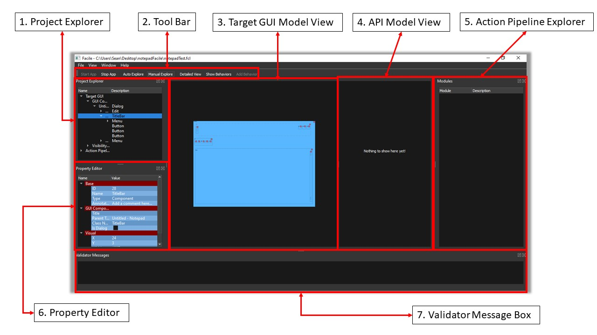
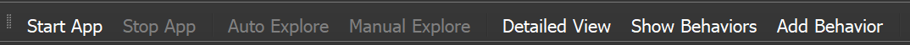
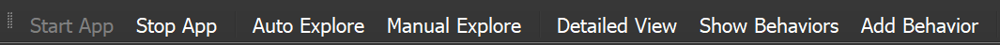
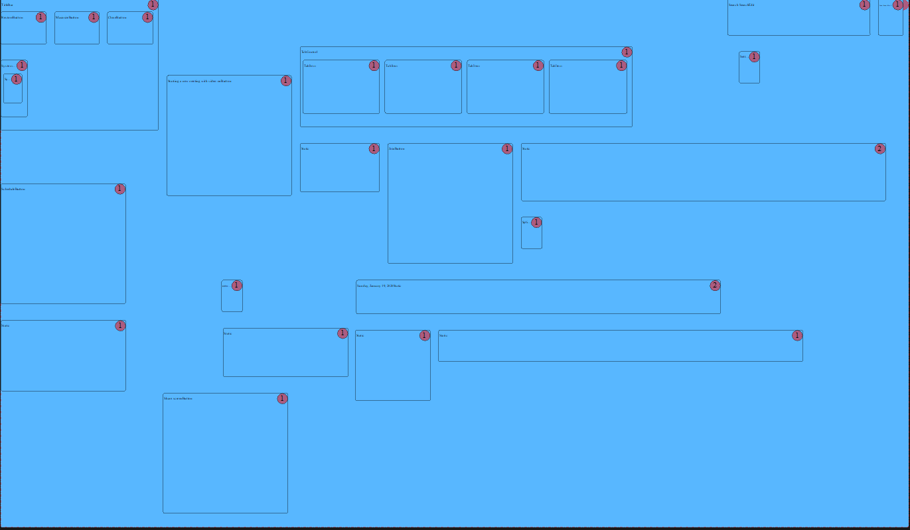
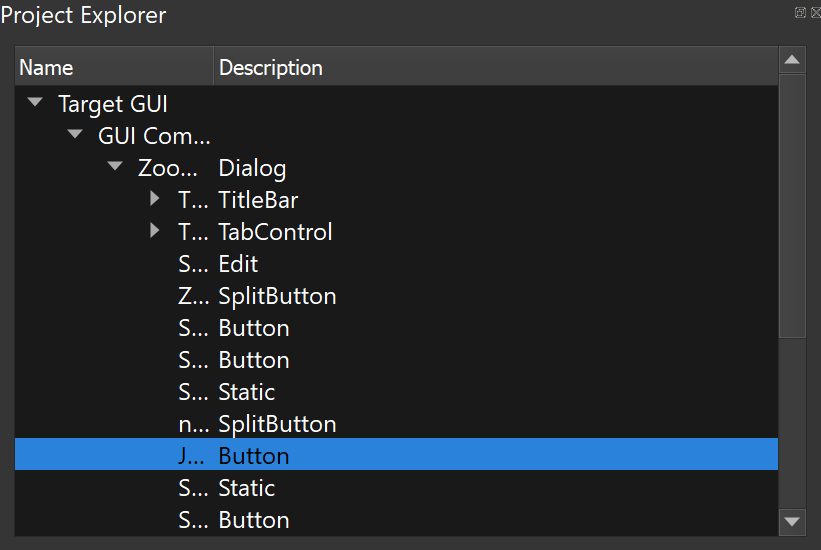
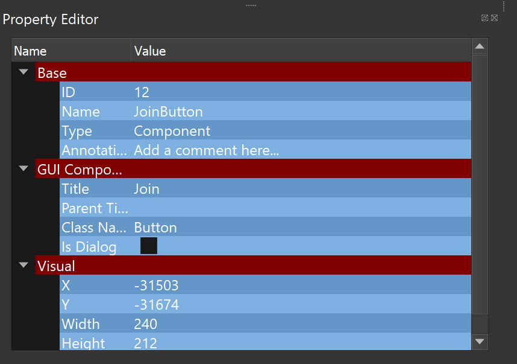
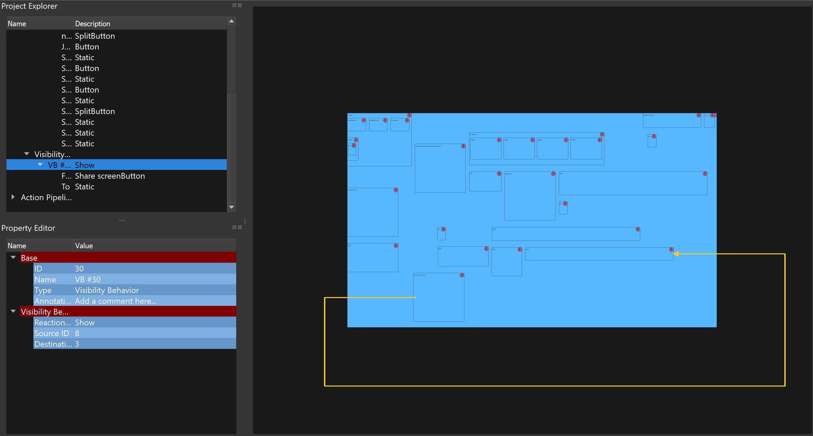

----------------------
Introduction and Scope
----------------------
Facile is a tool which allows you to generate Python APIs for Windows desktop
applications. Facile allows you to interface your software with existing desktop
applications which are normally only interacted with through a graphical user interface
(GUI). This allows the automation of repetitive tasks, creating automated GUI testing
scripts for GUI developers, extending an application’s functionality, and more.

Facile works by capturing and modelling the structure and behavior of the GUI of
interest (the “target GUI”), then letting the user create an easy-to-understand
graphical model of the functionality of the desired API, which is used to generate a
Python API that provides robust control of the target GUI.

-----------------------------------------
Index of Facile’s User Interface Features
-----------------------------------------

1. Project Explorer - Gives a hierarchical listing of the target GUI model’s components.
#. Tool Bar - Contains buttons which activate certain features of Facile.

    - Start App - Starts the target application.
    - Stop App - Stops the target application.
    - Auto Explore - Facile generates a model of the open window(s) in the target GUI
      and automatically attempts to explore and discover new windows in the target GUI.
    - Manual Explore - Facile generates a model of the open window(s) in the target GUI,
      but the user must manually open new windows for Facile to recognize them.
    - Detailed View - Shows a more detailed representation of the target GUI in the
      Target GUI Model View.
    - Show Behaviors - toggles the visibility of Visibility Behaviors in the Target GUI
      Model View.
    - Add Behaviors - Lets the user add a Visibility Behavior to the target GUI model.

#. Target GUI Model View - A graphical representation of the target GUI model.
#. API Model View - A graphical representation of the desired API functionality.
#. Action Pipeline Explorer - Displays a hierarchical list of the action pipelines
   contained in the API model.
#. Property Editor - Show’s the properties of a selected component, some of which
   are editable.
#. Validator Message Box - Displays messages about the validity of created action
   pipelines.

----------------------------
Using the Facile application
----------------------------

- System Requirements:

    - Operating System: Windows 10
    - Available disk space: 100MB

- To Launch the Facile application, double click its desktop icon(run .bat for now).

===================
High level Overview
===================

After launching Facile, the user can start a new project and select the target
application of their choice. The user then starts the application from within Facile
and may select manual explore mode or auto explore mode to generate a model of the
target GUI. A visual representation of this model is shown in the GUI Model View
along with a hierarchical list representation of the target GUI’s components in the
Project Explorer. The user is able to select individual components to view their
properties or set important information about them which may be needed when
constructing the API model.

After a satisfactory Target GUI Model has been created, the user then creates a model
of the API that they want to generate.

Once a model of the API has been built, the user can then generate the desired API.

.. figure:: facile_activity_diagram.png
    :alt: Facile Activity Diagram

    After a project is opened, a variety of actions can be performed.

===============
Start a project
===============

- To create a new project from scratch, follow these steps.
    - Click on ‘File’ on the top left corner. A small popup window will open. See :num:`Fig. #newprojfromscratch`.
    - Click on ‘New Project’.
    - Click on ‘From Scratch.’ A ‘Create New Project’ window will pop up. See :num:`Fig. #createnewprojwindow`.
    - Type in a project name.
    - Give a project description.
    - Click on the file explorer button (the three dots) near ‘Project Folder’
      to choose a project folder to store the project. One folder can only contain
      one project.
    - Click on the file explorer button near ‘Target Application’ to choose the
      target application.
    - Choose a category if the information is available (not required).
    - Click ‘OK’.

    .. raw:: latex

        \newpage

    .. _newprojfromscratch:
    .. figure:: ../images/newProject_FromScratch.png
        :alt: New Project From Scratch pic

        Creating a new project from scratch.

    .. _createnewprojwindow:
    .. figure:: ../images/CreateNewProjectWindow.png
        :alt: Create New Project Window pic

        The new project window.

    .. raw:: latex

        \newpage

- To create a new project from an existing project, follow these steps.
    - Click on ‘File’ on the top left corner. Small popup window will open. See :num:`Fig. #newprojfromexisting`.
    - Click on 'New Project'.
    - Click on ‘From Existing Project.’ A ‘Copy Existing Project’ window will pop up. See :num:`Fig. #copyexistingwindow`.
    - Click on the file explorer button (the three dots) near ‘Location’ under ‘Existing
      Project’ to choose the base project.
    - Click on the file explorer button near ‘Location’ under ‘New Project’ to choose
      a location to put the new project.
    - Type in name, choose application and give a description as needed.

    .. _newprojfromexisting:
    .. figure:: ../images/newProject_FromExisting.png
        :alt: New Project From Existing pic

        Creating a new project from an existing project.

    .. _copyexistingwindow:
    .. figure:: ../images/CreateNewProjectWindow.png
        :alt:  Create New Project Window pic

        The "create a new project" window.

.. raw:: latex

    \newpage

- To open an existing project, follow these steps.
    - Click on ‘File’ on the top left corner. A Small popup window will open. See :num:`Fig. #filedropdownmenu`.
    - Click on ‘Open Project’ to choose the project from file directory.
    - Click on ‘Recent Project’ to directly open a recent project.

    .. _filedropdownmenu:
    .. figure:: ../images/FileDropdownMenu.png
        :alt:  File Dropdown Menu pic

        The file drop down menu.

.. raw:: latex

    \newpage

======================================================
Exploring GUI components inside the target application
======================================================

- After opening the project, a new set of tabs will show up. See :num:`Fig. #toolbarbeforestartapp`.
- Click on ‘Start App’ to open the target application. The app will be
  started, and the color of the tabs will be changed. See :num:`Fig. #toolbarafterstartapp`.
- Click on ‘Manual Explore’ to start exploring. Wait until no new components
  shown up.
- Click on ‘Manual Explore’ again to stop exploring.

.. _ToolBarBeforeStartApp:

    The Tool Bar before the target application has been started.

.. _toolBarAfterStartApp:

    The Tool Bar after the target application has been started.

.. raw:: latex

    \newpage

===================================================================
Analyze and understand GUI components inside the target application
===================================================================
Here we use Zoom as the target application as an example.

- Understand the result after manual explore.
    - Refer to :num:`Fig. #targetguimodelviewzoom`.
    - One rectangular box refers to one GUI component in the target application.
    - A component’s name is shown on the top left corner of the corresponding rectangle.
    - Red circular box on the top right corner of each rectangle refers to the number of
      one GUI component’s token.

.. _TargetGUIModelViewZoom:

    The Target GUI Model View after the Zoom application has been explored.

.. raw:: latex

    \newpage

- Analyze a GUI component
    - Click on a GUI component to analyze. Its solid black border line will become a
      dotted red line.
    - On the left side of Facile, the component’s position in the tree is shown under
      ‘Project Explorer.’ See :num:`Fig. #projectexplorer`. Here the component ‘JoinButton’
      is used as an example. ‘JoinButton’ is included under GUI Components, and it’s the
      child of the root component - ‘Zoom - Pro AccountDialog.’
    - The component’s properties are shown under ‘Property Editor.’
      See :num:`Fig. #propertyeditor`. There’re three categories of information shown under
      property editor - Base, GUI Component and Visual.

.. _projectexplorer:

    A selected component in the Project Explorer.

.. _propertyeditor:

    The Property Editor showing properties of a selected component.

.. raw:: latex

    \newpage

==========================
Add Visibility Behavior(s)
==========================
To add a visibility behavior after finishing exploring, follow these steps.

    - Click on ‘Add Behavior.’ See :num:`Fig. #toolbarafterstartappaddvb`.
    - Click on a component as the source of the added behavior.
    - Click on another component as the destination of the added visibility behavior.
      An arrow will show up on the screen representing the added visibility behavior.
    - See :num:`Fig. #visibilitybehavior` to see what a visibility behavior may look like.
      It's also shown in the ‘Project Explorer’ and ‘Property Editor.’

.. _toolbarafterstartappaddvb:

    The Tool Bar (after the application has been started and explored).

.. _visibilitybehavior:

    A Visibility Behavior (yellow arrow).

