..
	This document has been auto generated by the test_procedure sphinx extension. Any changes to
	this file will be overwritten. DO NOT EDIT THIS FILE!

**************************
Acceptance Test Procedures
**************************

This section contains detailed testing procedures that dictate whether Facile meets requirements or not. It currently
contains only test procedures for requirements that can be fully verified at ISR. According to the test plan, 12 out of
26 requirements can be verified at the time of ISR.

To pass a verification procedure, each step must pass. If any step of the verification procedure fails, the entire 
verification procedure fails. Unless explicitly stated in the test description, it is assumed that completing a test 
without issues constitutes passing the test.

.. raw:: latex

	\newpage
	
----------------------------------------------------------------------------------------------------
(SR4.3.1) Graphical User Interface Acceptance Test
----------------------------------------------------------------------------------------------------

============
Introduction
============

This acceptance test verifies that the software system, Facile has a functional GUI that interacts with the user.  This acceptance test establishes the framework used by the acceptance test team to plan, execute, and document acceptance testing.  It describes the scope of the work performed and the approach taken to execute the tests created to validate that the system performs as required in the GUI. The details of this acceptance test are developed according to the requirements specifications and show traceability back to those specifications.

====================
Referenced Documents
====================

- System Requirements Document, Rev B, 10/27/2019

=======================
Required Test Equipment
=======================

- PC (Personal Computer)

=========================
Requirements Summary
=========================

To verify SR4.3.1 - Facile shall contain a GUI that interacts with the user to produce custom APIs that control the target GUI.

===================
Pre-Test Conditions
===================

- Need to be running application on Operating system Windows 10 Home Version 1903.
- Python 3.7.4 is installed and added to the PATH.

.. tabularcolumns:: |c|L|L|
.. table:: Test Procedure Steps

	+------+-------------------------------------------------------------------------------+-----------------------------------------------------------------------------------+
	| Step | Action                                                                        | Expected Result                                                                   |
	+======+===============================================================================+===================================================================================+
	|    1 | Run the verification procedure for SSR4.3.1.5 Project Settings Dialog         | The verification procedure for SSR4.3.1.5 Project Settings Dialog passes          |
	+------+-------------------------------------------------------------------------------+-----------------------------------------------------------------------------------+
	|    2 | Run the verification procedure for SSR4.3.1.1 Target GUI Component Identifier | The verification procedure for SSR4.3.1.1 Target GUI Component Identifier passes. |
	+------+-------------------------------------------------------------------------------+-----------------------------------------------------------------------------------+
	|    3 | Run the verification procedure for SSR4.3.1.2 Target GUI Behaviour Mapper     | The verification procedure for SSR4.3.1.2 Target GUI Behaviour Mapper passes.     |
	+------+-------------------------------------------------------------------------------+-----------------------------------------------------------------------------------+
	|    4 | Run the verification procedure for SSR4.3.1.3 Project Overview Sidebar        | The verification procedure for SSR4.3.1.3 Project Overview Sidebar passes.        |
	+------+-------------------------------------------------------------------------------+-----------------------------------------------------------------------------------+
	|    5 | Run the verification procedure for SSR4.3.1.4 Property Editor Panel           | The verification procedure for SSR4.3.1.4 Property Editor Panel passes.           |
	+------+-------------------------------------------------------------------------------+-----------------------------------------------------------------------------------+
	|    6 | Run the verification procedure for SSR4.3.1.6 API Model Creation              | The verification procedure for SSR4.3.1.6 API Model Creation passes.              |
	+------+-------------------------------------------------------------------------------+-----------------------------------------------------------------------------------+
	|    7 | Run the verification procedure for SSR4.3.1.7 Validator                       | The verification procedure for SSR4.3.1.7 Validator passes                        |
	+------+-------------------------------------------------------------------------------+-----------------------------------------------------------------------------------+

.. raw:: latex

	\newpage
	
----------------------------------------------------------------------------------------------------
(SSR4.3.1.1) Target GUI Component Identifier Acceptance Test
----------------------------------------------------------------------------------------------------

============
Introduction
============

This acceptance test verifies that the software system, Facile has a view that will allow the user to identify components of a target GUI.  This acceptance test establishes the framework used by the acceptance test team to plan, execute, and document acceptance testing.  It describes the scope of the work performed and the approach taken to execute the tests created to validate that the system performs as required in the target GUI. The details of this acceptance test are developed according to the requirements specifications and show traceability back to those specifications.

====================
Referenced Documents
====================

- System Requirements Document, Rev B, 10/27/2019

=======================
Required Test Equipment
=======================

- PC (Personal Computer)

=========================
Requirements Summary
=========================

To verify SSR 4.3.1.1 - The Facile GUI shall contain a view that allows users to identify components from the target GUI.

===================
Pre-Test Conditions
===================

- Need to be running application on Operating system Windows 10 Home Version 1903.
- Python 3.7.4 is installed and added to the PATH.
- A Facile project has already been created.

.. tabularcolumns:: |c|L|L|
.. table:: Test Procedure Steps

	+------+---------------------------------------------------------------------------------------------------------+-----------------------------------------------------------------------------------------------------------------------------+
	| Step | Action                                                                                                  | Expected Result                                                                                                             |
	+======+=========================================================================================================+=============================================================================================================================+
	|    1 | Navigate to the directory containing the **facile** folder with faciles source code                     | **Facile** directory is open                                                                                                |
	+------+---------------------------------------------------------------------------------------------------------+-----------------------------------------------------------------------------------------------------------------------------+
	|    2 | Click on the **Windows Search Bar**                                                                     | **Windows Search Bar** comes into focus                                                                                     |
	+------+---------------------------------------------------------------------------------------------------------+-----------------------------------------------------------------------------------------------------------------------------+
	|    3 | Type **cmd** and press enter                                                                            | A **Command Prompt** opens                                                                                                  |
	+------+---------------------------------------------------------------------------------------------------------+-----------------------------------------------------------------------------------------------------------------------------+
	|    4 | Click on the **Command Prompt**                                                                         | The **Command Prompt** comes into focus                                                                                     |
	+------+---------------------------------------------------------------------------------------------------------+-----------------------------------------------------------------------------------------------------------------------------+
	|    5 | Type **python facile.py** in the **Command Prompt**                                                     | **Facile** should run.                                                                                                      |
	+------+---------------------------------------------------------------------------------------------------------+-----------------------------------------------------------------------------------------------------------------------------+
	|    6 | Click on **File** in the menu.                                                                          | See :num:`Fig. #tguicitest01rhuaakth`                                                                                       |
	+------+---------------------------------------------------------------------------------------------------------+-----------------------------------------------------------------------------------------------------------------------------+
	|    7 | Click on **Recent Projects**                                                                            | See :num:`Fig. #tguicitest01rhuaakth`                                                                                       |
	+------+---------------------------------------------------------------------------------------------------------+-----------------------------------------------------------------------------------------------------------------------------+
	|    8 | Click on a recent project that you created previously.                                                  | See :num:`Fig. #tguicitest01rhuaakth`                                                                                       |
	+------+---------------------------------------------------------------------------------------------------------+-----------------------------------------------------------------------------------------------------------------------------+
	|    9 | Click on **Start App**                                                                                  | **Target Application** will run                                                                                             |
	+------+---------------------------------------------------------------------------------------------------------+-----------------------------------------------------------------------------------------------------------------------------+
	|   10 | Click on **Auto Explore** or **Manual Explore**                                                         | **Target GUI** is shown in the view with components highlighted in red.                                                     |
	+------+---------------------------------------------------------------------------------------------------------+-----------------------------------------------------------------------------------------------------------------------------+
	|   11 | Click on any component of the **Target GUI Model**                                                      | See :num:`Fig. #tguicitest02vaxpaspb` .                                                                                     |
	+------+---------------------------------------------------------------------------------------------------------+-----------------------------------------------------------------------------------------------------------------------------+
	|   12 | Observe the **Project Explorer** view and **Property Editor** view on the left of the Target GUI view.  | Selected component of the **Target GUI**, it's properties, and its behavior are now shown in views. Test case is completed. |
	+------+---------------------------------------------------------------------------------------------------------+-----------------------------------------------------------------------------------------------------------------------------+

.. _TGUICItest01RhUAaktH:

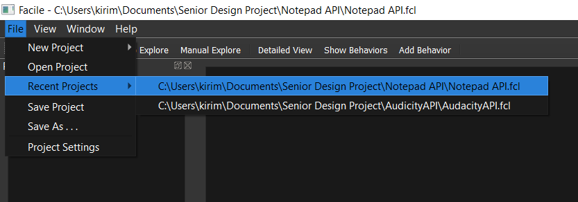
    
    A snippit of the Facile software system that shows the menu path to open an existing project.
    

.. _TGUICItest02vaXPASpB:

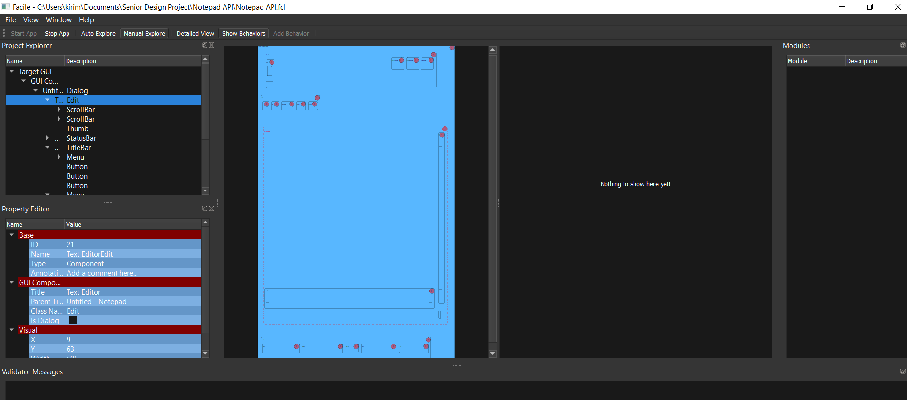
    
    A snippit of Target Application's, Notepad, Target GUI with a selected component highlighted in red. 
    

.. raw:: latex

	\newpage
	
----------------------------------------------------------------------------------------------------
(SSR4.3.1.2) Target GUI Behavior Mapper Acceptance Test
----------------------------------------------------------------------------------------------------

============
Introduction
============

This acceptance test verifies that the software system, Facile has a GUI that contains a view that allows the users to specify 'Show/Hide' for relation between two components.  This acceptance test establishes the framework used by the acceptance test team to plan, execute, and document acceptance testing.  It describes the scope of the work performed and the approach taken to execute the tests created to validate that the system performs as required in the GUI. The details of this acceptance test are developed according to the requirements specifications and show traceability back to those specifications.

====================
Referenced Documents
====================

- System Requirements Document, Rev B, 10/27/2019

=======================
Required Test Equipment
=======================

- PC (Personal Computer)

=========================
Requirements Summary
=========================

To verify SSR 4.3.1.2 The Facile GUI shall contain a view that allows user to specify 'Show/Hide' relation between two components.

===================
Pre-Test Conditions
===================

- Need to be running application on Operating system Windows 10 Home Version 1903.
- Python 3.7.4 is installed and added to the PATH.
- A Facile project has already been created.

.. tabularcolumns:: |c|L|L|
.. table:: Test Procedure Steps

	+------+-------------------------------------------------------------------------------------+---------------------------------------------------------------------------------------------+
	| Step | Action                                                                              | Expected Result                                                                             |
	+======+=====================================================================================+=============================================================================================+
	|    1 | Navigate to the directory containing the **facile** folder with faciles source code | **Facile** directory is open                                                                |
	+------+-------------------------------------------------------------------------------------+---------------------------------------------------------------------------------------------+
	|    2 | Click on the **Windows Search Bar**                                                 | **Windows Search Bar** comes into focus                                                     |
	+------+-------------------------------------------------------------------------------------+---------------------------------------------------------------------------------------------+
	|    3 | Type **cmd** and press enter                                                        | A **Command Prompt** opens                                                                  |
	+------+-------------------------------------------------------------------------------------+---------------------------------------------------------------------------------------------+
	|    4 | Click on the **Command Prompt**                                                     | The **Command Prompt** comes into focus                                                     |
	+------+-------------------------------------------------------------------------------------+---------------------------------------------------------------------------------------------+
	|    5 | Type **python facile.py** in the **Command Prompt**                                 | **Facile** should run.                                                                      |
	+------+-------------------------------------------------------------------------------------+---------------------------------------------------------------------------------------------+
	|    6 | Click on **File** in the menu.                                                      | Context menu of items will be shown                                                         |
	+------+-------------------------------------------------------------------------------------+---------------------------------------------------------------------------------------------+
	|    7 | Click on **Recent Projects**                                                        | Context menu of recent projects will be shown.                                              |
	+------+-------------------------------------------------------------------------------------+---------------------------------------------------------------------------------------------+
	|    8 | Click on a recent project that you created previously.                              | The selected project will be opened.                                                        |
	+------+-------------------------------------------------------------------------------------+---------------------------------------------------------------------------------------------+
	|    9 | Click on **Start App**                                                              | **Target Application** will open                                                            |
	+------+-------------------------------------------------------------------------------------+---------------------------------------------------------------------------------------------+
	|   10 | Click on **Auto Explore** or **Manual Explore**                                     | GUI is shown in the view with the selected component highlighted in red.                    |
	+------+-------------------------------------------------------------------------------------+---------------------------------------------------------------------------------------------+
	|   11 | Click on the same button that you clicked on in the previous step.                  | **Observer** (and **Explorer**) will stop running.                                          |
	+------+-------------------------------------------------------------------------------------+---------------------------------------------------------------------------------------------+
	|   12 | Click on **Add Behavior**                                                           | Facile will enter the **ADD_VB** state and wait for the user to select 2 components.        |
	+------+-------------------------------------------------------------------------------------+---------------------------------------------------------------------------------------------+
	|   13 | Click on 2 highlighted components that are shown in the view.                       | Refer to :num:`Fig. #tguibmtest01fogaorge`                                                  |
	+------+-------------------------------------------------------------------------------------+---------------------------------------------------------------------------------------------+
	|   14 | Select the new visibility behavior in the **project explorer**.                     | The properties for the selected visibility behavior will be shown in the Properties editor. |
	+------+-------------------------------------------------------------------------------------+---------------------------------------------------------------------------------------------+
	|   15 | Double click on the right column of the Reaction Type property.                     | Refer to :num:`Fig. #tguibmtest02bmtvbber`                                                  |
	+------+-------------------------------------------------------------------------------------+---------------------------------------------------------------------------------------------+
	|   16 | Click on **Shows** or **Hides**                                                     | Reaction Type property is altered                                                           |
	+------+-------------------------------------------------------------------------------------+---------------------------------------------------------------------------------------------+
	|   17 | Select any behavior in the **Project Explorer**                                     | Reaction Type property is changed in the **Project Explorer**. Test case is completed.      |
	+------+-------------------------------------------------------------------------------------+---------------------------------------------------------------------------------------------+

.. _TGUIBMtest01FogAOrGE:

.. figure:: ../../images/TGUIBM_test_01.png
    :alt: A snippet of an arrow from the first component to the second component of the Target GUI. 
    
    A snippet of an arrow from the first component to the second component of the Target GUI. 
    

.. _TGUIBMtest02bmTvBbER:

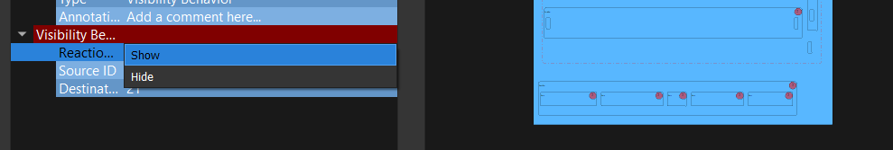
    
    A snippet of the options of Show or Hide in the dropdown menu. 
    

.. raw:: latex

	\newpage
	
----------------------------------------------------------------------------------------------------
(SSR4.3.1.3) Project Overview Sidebar Acceptance Test
----------------------------------------------------------------------------------------------------

============
Introduction
============

This acceptance test verifies that the software system, Facile has a GUI, that will have a view of all model components of the API project.  This acceptance test establishes the framework used by the acceptance test team to plan, execute, and document acceptance testing.  It describes the scope of the work performed and the approach taken to execute the tests created to validate that the system performs as required in the GUI. The details of this acceptance test are developed according to the requirements specifications and show traceability back to those specifications.

====================
Referenced Documents
====================

- System Requirements Document, Rev B, 10/27/2019

=======================
Required Test Equipment
=======================

- PC (Personal Computer)

=========================
Requirements Summary
=========================

To verify SSR 4.3.1.3 - The system shall contain a view that shows all model components of the API project.

===================
Pre-Test Conditions
===================

- Need to be running application on Operating system Windows 10 Home Version 1903.
- Python 3.7.4 is installed and added to the PATH.

.. tabularcolumns:: |c|L|L|
.. table:: Test Procedure Steps

	+------+---------------------------------------------------------------------------------------------------------------------------------------------------------------------------------------------------------+-------------------------------------------------------------------------------------------------------------------------------------+
	| Step | Action                                                                                                                                                                                                  | Expected Result                                                                                                                     |
	+======+=========================================================================================================================================================================================================+=====================================================================================================================================+
	|    1 | Navigate to the directory containing the **facile** folder with faciles source code                                                                                                                     | **Facile** directory is open                                                                                                        |
	+------+---------------------------------------------------------------------------------------------------------------------------------------------------------------------------------------------------------+-------------------------------------------------------------------------------------------------------------------------------------+
	|    2 | Click on the **Windows Search Bar**                                                                                                                                                                     | **Windows Seach Bar** comes into focus.                                                                                             |
	+------+---------------------------------------------------------------------------------------------------------------------------------------------------------------------------------------------------------+-------------------------------------------------------------------------------------------------------------------------------------+
	|    3 | Type **cmd** and press Enter                                                                                                                                                                            | A **Command Prompt** opens                                                                                                          |
	+------+---------------------------------------------------------------------------------------------------------------------------------------------------------------------------------------------------------+-------------------------------------------------------------------------------------------------------------------------------------+
	|    4 | Click on the **Command Prompt**                                                                                                                                                                         | The **Command Prompt** comes into focus                                                                                             |
	+------+---------------------------------------------------------------------------------------------------------------------------------------------------------------------------------------------------------+-------------------------------------------------------------------------------------------------------------------------------------+
	|    5 | Type **python facile.py** in the **Command Prompt**                                                                                                                                                     | **Facile** should run.                                                                                                              |
	+------+---------------------------------------------------------------------------------------------------------------------------------------------------------------------------------------------------------+-------------------------------------------------------------------------------------------------------------------------------------+
	|    6 | Click on **File**                                                                                                                                                                                       | Refer to :num:`Fig. #guitest01ykirvtrg`                                                                                             |
	+------+---------------------------------------------------------------------------------------------------------------------------------------------------------------------------------------------------------+-------------------------------------------------------------------------------------------------------------------------------------+
	|    7 | Click on **New Project**                                                                                                                                                                                | Refer to :num:`Fig. #guitest01ykirvtrg`                                                                                             |
	+------+---------------------------------------------------------------------------------------------------------------------------------------------------------------------------------------------------------+-------------------------------------------------------------------------------------------------------------------------------------+
	|    8 | Click on **From Scratch**                                                                                                                                                                               | Refer to :num:`Fig. #guitest01ykirvtrg`                                                                                             |
	+------+---------------------------------------------------------------------------------------------------------------------------------------------------------------------------------------------------------+-------------------------------------------------------------------------------------------------------------------------------------+
	|    9 | Fill in **Project Name** and **Project Description.** Upload your **Project Folder** and **Target Application.** Choose the category the **Target Application** best fits under. Finally, click **OK.** | Project is saved with the *.fcl* extension in the selected folder. Refer to :num:`Fig. #guitest02fxctapfr`                          |
	+------+---------------------------------------------------------------------------------------------------------------------------------------------------------------------------------------------------------+-------------------------------------------------------------------------------------------------------------------------------------+
	|   10 | Click on **Start App**                                                                                                                                                                                  | **Target Application** will pop up.                                                                                                 |
	+------+---------------------------------------------------------------------------------------------------------------------------------------------------------------------------------------------------------+-------------------------------------------------------------------------------------------------------------------------------------+
	|   11 | Click on **Auto Explore** or **Manual Explore**                                                                                                                                                         | A model of the target GUI is shown in the view.                                                                                     |
	+------+---------------------------------------------------------------------------------------------------------------------------------------------------------------------------------------------------------+-------------------------------------------------------------------------------------------------------------------------------------+
	|   12 | In the left sidebar, expand **Project**, then expand **GUI Components**                                                                                                                                 | All of the GUI Components that make up the project are shown as a hierarchical view in the project explorer.Test case is completed. |
	+------+---------------------------------------------------------------------------------------------------------------------------------------------------------------------------------------------------------+-------------------------------------------------------------------------------------------------------------------------------------+

.. _GUItest01ykIRVTRG:

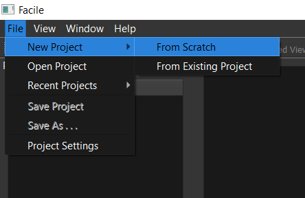
    
    A snippit of the Facile software system that shows the menu path to create a new project from scratch.
    

.. _GUItest02FxcTapfR:

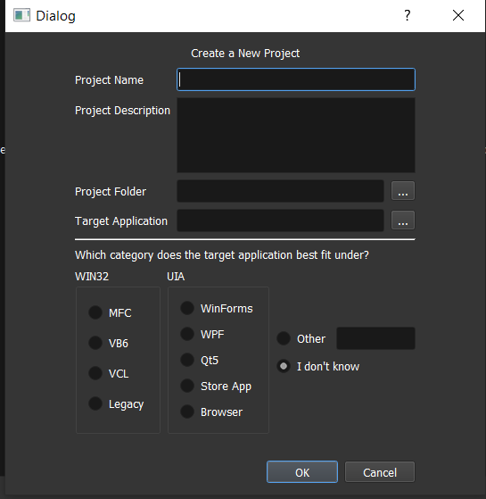
    
    A snippit of the Facile project creation dialog. This dialog allows the user to specify some basic information about the project and application they wish to control.
    

.. raw:: latex

	\newpage
	
----------------------------------------------------------------------------------------------------
(SSR4.3.1.4) Property Editor Panel Acceptance Test
----------------------------------------------------------------------------------------------------

============
Introduction
============

This acceptance test verifies that the software system, Facile has a functional GUI that shall contain a view that allows the user to edit specific properties. The properties will be for any model components of the project that are selected by the user.  This acceptance test establishes the framework used by the acceptance test team to plan, execute, and document acceptance testing.  It describes the scope of the work performed and the approach taken to execute the tests created to validate that the system performs as required in the GUI. The details of this acceptance test are developed according to the requirements specifications and show traceability back to those specifications.

====================
Referenced Documents
====================

- System Requirements Document, Rev B, 10/27/2019

=======================
Required Test Equipment
=======================

- PC (Personal Computer)

=========================
Requirements Summary
=========================

To verify SRR 4.3.1.4 - The system shall contain a view that allows the user to edit specific properties for any model components in the project.

===================
Pre-Test Conditions
===================

- Need to be running application on Operating system Windows 10 Home Version 1903.
- Python 3.7.4 is installed and added to the PATH.
- A Facile project has already been created.

.. tabularcolumns:: |c|L|L|
.. table:: Test Procedure Steps

	+------+--------------------------------------------------------------------------------------------+---------------------------------------------------------------------------------------------+
	| Step | Action                                                                                     | Expected Result                                                                             |
	+======+============================================================================================+=============================================================================================+
	|    1 | Navigate to the directory containing the **facile** folder with faciles source code        | **Facile** directory is open                                                                |
	+------+--------------------------------------------------------------------------------------------+---------------------------------------------------------------------------------------------+
	|    2 | Click on the **Windows Search Bar**                                                        | **Windows Search Bar** comes into focus                                                     |
	+------+--------------------------------------------------------------------------------------------+---------------------------------------------------------------------------------------------+
	|    3 | Type **cmd** and press enter                                                               | A **Command Prompt** opens                                                                  |
	+------+--------------------------------------------------------------------------------------------+---------------------------------------------------------------------------------------------+
	|    4 | Click on the **Command Prompt**                                                            | The **Command Prompt** comes into focus                                                     |
	+------+--------------------------------------------------------------------------------------------+---------------------------------------------------------------------------------------------+
	|    5 | Type**python facile.py** in the **Command Prompt**                                         | **Facile** should run.                                                                      |
	+------+--------------------------------------------------------------------------------------------+---------------------------------------------------------------------------------------------+
	|    6 | Click on **File** in the menu.                                                             | Context menu of items will be shown                                                         |
	+------+--------------------------------------------------------------------------------------------+---------------------------------------------------------------------------------------------+
	|    7 | Click on **Recent Projects**                                                               | Context menu of recent projects will be shown.                                              |
	+------+--------------------------------------------------------------------------------------------+---------------------------------------------------------------------------------------------+
	|    8 | Click on a recent project that you created previously.                                     | The selected project will be opened.                                                        |
	+------+--------------------------------------------------------------------------------------------+---------------------------------------------------------------------------------------------+
	|    9 | Click on **Start App**                                                                     | **Target Application** will open                                                            |
	+------+--------------------------------------------------------------------------------------------+---------------------------------------------------------------------------------------------+
	|   10 | Click on **Auto Explore** or **Manual Explore**                                            | GUI is shown in the view with the selected component highlighted in red.                    |
	+------+--------------------------------------------------------------------------------------------+---------------------------------------------------------------------------------------------+
	|   11 | Click on a component in the **Target GUI Model Graphics View**                             | Highlighted component will have its properties shown in the **Property Editor** view.       |
	+------+--------------------------------------------------------------------------------------------+---------------------------------------------------------------------------------------------+
	|   12 | Click on a property in the **Property Editor** view                                        | The property will come into focus. Refer to :num:`Fig. #propertytest01sxjmssrk`             |
	+------+--------------------------------------------------------------------------------------------+---------------------------------------------------------------------------------------------+
	|   13 | Edit the property value (If editable)                                                      | The value of the property is edited.                                                        |
	+------+--------------------------------------------------------------------------------------------+---------------------------------------------------------------------------------------------+
	|   14 | Select a different component and then select the one that had the *Name* property changed. | The *Name* of the component has been updated in the **Project Explorer**. Test is complete. |
	+------+--------------------------------------------------------------------------------------------+---------------------------------------------------------------------------------------------+

.. _propertytest01sxjMSSrK:

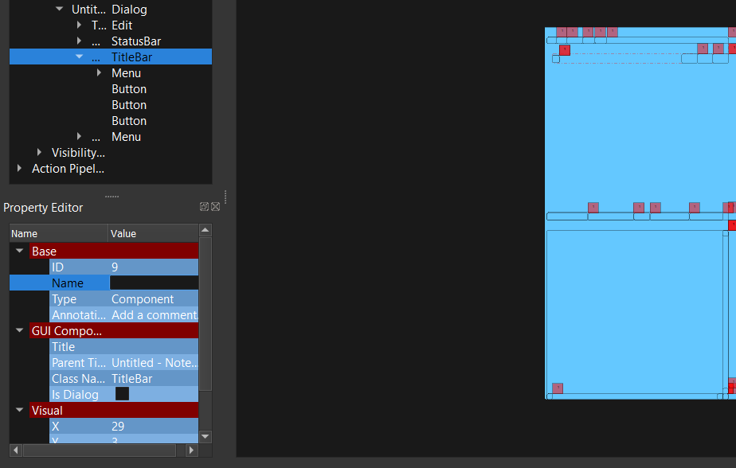
    
    Shows the Facile software with the *Name* property selected. The *Name* property is always editable.
    

.. raw:: latex

	\newpage
	
----------------------------------------------------------------------------------------------------
(SSR4.3.1.5) Project Settings Dialog Acceptance Test
----------------------------------------------------------------------------------------------------

============
Introduction
============

This acceptance test verifies that the software system, Facile has a functional GUI that contains a dialog that will allow the user to edit the setting of a specified project.  This acceptance test establishes the framework used by the acceptance test team to plan, execute, and document acceptance testing.  It describes the scope of the work performed and the approach taken to execute the tests created to validate that the system performs as required in the GUI. The details of this acceptance test are developed according to the requirements specifications and show traceability back to those specifications.

====================
Referenced Documents
====================

- System Requirements Document, Rev B, 10/27/2019

=======================
Required Test Equipment
=======================

- PC (Personal Computer)

=========================
Requirements Summary
=========================

To verify SSR 4.3.1.5 - The Facile GUI shall contain a dialog that allows the user to edit project settings.

===================
Pre-Test Conditions
===================

- Need to be running application on Operating system Windows 10 Home Version 1903.
- Python 3.7.4 is installed and added to the PATH.
- A Facile project has already been created.

.. tabularcolumns:: |c|L|L|
.. table:: Test Procedure Steps

	+------+-------------------------------------------------------------------------------------+---------------------------------------------------------+
	| Step | Action                                                                              | Expected Result                                         |
	+======+=====================================================================================+=========================================================+
	|    1 | Navigate to the directory containing the **facile** folder with faciles source code | **Facile** directory is open                            |
	+------+-------------------------------------------------------------------------------------+---------------------------------------------------------+
	|    2 | Click on the **Windows Search Bar**                                                 | **Windows Search Bar** comes into focus                 |
	+------+-------------------------------------------------------------------------------------+---------------------------------------------------------+
	|    3 | Type **cmd** and press enter                                                        | A **Command Prompt** opens                              |
	+------+-------------------------------------------------------------------------------------+---------------------------------------------------------+
	|    4 | Click on the **Command Prompt**                                                     | The **Command Prompt** comes into focus                 |
	+------+-------------------------------------------------------------------------------------+---------------------------------------------------------+
	|    5 | Type **python facile.py** in the **Command Prompt**                                 | **Facile** should run.                                  |
	+------+-------------------------------------------------------------------------------------+---------------------------------------------------------+
	|    6 | Click on **File** in the menu.                                                      | Context menu of items will be shown                     |
	+------+-------------------------------------------------------------------------------------+---------------------------------------------------------+
	|    7 | Click on **Recent Projects**                                                        | Context menu of recent projects will be shown.          |
	+------+-------------------------------------------------------------------------------------+---------------------------------------------------------+
	|    8 | Click on a recent project that you created previously.                              | The selected project will be opened.                    |
	+------+-------------------------------------------------------------------------------------+---------------------------------------------------------+
	|    9 | Click on **File** again                                                             | Context menu of items will be shown                     |
	+------+-------------------------------------------------------------------------------------+---------------------------------------------------------+
	|   10 | Click on **Project Settings**                                                       | Refer to :num:`Fig. #settingstest01arjodelw`            |
	+------+-------------------------------------------------------------------------------------+---------------------------------------------------------+
	|   11 | Edit any project setting and click on **Save**                                      | Project setting is edited and saved.                    |
	+------+-------------------------------------------------------------------------------------+---------------------------------------------------------+
	|   12 | Close the project settings dialog.                                                  | The project settings dialog is closed.                  |
	+------+-------------------------------------------------------------------------------------+---------------------------------------------------------+
	|   13 | Open the project settings dialog again.                                             | The updated values should show. Test case is completed. |
	+------+-------------------------------------------------------------------------------------+---------------------------------------------------------+

.. _settingstest01arJODelw:

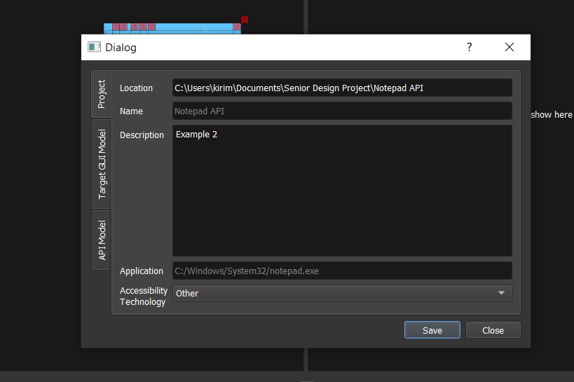
    
    Shows the Project Settings dialog.
    

.. raw:: latex

	\newpage
	
----------------------------------------------------------------------------------------------------
(SSR4.3.1.6) API Model Creation
----------------------------------------------------------------------------------------------------

============
Introduction
============

This acceptance test verifies that the software system, Facile has a functional GUI that contains a view that will allow the user to build a model of the API they generated with multiple action pipelines. User will be able to manipulate these action pipelines in the Action Menu by adding an action pipeline to a current action pipeline, editing the behavior or interface of the pipeline, and deleting the action pipeline.This acceptance test establishes the framework used by the acceptance test team to plan, execute, and document acceptance testing.  It describes the scope of the work performed and the approach taken to execute the tests created to validate that the system performs as required in the GUI. The details of this acceptance test are developed according to the requirements specifications and show traceability back to those specifications.

====================
Referenced Documents
====================

- System Requirements Document, Rev B, 10/27/2019

=======================
Required Test Equipment
=======================

- PC (Personal Computer)

=========================
Requirements Summary
=========================

To verify SSR 4.3.1.6 - The Facile GUI shall contain a view that allows the user to build a graphical model of the generated API. 

===================
Pre-Test Conditions
===================

- Need to be running application on Operating system Windows 10 Home Version 1903.
- Python 3.7.4 is installed and added to the PATH.
- A Facile project has already been created.

.. tabularcolumns:: |c|L|L|
.. table:: Test Procedure Steps

	+------+------------------------------------------------------------------------------------------------------------------------------------------------------------------+--------------------------------------------------------------------------------------------------------------+
	| Step | Action                                                                                                                                                           | Expected Result                                                                                              |
	+======+==================================================================================================================================================================+==============================================================================================================+
	|    1 | Run the verification procedure for SAR4.3.1.6.1 Action Pipeline Creation.                                                                                        | The verification procedure for SAR4.3.1.6.1 Action Pipeline Creation passes.                                 |
	+------+------------------------------------------------------------------------------------------------------------------------------------------------------------------+--------------------------------------------------------------------------------------------------------------+
	|    2 | Run the verification procedure for SAR4.3.1.6.2 Show Relevant Actions.                                                                                           | The verification procedure for SAR4.3.1.6.2 Show Relevant Actions passes.                                    |
	+------+------------------------------------------------------------------------------------------------------------------------------------------------------------------+--------------------------------------------------------------------------------------------------------------+
	|    3 | Navigate to the directory containing the **facile** folder with faciles source code                                                                              | **Facile** directory is open                                                                                 |
	+------+------------------------------------------------------------------------------------------------------------------------------------------------------------------+--------------------------------------------------------------------------------------------------------------+
	|    4 | Click on the **Windows Search Bar**                                                                                                                              | **Windows Search Bar** comes into focus                                                                      |
	+------+------------------------------------------------------------------------------------------------------------------------------------------------------------------+--------------------------------------------------------------------------------------------------------------+
	|    5 | Type **cmd** and press enter                                                                                                                                     | A **Command Prompt** opens                                                                                   |
	+------+------------------------------------------------------------------------------------------------------------------------------------------------------------------+--------------------------------------------------------------------------------------------------------------+
	|    6 | Click on the **Command Prompt**                                                                                                                                  | The **Command Prompt** comes into focus                                                                      |
	+------+------------------------------------------------------------------------------------------------------------------------------------------------------------------+--------------------------------------------------------------------------------------------------------------+
	|    7 | Type **python facile.py** in the **Command Prompt**                                                                                                              | **Facile** should run.                                                                                       |
	+------+------------------------------------------------------------------------------------------------------------------------------------------------------------------+--------------------------------------------------------------------------------------------------------------+
	|    8 | Click on **File** in the menu.                                                                                                                                   | Context menu of items will be shown                                                                          |
	+------+------------------------------------------------------------------------------------------------------------------------------------------------------------------+--------------------------------------------------------------------------------------------------------------+
	|    9 | Click on **Recent Projects**                                                                                                                                     | Context menu of recent projects will be shown.                                                               |
	+------+------------------------------------------------------------------------------------------------------------------------------------------------------------------+--------------------------------------------------------------------------------------------------------------+
	|   10 | Click on a recent project that you created previously.                                                                                                           | The selected project will be opened.                                                                         |
	+------+------------------------------------------------------------------------------------------------------------------------------------------------------------------+--------------------------------------------------------------------------------------------------------------+
	|   11 | Click on **Start App**                                                                                                                                           | **Target Application** will open                                                                             |
	+------+------------------------------------------------------------------------------------------------------------------------------------------------------------------+--------------------------------------------------------------------------------------------------------------+
	|   12 | Click on **Auto Explore** or **Manual Explore**                                                                                                                  | GUI is shown in the view with the selected component highlighted in red.                                     |
	+------+------------------------------------------------------------------------------------------------------------------------------------------------------------------+--------------------------------------------------------------------------------------------------------------+
	|   13 | Click on a component in the **Create New Action Pipeline**                                                                                                       | Dialog box to add **Input Ports** and **Output Ports** is shown in a new window.                             |
	+------+------------------------------------------------------------------------------------------------------------------------------------------------------------------+--------------------------------------------------------------------------------------------------------------+
	|   14 | Click on **Edit ports for:** and add a name.                                                                                                                     | Name of ports for action pipeline is updated.                                                                |
	+------+------------------------------------------------------------------------------------------------------------------------------------------------------------------+--------------------------------------------------------------------------------------------------------------+
	|   15 | Click on **default** under **Input Ports** and add a name.                                                                                                       | Name of input port is updated.                                                                               |
	+------+------------------------------------------------------------------------------------------------------------------------------------------------------------------+--------------------------------------------------------------------------------------------------------------+
	|   16 | Click on **NoneType** under **Input Ports** and add the type data structure.                                                                                     | Type of data structure for input port is updated.                                                            |
	+------+------------------------------------------------------------------------------------------------------------------------------------------------------------------+--------------------------------------------------------------------------------------------------------------+
	|   17 | Decide whether to make the value of the input port required or optional.                                                                                         | Value of input port is updated or not.                                                                       |
	+------+------------------------------------------------------------------------------------------------------------------------------------------------------------------+--------------------------------------------------------------------------------------------------------------+
	|   18 | Click on **default** under **Output Ports** and add a name.                                                                                                      | Name of output port is updated.                                                                              |
	+------+------------------------------------------------------------------------------------------------------------------------------------------------------------------+--------------------------------------------------------------------------------------------------------------+
	|   19 | Click on **NoneType** under **Output Ports** and add the type data structure.                                                                                    | Type of data structure for output port is updated.                                                           |
	+------+------------------------------------------------------------------------------------------------------------------------------------------------------------------+--------------------------------------------------------------------------------------------------------------+
	|   20 | Repeat past 5 steps till there is an input port and output port for bool, int, string, and float data types.                                                     | Dialog box with 4 input ports and output ports with data types of bool, int, string, and float are added.    |
	+------+------------------------------------------------------------------------------------------------------------------------------------------------------------------+--------------------------------------------------------------------------------------------------------------+
	|   21 | Click on **OK**                                                                                                                                                  | Refer to :num:`Fig. #apimcreationtest01adhaccjr`                                                             |
	+------+------------------------------------------------------------------------------------------------------------------------------------------------------------------+--------------------------------------------------------------------------------------------------------------+
	|   22 | Right click on an action in the **Action Menu** and click on **Add to Current Action Pipeline** to add an action pipeline to the current action pipeline.        | Refer to :num:`Fig. #apimcreationtest02gdyukgob`                                                             |
	+------+------------------------------------------------------------------------------------------------------------------------------------------------------------------+--------------------------------------------------------------------------------------------------------------+
	|   23 | Right click on an action in the **Action Menu** and click on **Add to Current Action Pipeline** to add another action pipeline to the current action pipeline.   | Refer to :num:`Fig. #apimcreationtest03vkluxhod`                                                             |
	+------+------------------------------------------------------------------------------------------------------------------------------------------------------------------+--------------------------------------------------------------------------------------------------------------+
	|   24 | Click on a input port at the top level of an action pipeline and draw a wire from it to an top level output port or a child input port with the same data type.  | A wire is drawn from an input port to a top level output port or a child input port with the same data type. |
	+------+------------------------------------------------------------------------------------------------------------------------------------------------------------------+--------------------------------------------------------------------------------------------------------------+
	|   25 | Repeat the last step several times.                                                                                                                              | Refer to :num:`Fig. #apimcreationtest04nrykncdg`                                                             |
	+------+------------------------------------------------------------------------------------------------------------------------------------------------------------------+--------------------------------------------------------------------------------------------------------------+
	|   26 | Wave cursor over the an action pipeline.                                                                                                                         | Blue up and down arrow box is shown.                                                                         |
	+------+------------------------------------------------------------------------------------------------------------------------------------------------------------------+--------------------------------------------------------------------------------------------------------------+
	|   27 | Click on blue up and down arrow to move an action pipeline up or down.                                                                                           | Refer to :num:`Fig. #apimcreationtest05huomzbxj`                                                             |
	+------+------------------------------------------------------------------------------------------------------------------------------------------------------------------+--------------------------------------------------------------------------------------------------------------+
	|   28 | Right click on an action in the API Model view and click on **delete** to delete an action pipeline from the current action pipeline.                            | Refer to :num:`Fig. #apimcreationtest06jkuekhxg` Test case is completed.                                     |
	+------+------------------------------------------------------------------------------------------------------------------------------------------------------------------+--------------------------------------------------------------------------------------------------------------+

.. _APIMCreationtest01adHacCjr:

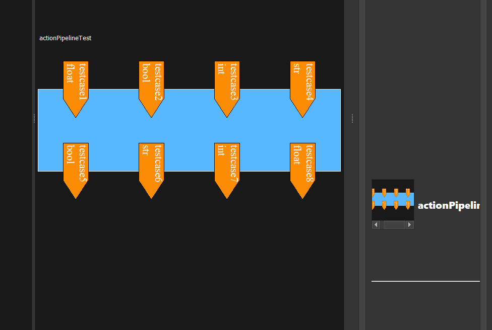
    
    A snippit of the Facile system that shows an action pipeline in the API Model view with 4 input and output ports with the basic python data structures such as int, bool, float, and string.
    

.. _APIMCreationtest02gDyuKGOB:

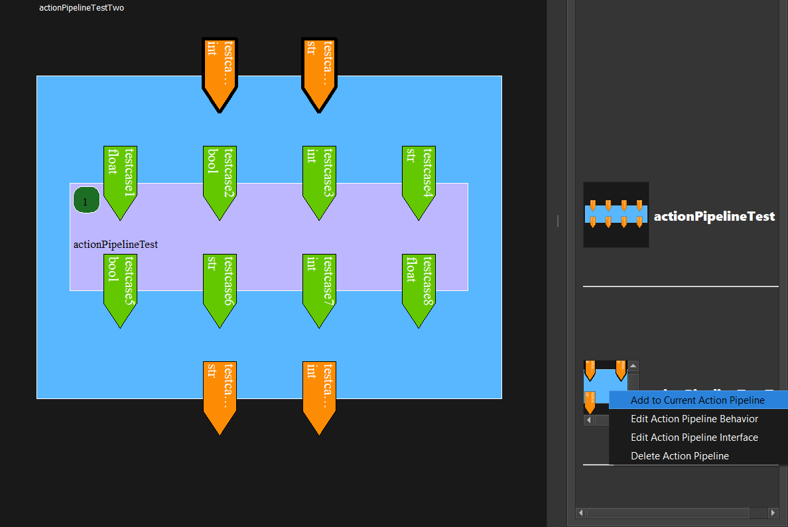
    
    A snippit of the Facile system that shows an action pipeline being added to the current action pipeline in the API Model view.
    

.. _APIMCreationtest03VKlUxhod:

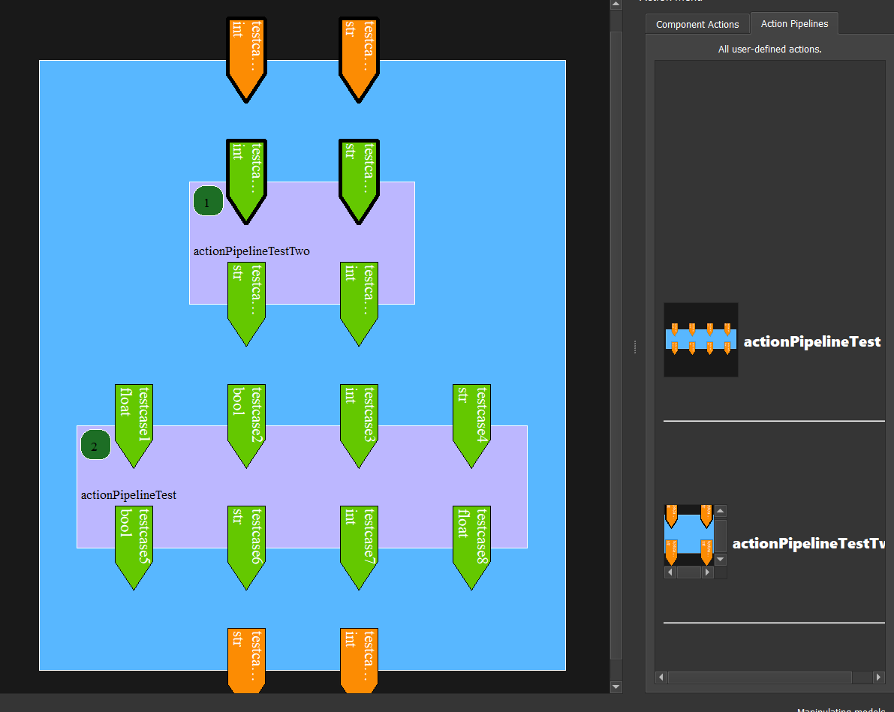
    
    A snippit of the Facile system that shows another action pipeline being added to the current action pipeline in the API Model view.
    

.. _APIMCreationtest04NrYKNCdg:

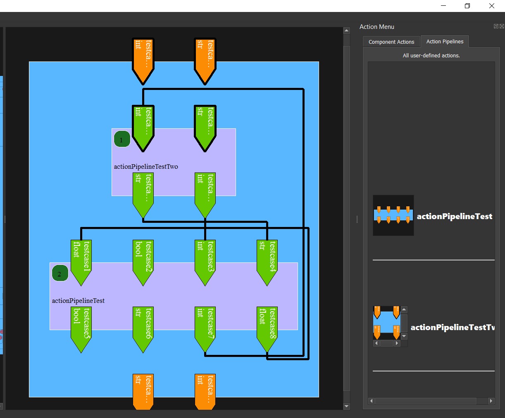
    
    A snippit of the Facile system that shows an action pipeline with several input and output ports connected with wires. API Model view.
    

.. _APIMCreationtest05huOmzBXj:

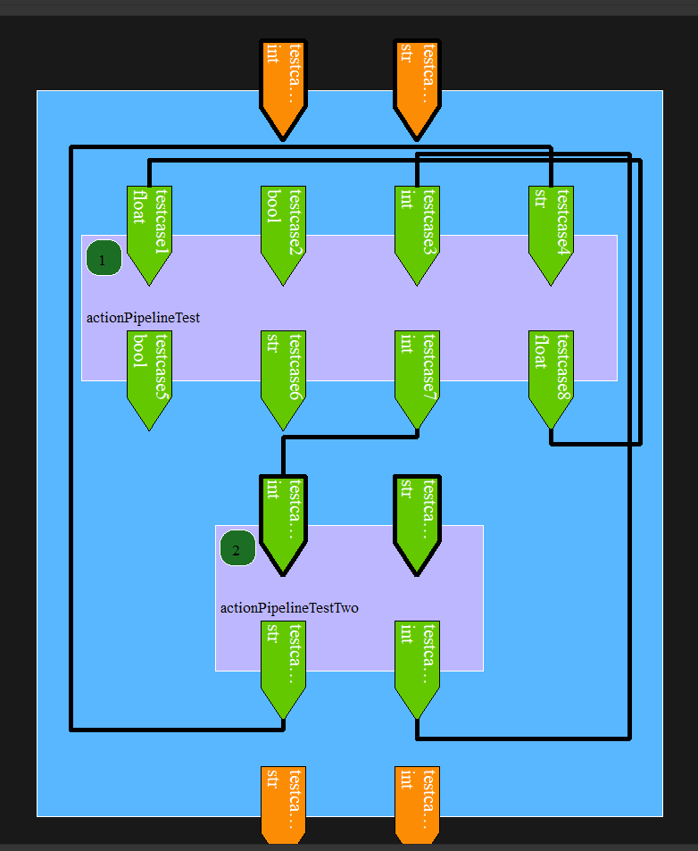
    
    A snippit of the Facile system that shows an action pipeline with a modified alignment of the two action pipelines added to it with their wire port connections in the API Model view.
    

.. _APIMCreationtest06jKuEKhxg:

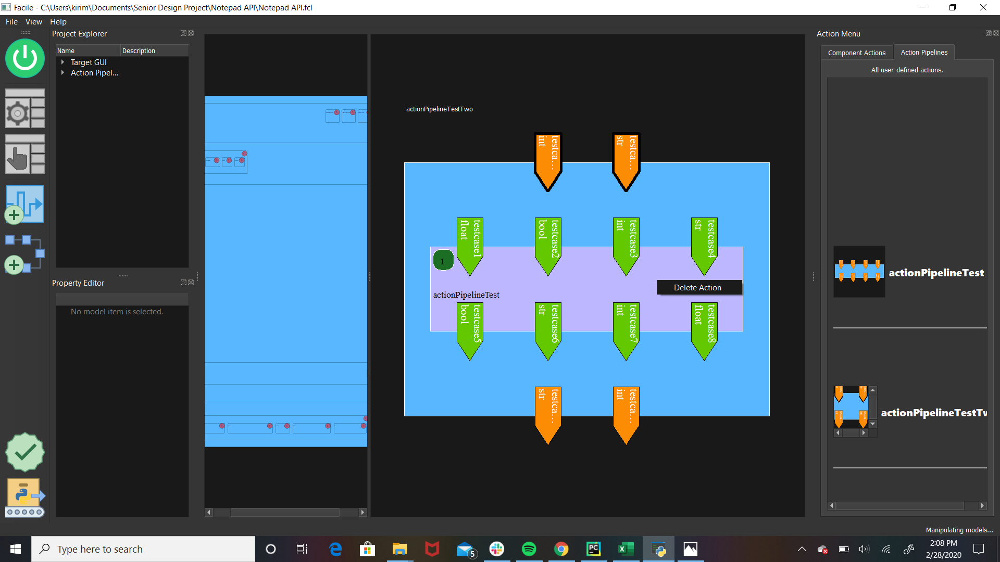
    
    A snippit of the Facile system that shows an action pipeline that has been deleted from the current action pipeline in the API Model view.
    

.. raw:: latex

	\newpage
	
----------------------------------------------------------------------------------------------------
(SAR4.3.1.6.1) Action Pipeline Creation
----------------------------------------------------------------------------------------------------

============
Introduction
============

This acceptance test verifies that the software system, Facile has a functional GUI that contains a view that will allow the user to create action pipelines from predefined actions. User will be able to add as many input or output ports of basic python data structures. This acceptance test establishes the framework used by the acceptance test team to plan, execute, and document acceptance testing.  It describes the scope of the work performed and the approach taken to execute the tests created to validate that the system performs as required in the GUI. The details of this acceptance test are developed according to the requirements specifications and show traceability back to those specifications.

====================
Referenced Documents
====================

- System Requirements Document, Rev B, 10/27/2019

=======================
Required Test Equipment
=======================

- PC (Personal Computer)

=========================
Requirements Summary
=========================

To verify SAR 4.3.1.6.1 - The Facile GUI shall allow the user to create action pipelines utilizing predefined actions.

===================
Pre-Test Conditions
===================

- Need to be running application on Operating system Windows 10 Home Version 1903.
- Python 3.7.4 is installed and added to the PATH.
- A Facile project has already been created.

.. tabularcolumns:: |c|L|L|
.. table:: Test Procedure Steps

	+------+--------------------------------------------------------------------------------------------------------------+------------------------------------------------------------------------------------------------------------------------+
	| Step | Action                                                                                                       | Expected Result                                                                                                        |
	+======+==============================================================================================================+========================================================================================================================+
	|    1 | Navigate to the directory containing the **facile** folder with faciles source code                          | **Facile** directory is open                                                                                           |
	+------+--------------------------------------------------------------------------------------------------------------+------------------------------------------------------------------------------------------------------------------------+
	|    2 | Click on the **Windows Search Bar**                                                                          | **Windows Search Bar** comes into focus                                                                                |
	+------+--------------------------------------------------------------------------------------------------------------+------------------------------------------------------------------------------------------------------------------------+
	|    3 | Type **cmd** and press enter                                                                                 | A **Command Prompt** opens                                                                                             |
	+------+--------------------------------------------------------------------------------------------------------------+------------------------------------------------------------------------------------------------------------------------+
	|    4 | Click on the **Command Prompt**                                                                              | The **Command Prompt** comes into focus                                                                                |
	+------+--------------------------------------------------------------------------------------------------------------+------------------------------------------------------------------------------------------------------------------------+
	|    5 | Type **python facile.py** in the **Command Prompt**                                                          | **Facile** should run.                                                                                                 |
	+------+--------------------------------------------------------------------------------------------------------------+------------------------------------------------------------------------------------------------------------------------+
	|    6 | Click on **File** in the menu.                                                                               | Context menu of items will be shown                                                                                    |
	+------+--------------------------------------------------------------------------------------------------------------+------------------------------------------------------------------------------------------------------------------------+
	|    7 | Click on **Recent Projects**                                                                                 | Context menu of recent projects will be shown.                                                                         |
	+------+--------------------------------------------------------------------------------------------------------------+------------------------------------------------------------------------------------------------------------------------+
	|    8 | Click on a recent project that you created previously.                                                       | The selected project will be opened.                                                                                   |
	+------+--------------------------------------------------------------------------------------------------------------+------------------------------------------------------------------------------------------------------------------------+
	|    9 | Click on **Start App**                                                                                       | **Target Application** will open                                                                                       |
	+------+--------------------------------------------------------------------------------------------------------------+------------------------------------------------------------------------------------------------------------------------+
	|   10 | Click on **Auto Explore** or **Manual Explore**                                                              | Target GUI model is shown in the view.                                                                                 |
	+------+--------------------------------------------------------------------------------------------------------------+------------------------------------------------------------------------------------------------------------------------+
	|   11 | Click on the **Create New Action Pipeline** icon.                                                            | A action pipeline creation dialog is shown in a new window. Refer to :num:`Fig. #actionpipelinecreationtest01alzckbvs` |
	+------+--------------------------------------------------------------------------------------------------------------+------------------------------------------------------------------------------------------------------------------------+
	|   12 | Click on **Edit ports for:** and add a name.                                                                 | Name of ports for action pipeline is updated.                                                                          |
	+------+--------------------------------------------------------------------------------------------------------------+------------------------------------------------------------------------------------------------------------------------+
	|   13 | Click on **default** under **Input Ports** and add a name.                                                   | Name of input port is updated.                                                                                         |
	+------+--------------------------------------------------------------------------------------------------------------+------------------------------------------------------------------------------------------------------------------------+
	|   14 | Click on **NoneType** under **Input Ports** and add the type data structure.                                 | Type of data structure for input port is updated.                                                                      |
	+------+--------------------------------------------------------------------------------------------------------------+------------------------------------------------------------------------------------------------------------------------+
	|   15 | Decide whether to make the value of the input port required or optional.                                     | Value of input port is updated or not.                                                                                 |
	+------+--------------------------------------------------------------------------------------------------------------+------------------------------------------------------------------------------------------------------------------------+
	|   16 | Click on **default** under **Output Ports** and add a name.                                                  | Name of output port is updated.                                                                                        |
	+------+--------------------------------------------------------------------------------------------------------------+------------------------------------------------------------------------------------------------------------------------+
	|   17 | Click on **NoneType** under **Output Ports** and add the type data structure.                                | Type of data structure for output port is updated.                                                                     |
	+------+--------------------------------------------------------------------------------------------------------------+------------------------------------------------------------------------------------------------------------------------+
	|   18 | Repeat past 5 steps till there is an input port and output port for bool, int, string, and float data types. | Refer to :num:`Fig. #actionpipelinecreationtest02gnaqcbiv`                                                             |
	+------+--------------------------------------------------------------------------------------------------------------+------------------------------------------------------------------------------------------------------------------------+
	|   19 | Click on **OK**                                                                                              | Refer to :num:`Fig. #actionpipelinecreationtest03chxiscsg` Test Case is completed.                                     |
	+------+--------------------------------------------------------------------------------------------------------------+------------------------------------------------------------------------------------------------------------------------+

.. _ActionPipelineCreationtest01alzCkBVs:

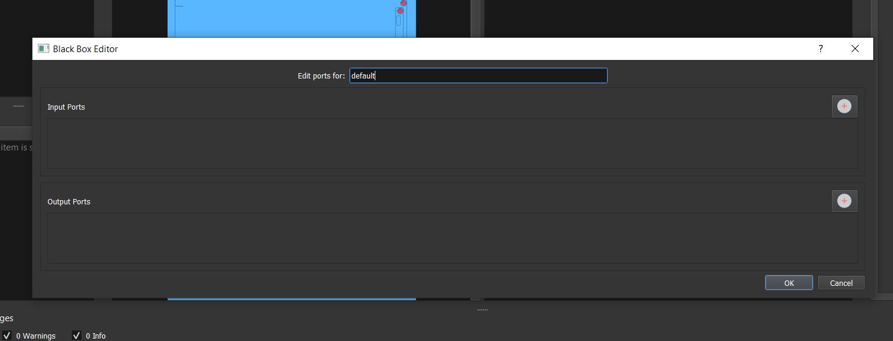
    
    A snippit of the Facile system action pipeline creation dialog. This Black Box Editor allows the user to add input and/or output ports to create an action pipeline. 
    

.. _ActionPipelineCreationtest02Gnaqcbiv:

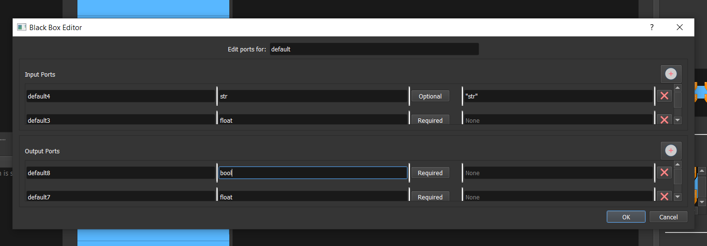
    
    A snippit of the Facile system action pipeline creation dialog that shows input and output ports of  bool, int, string, and float data types being added to the action pipeline.
    

.. _ActionPipelineCreationtest03ChXIscsg:

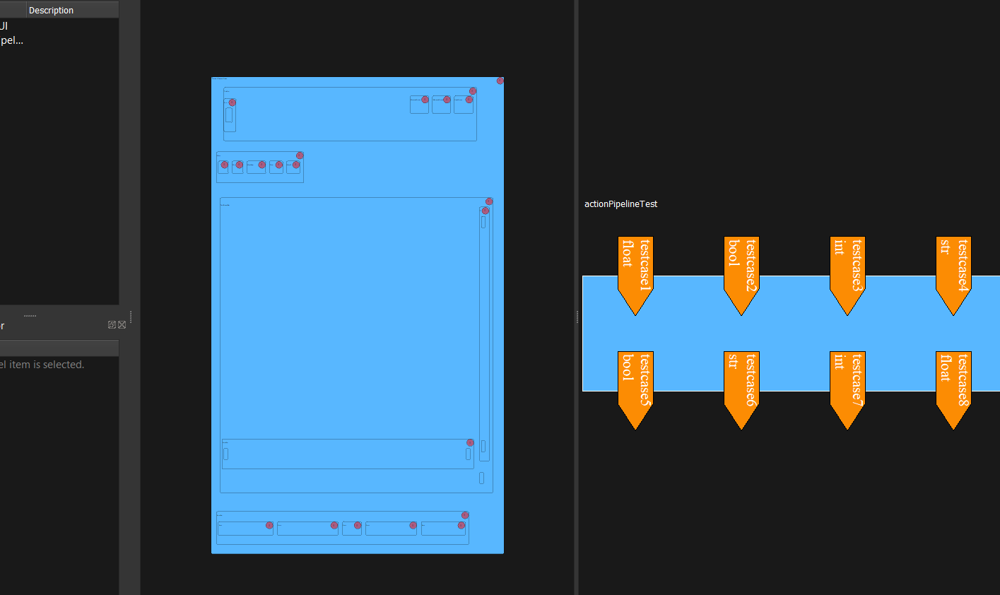
    
    A snippit of the Facile system that shows an action pipeline in the API Model view with 4 input and output ports with the basic python data structures such as int, bool, float, and string.
    

.. raw:: latex

	\newpage
	
----------------------------------------------------------------------------------------------------
(SAR4.3.1.6.2) Show Relevant Actions
----------------------------------------------------------------------------------------------------

============
Introduction
============

This acceptance test verifies that the software system, Facile has a functional GUI that contains a view that shows any action that is relevant to the target GUI model. User will be able to choose from a Component Actions or Action Pipelines tab to modify the current action pipelines.  This acceptance test establishes the framework used by the acceptance test team to plan, execute, and document acceptance testing.  It describes the scope of the work performed and the approach taken to execute the tests created to validate that the system performs as required in the GUI. The details of this acceptance test are developed according to the requirements specifications and show traceability back to those specifications.

====================
Referenced Documents
====================

- System Requirements Document, Rev B, 10/27/2019

=======================
Required Test Equipment
=======================

- PC (Personal Computer)

=========================
Requirements Summary
=========================

To verify SAR4.3.1.6.2 - The Facile GUI shall contain a view that shows all actions relevant to the target GUI model. 

===================
Pre-Test Conditions
===================

- Need to be running application on Operating system Windows 10 Home Version 1903.
- Python 3.7.4 is installed and added to the PATH.
- A Facile project has already been created.

.. tabularcolumns:: |c|L|L|
.. table:: Test Procedure Steps

	+------+-------------------------------------------------------------------------------------+---------------------------------------------------------------------------------------------------------------------------------------------------------------------+
	| Step | Action                                                                              | Expected Result                                                                                                                                                     |
	+======+=====================================================================================+=====================================================================================================================================================================+
	|    1 | Navigate to the directory containing the **facile** folder with faciles source code | **Facile** directory is open                                                                                                                                        |
	+------+-------------------------------------------------------------------------------------+---------------------------------------------------------------------------------------------------------------------------------------------------------------------+
	|    2 | Click on the **Windows Search Bar**                                                 | **Windows Search Bar** comes into focus                                                                                                                             |
	+------+-------------------------------------------------------------------------------------+---------------------------------------------------------------------------------------------------------------------------------------------------------------------+
	|    3 | Type **cmd** and press enter                                                        | A **Command Prompt** opens                                                                                                                                          |
	+------+-------------------------------------------------------------------------------------+---------------------------------------------------------------------------------------------------------------------------------------------------------------------+
	|    4 | Click on the **Command Prompt**                                                     | The **Command Prompt** comes into focus                                                                                                                             |
	+------+-------------------------------------------------------------------------------------+---------------------------------------------------------------------------------------------------------------------------------------------------------------------+
	|    5 | Type **python facile.py** in the **Command Prompt**                                 | **Facile** should run.                                                                                                                                              |
	+------+-------------------------------------------------------------------------------------+---------------------------------------------------------------------------------------------------------------------------------------------------------------------+
	|    6 | Click on **File** in the menu.                                                      | Context menu of items will be shown                                                                                                                                 |
	+------+-------------------------------------------------------------------------------------+---------------------------------------------------------------------------------------------------------------------------------------------------------------------+
	|    7 | Click on **Recent Projects**                                                        | Context menu of recent projects will be shown.                                                                                                                      |
	+------+-------------------------------------------------------------------------------------+---------------------------------------------------------------------------------------------------------------------------------------------------------------------+
	|    8 | Click on a recent project that you created previously.                              | The selected project will be opened.                                                                                                                                |
	+------+-------------------------------------------------------------------------------------+---------------------------------------------------------------------------------------------------------------------------------------------------------------------+
	|    9 | Click on **Start App**                                                              | **Target Application** will open                                                                                                                                    |
	+------+-------------------------------------------------------------------------------------+---------------------------------------------------------------------------------------------------------------------------------------------------------------------+
	|   10 | Click on **Auto Explore** or **Manual Explore**                                     | Target GUI model is shown in the view.                                                                                                                              |
	+------+-------------------------------------------------------------------------------------+---------------------------------------------------------------------------------------------------------------------------------------------------------------------+
	|   11 | Click on a component in the **Target GUI Model**.                                   | All actions that can be performed on that component appear in the Action Menu view. Refer to :num:`Fig. #showrelevantactionstest01kezbecoj` Test case is complete.  |
	+------+-------------------------------------------------------------------------------------+---------------------------------------------------------------------------------------------------------------------------------------------------------------------+

.. _ShowRelevantActionstest01KEZbECoj:

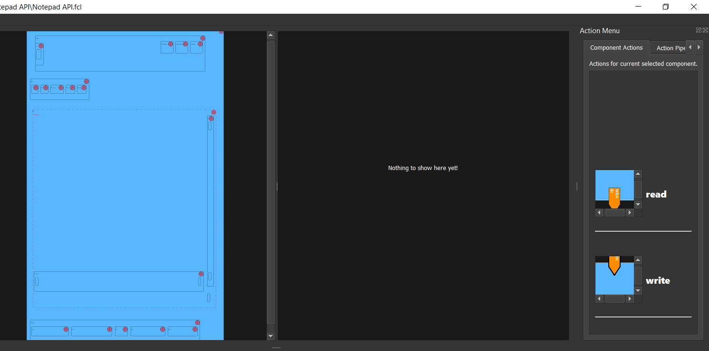
    
    A snippit of the Facile software system that shows all relevant actions of the target GUI model in a Action Menu view under the Action Pipelines tab.
    

.. raw:: latex

	\newpage
	
----------------------------------------------------------------------------------------------------
(SSR4.3.1.7) Validator
----------------------------------------------------------------------------------------------------

============
Introduction
============

This acceptance test verifies that the software system, Facile has a functional GUI that contains a view with a  dialog that will let the user know of any potential errors for the project model being used.  This acceptance test establishes the framework used by the acceptance test team to plan, execute, and document acceptance testing. User will be able to hide or show info, warning, or error messages in a Validator view. It describes the scope of the work performed and the approach taken to execute the tests created to validate that the system performs as required in the GUI. The details of this acceptance test are developed according to the requirements specifications and show traceability back to those specifications.

====================
Referenced Documents
====================

- System Requirements Document, Rev B, 10/27/2019

=======================
Required Test Equipment
=======================

- PC (Personal Computer)

=========================
Requirements Summary
=========================

To verify SSR4.3.1.7 - The Facile GUI shall contain a view that warns the user of potential errors in project models.

===================
Pre-Test Conditions
===================

- Need to be running application on Operating system Windows 10 Home Version 1903.
- Python 3.7.4 is installed and added to the PATH.
- A Facile project has already been created.

.. tabularcolumns:: |c|L|L|
.. table:: Test Procedure Steps

	+------+--------------------------------------------------------------------------------------------------------------------------------------------------------------------+------------------------------------------------------------------------------------------------------------------------------+
	| Step | Action                                                                                                                                                             | Expected Result                                                                                                              |
	+======+====================================================================================================================================================================+==============================================================================================================================+
	|    1 | Navigate to the directory containing the **facile** folder with faciles source code                                                                                | **Facile** directory is open                                                                                                 |
	+------+--------------------------------------------------------------------------------------------------------------------------------------------------------------------+------------------------------------------------------------------------------------------------------------------------------+
	|    2 | Click on the **Windows Search Bar**                                                                                                                                | **Windows Search Bar** comes into focus                                                                                      |
	+------+--------------------------------------------------------------------------------------------------------------------------------------------------------------------+------------------------------------------------------------------------------------------------------------------------------+
	|    3 | Type **cmd** and press enter                                                                                                                                       | A **Command Prompt** opens                                                                                                   |
	+------+--------------------------------------------------------------------------------------------------------------------------------------------------------------------+------------------------------------------------------------------------------------------------------------------------------+
	|    4 | Click on the **Command Prompt**                                                                                                                                    | The **Command Prompt** comes into focus                                                                                      |
	+------+--------------------------------------------------------------------------------------------------------------------------------------------------------------------+------------------------------------------------------------------------------------------------------------------------------+
	|    5 | Type **python facile.py** in the **Command Prompt**                                                                                                                | **Facile** should run.                                                                                                       |
	+------+--------------------------------------------------------------------------------------------------------------------------------------------------------------------+------------------------------------------------------------------------------------------------------------------------------+
	|    6 | Click on **File** in the menu.                                                                                                                                     | Context menu of items will be shown                                                                                          |
	+------+--------------------------------------------------------------------------------------------------------------------------------------------------------------------+------------------------------------------------------------------------------------------------------------------------------+
	|    7 | Click on **Recent Projects**                                                                                                                                       | Context menu of recent projects will be shown.                                                                               |
	+------+--------------------------------------------------------------------------------------------------------------------------------------------------------------------+------------------------------------------------------------------------------------------------------------------------------+
	|    8 | Click on a recent project that you created previously.                                                                                                             | The selected project will be opened.                                                                                         |
	+------+--------------------------------------------------------------------------------------------------------------------------------------------------------------------+------------------------------------------------------------------------------------------------------------------------------+
	|    9 | Click on **Start App**                                                                                                                                             | **Target Application** will open                                                                                             |
	+------+--------------------------------------------------------------------------------------------------------------------------------------------------------------------+------------------------------------------------------------------------------------------------------------------------------+
	|   10 | Click on **Auto Explore** or **Manual Explore**                                                                                                                    | Target GUI model is shown in the view.                                                                                       |
	+------+--------------------------------------------------------------------------------------------------------------------------------------------------------------------+------------------------------------------------------------------------------------------------------------------------------+
	|   11 | Click on **Validate TGUIM and API** icon.                                                                                                                          | Refer to :num:`Fig. #validatortest01jymwmvod`  error message comes up for not having an action pipeline.                     |
	+------+--------------------------------------------------------------------------------------------------------------------------------------------------------------------+------------------------------------------------------------------------------------------------------------------------------+
	|   12 | Click on the **Create New Action Pipeline** icon.                                                                                                                  | A action pipeline creation dialog is shown in a new window.                                                                  |
	+------+--------------------------------------------------------------------------------------------------------------------------------------------------------------------+------------------------------------------------------------------------------------------------------------------------------+
	|   13 | Click on **Edit ports for:** and add a name.                                                                                                                       | Name of ports for action pipeline is updated.                                                                                |
	+------+--------------------------------------------------------------------------------------------------------------------------------------------------------------------+------------------------------------------------------------------------------------------------------------------------------+
	|   14 | Click on **default** under **Input Ports** and add a name.                                                                                                         | Name of input port is updated.                                                                                               |
	+------+--------------------------------------------------------------------------------------------------------------------------------------------------------------------+------------------------------------------------------------------------------------------------------------------------------+
	|   15 | Click on **NoneType** under **Input Ports** and add the type data structure.                                                                                       | Type of data structure for input port is updated.                                                                            |
	+------+--------------------------------------------------------------------------------------------------------------------------------------------------------------------+------------------------------------------------------------------------------------------------------------------------------+
	|   16 | Decide whether to make the value of the input port required or optional.                                                                                           | Value of input port is updated or not.                                                                                       |
	+------+--------------------------------------------------------------------------------------------------------------------------------------------------------------------+------------------------------------------------------------------------------------------------------------------------------+
	|   17 | Click on **default** under **Output Ports** and add a name.                                                                                                        | Name of output port is updated.                                                                                              |
	+------+--------------------------------------------------------------------------------------------------------------------------------------------------------------------+------------------------------------------------------------------------------------------------------------------------------+
	|   18 | Click on **NoneType** under **Output Ports** and add the type data structure.                                                                                      | Type of data structure for output port is updated.                                                                           |
	+------+--------------------------------------------------------------------------------------------------------------------------------------------------------------------+------------------------------------------------------------------------------------------------------------------------------+
	|   19 | Click on **Validate TGUIM and API** icon.                                                                                                                          | Refer to :num:`Fig. #validatortest02ertwxhjv`  warning message comes up for not using the input port of the action pipeline. |
	+------+--------------------------------------------------------------------------------------------------------------------------------------------------------------------+------------------------------------------------------------------------------------------------------------------------------+
	|   20 | Right click on an action in the **Action Menu** and click on **Add to Current Action Pipeline** to add an action pipeline to the current action pipeline.          | Refer to :num:`Fig. #apimcreationtest03qjlnjqhp`                                                                             |
	+------+--------------------------------------------------------------------------------------------------------------------------------------------------------------------+------------------------------------------------------------------------------------------------------------------------------+
	|   21 | Click on a input port at the top level of that action pipeline and draw a wire from it to an top level output port or a child input port with the same data type.  | A wire is drawn from an input port to a top level output port or a child input port with the same data type.                 |
	+------+--------------------------------------------------------------------------------------------------------------------------------------------------------------------+------------------------------------------------------------------------------------------------------------------------------+
	|   22 | Click on **Validate TGUIM and API** icon.                                                                                                                          | Refer to :num:`Fig. #validatortest03ffmcxkax`  a green message comes up validating the **APIM**. Test case is completed.     |
	+------+--------------------------------------------------------------------------------------------------------------------------------------------------------------------+------------------------------------------------------------------------------------------------------------------------------+

.. _Validatortest01JYMWMvOd:

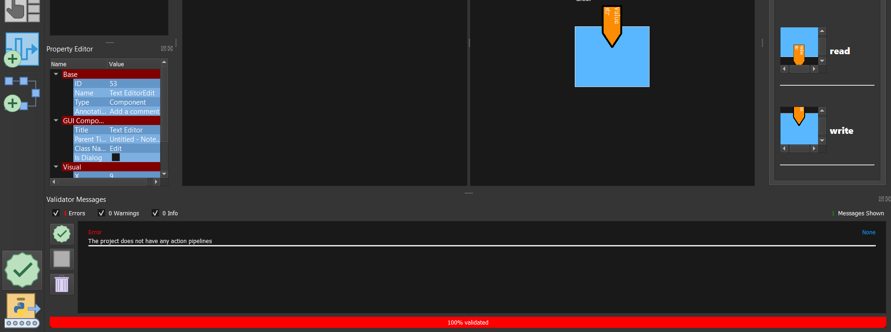
    
    A snippit of the Facile software system that shows a message of thevalidator being run and warning message coming up.
    

.. _Validatortest02ErtwxHjV:

.. figure:: ../../images/Validator_test_02.png
    :alt: A snippit of the Facile software system that shows a message of thevalidator being run and warning message coming up.
    
    A snippit of the Facile software system that shows a message of thevalidator being run and warning message coming up.
    

.. _APIMCreationtest03QJLNjQhP:

    
    A snippit of the Facile system that shows another action pipeline being added to the current action pipeline in the API Model view.
    

.. _Validatortest03FfMcxkax:

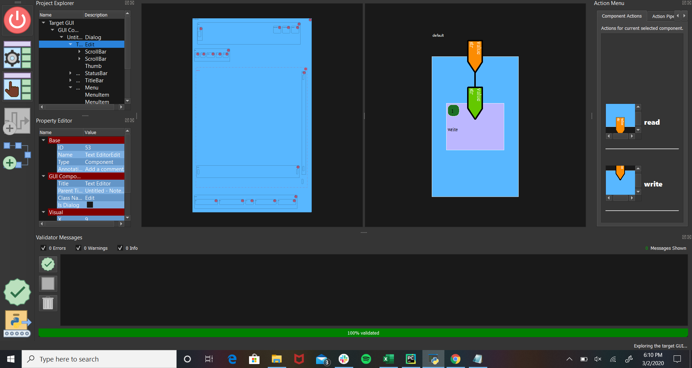
    
    A snippit of the Facile software system that shows a message of thevalidator being run and validated message coming up.
    

.. raw:: latex

	\newpage
	
----------------------------------------------------------------------------------------------------
(SR4.6.3) Project File Extension Acceptance Test
----------------------------------------------------------------------------------------------------

============
Introduction
============

This acceptance test verifies that the software system, Facile will have its project files saved with a .fcl extension.  This acceptance test establishes the framework used by the acceptance test team to plan, execute, and document acceptance testing.  It describes the scope of the work performed and the approach taken to execute the tests created to validate that the system performs as required in the GUI. The details of this acceptance test are developed according to the requirements specifications and show traceability back to those specifications.

====================
Referenced Documents
====================

- System Requirements Document, Rev B, 10/27/2019

=======================
Required Test Equipment
=======================

- PC (Personal Computer)

=========================
Requirements Summary
=========================

To verify SR4.2.1 - Facile shall operate on 64-bit Windows 10 Home Version 1903.

===================
Pre-Test Conditions
===================

- Need to be running application on Operating system Windows 10 Home Version 1903.
- Python 3.7.4 is installed and added to the PATH.

.. tabularcolumns:: |c|L|L|
.. table:: Test Procedure Steps

	+------+---------------------------------------------------------------------------------------------------------------------------------------------------------------------------------------------------------+--------------------------------------------------------------------------------------------------------------------------------------------------------------------------+
	| Step | Action                                                                                                                                                                                                  | Expected Result                                                                                                                                                          |
	+======+=========================================================================================================================================================================================================+==========================================================================================================================================================================+
	|    1 | Navigate to the directory containing the **facile** folder with faciles source code                                                                                                                     | **Facile** directory is open                                                                                                                                             |
	+------+---------------------------------------------------------------------------------------------------------------------------------------------------------------------------------------------------------+--------------------------------------------------------------------------------------------------------------------------------------------------------------------------+
	|    2 | Click on the **Windows Search Bar**                                                                                                                                                                     | **Windows Seach Bar** comes into focus.                                                                                                                                  |
	+------+---------------------------------------------------------------------------------------------------------------------------------------------------------------------------------------------------------+--------------------------------------------------------------------------------------------------------------------------------------------------------------------------+
	|    3 | Type **cmd** and press Enter                                                                                                                                                                            | A **Command Prompt** opens                                                                                                                                               |
	+------+---------------------------------------------------------------------------------------------------------------------------------------------------------------------------------------------------------+--------------------------------------------------------------------------------------------------------------------------------------------------------------------------+
	|    4 | Click on the **Command Prompt**                                                                                                                                                                         | The **Command Prompt** comes into focus                                                                                                                                  |
	+------+---------------------------------------------------------------------------------------------------------------------------------------------------------------------------------------------------------+--------------------------------------------------------------------------------------------------------------------------------------------------------------------------+
	|    5 | Type **python facile.py** in the **Command Prompt**                                                                                                                                                     | **Facile** should run.                                                                                                                                                   |
	+------+---------------------------------------------------------------------------------------------------------------------------------------------------------------------------------------------------------+--------------------------------------------------------------------------------------------------------------------------------------------------------------------------+
	|    6 | Click on **File**                                                                                                                                                                                       | Refer to :num:`Fig. #guitest01uhmbrler`                                                                                                                                  |
	+------+---------------------------------------------------------------------------------------------------------------------------------------------------------------------------------------------------------+--------------------------------------------------------------------------------------------------------------------------------------------------------------------------+
	|    7 | Click on **New Project**                                                                                                                                                                                | Refer to :num:`Fig. #guitest01uhmbrler`                                                                                                                                  |
	+------+---------------------------------------------------------------------------------------------------------------------------------------------------------------------------------------------------------+--------------------------------------------------------------------------------------------------------------------------------------------------------------------------+
	|    8 | Click on **From Scratch**                                                                                                                                                                               | Refer to :num:`Fig. #guitest01uhmbrler`                                                                                                                                  |
	+------+---------------------------------------------------------------------------------------------------------------------------------------------------------------------------------------------------------+--------------------------------------------------------------------------------------------------------------------------------------------------------------------------+
	|    9 | Fill in **Project Name** and **Project Description.** Upload your **Project Folder** and **Target Application.** Choose the category the **Target Application** best fits under. Finally, click **OK.** | Project is saved with the *.fcl* extension in the selected folder. Refer to :num:`Fig. #guitest02vvvvyrih`                                                               |
	+------+---------------------------------------------------------------------------------------------------------------------------------------------------------------------------------------------------------+--------------------------------------------------------------------------------------------------------------------------------------------------------------------------+
	|   10 | In the Windows taskbar, click on **File Explorer** and navigate to your project folder.                                                                                                                 | A variety of files are shown. The main file is the name of your project with the *.fcl* extension. Refer to :num:`Fig. #extensiontest01eqqlfxtn` Test case is completed. |
	+------+---------------------------------------------------------------------------------------------------------------------------------------------------------------------------------------------------------+--------------------------------------------------------------------------------------------------------------------------------------------------------------------------+

.. _GUItest01UHmbrler:

    
    A snippit of the Facile software system that shows the menu path to create a new project from scratch.
    

.. _GUItest02vVvvYRIH:

    
    A snippit of the Facile project creation dialog. This dialog allows the user to specify some basic information abou the project and application they wish to control.
    

.. _extensiontest01eqqlfxtn:

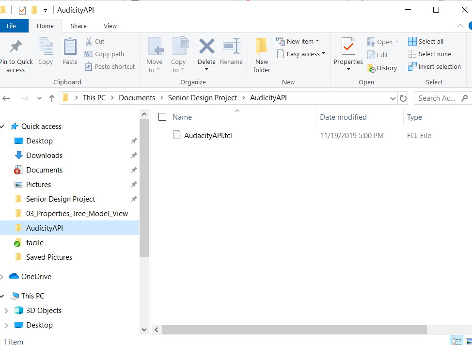
    
    Shows the files in your project. The filenames in your project may differ, but the extensions should remain the same.
    

.. raw:: latex

	\newpage
	
----------------------------------------------------------------------------------------------------
(SR4.6.4) Project File Format Acceptance Test
----------------------------------------------------------------------------------------------------

============
Introduction
============

This acceptance test verifies that the software system, Facile will have project files than be in a human-readable format such as JSON.  This acceptance test establishes the framework used by the acceptance test team to plan, execute, and document acceptance testing.  It describes the scope of the work performed and the approach taken to execute the tests created to validate that the system performs as required. The details of this acceptance test are developed according to the requirements specifications and show traceability back to those specifications.

====================
Referenced Documents
====================

- System Requirements Document, Rev B, 10/27/2019

=======================
Required Test Equipment
=======================

- PC (Personal Computer)

=========================
Requirements Summary
=========================

To verify SR 4.6.4 - Facile project files shall be in a human-readable format such as JSON.

===================
Pre-Test Conditions
===================

- Need to be running application on Operating system Windows 10 Home Version 1903.
- Python 3.7.4 is installed and added to the PATH.

.. tabularcolumns:: |c|L|L|
.. table:: Test Procedure Steps

	+------+---------------------------------------------------------------------------------------------------------------------------------------------------------------------------------------------------------+--------------------------------------------------------------------------------------------------------------------------------------------------+
	| Step | Action                                                                                                                                                                                                  | Expected Result                                                                                                                                  |
	+======+=========================================================================================================================================================================================================+==================================================================================================================================================+
	|    1 | Navigate to the directory containing the **facile** folder with faciles source code                                                                                                                     | **Facile** directory is open                                                                                                                     |
	+------+---------------------------------------------------------------------------------------------------------------------------------------------------------------------------------------------------------+--------------------------------------------------------------------------------------------------------------------------------------------------+
	|    2 | Click on the **Windows Search Bar**                                                                                                                                                                     | **Windows Seach Bar** comes into focus.                                                                                                          |
	+------+---------------------------------------------------------------------------------------------------------------------------------------------------------------------------------------------------------+--------------------------------------------------------------------------------------------------------------------------------------------------+
	|    3 | Type **cmd** and press Enter                                                                                                                                                                            | A **Command Prompt** opens                                                                                                                       |
	+------+---------------------------------------------------------------------------------------------------------------------------------------------------------------------------------------------------------+--------------------------------------------------------------------------------------------------------------------------------------------------+
	|    4 | Click on the **Command Prompt**                                                                                                                                                                         | The **Command Prompt** comes into focus                                                                                                          |
	+------+---------------------------------------------------------------------------------------------------------------------------------------------------------------------------------------------------------+--------------------------------------------------------------------------------------------------------------------------------------------------+
	|    5 | Type **python facile.py** in the **Command Prompt**                                                                                                                                                     | **Facile** should run.                                                                                                                           |
	+------+---------------------------------------------------------------------------------------------------------------------------------------------------------------------------------------------------------+--------------------------------------------------------------------------------------------------------------------------------------------------+
	|    6 | Click on **File**                                                                                                                                                                                       | Refer to :num:`Fig. #guitest01azgdinzp`                                                                                                          |
	+------+---------------------------------------------------------------------------------------------------------------------------------------------------------------------------------------------------------+--------------------------------------------------------------------------------------------------------------------------------------------------+
	|    7 | Click on **New Project**                                                                                                                                                                                | Refer to :num:`Fig. #guitest01azgdinzp`                                                                                                          |
	+------+---------------------------------------------------------------------------------------------------------------------------------------------------------------------------------------------------------+--------------------------------------------------------------------------------------------------------------------------------------------------+
	|    8 | Click on **From Scratch**                                                                                                                                                                               | Refer to :num:`Fig. #guitest01azgdinzp`                                                                                                          |
	+------+---------------------------------------------------------------------------------------------------------------------------------------------------------------------------------------------------------+--------------------------------------------------------------------------------------------------------------------------------------------------+
	|    9 | Fill in **Project Name** and **Project Description.** Upload your **Project Folder** and **Target Application.** Choose the category the **Target Application** best fits under. Finally, click **OK.** | Project is saved with the *.fcl* extension in the selected folder. Refer to :num:`Fig. #guitest02mkwpkqra`                                       |
	+------+---------------------------------------------------------------------------------------------------------------------------------------------------------------------------------------------------------+--------------------------------------------------------------------------------------------------------------------------------------------------+
	|   10 | In the Windows taskbar, click on **File Explorer** and navigate to your project folder.                                                                                                                 | A variety of files are shown. The main file is the name of your project with the *.fcl* extension. Refer to :num:`Fig. #extensiontest01stqalqzy` |
	+------+---------------------------------------------------------------------------------------------------------------------------------------------------------------------------------------------------------+--------------------------------------------------------------------------------------------------------------------------------------------------+
	|   11 | Right click on the project file (*.fcl* extension) and select **Open with**. Select a text editor to open the file with.                                                                                | Refer to :num:`Fig. #ppftest01zchlqwlo` Test case completed.                                                                                     |
	+------+---------------------------------------------------------------------------------------------------------------------------------------------------------------------------------------------------------+--------------------------------------------------------------------------------------------------------------------------------------------------+

.. _GUItest01AZgdiNzp:

    
    A snippit of the Facile software system that shows the menu path to create a new project from scratch.
    

.. _GUItest02mkWPkQra:

    
    A snippit of the Facile project creation dialog. This dialog allows the user to specify some basic information abou the project and application they wish to control.
    

.. _extensiontest01stqalqzy:

    
    Shows the files in your project. The filenames in your project may differ, but the extensions should remain the same.
    

.. _PPFtest01ZcHLQWlo:

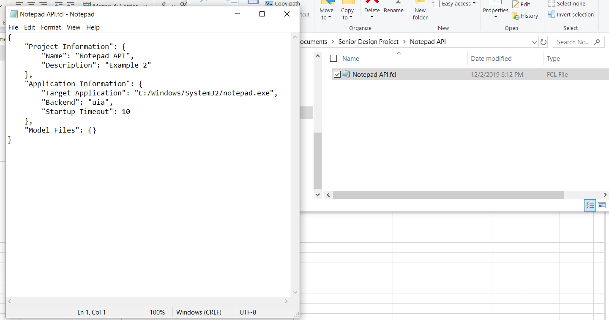
    
    The content of the Project file is shown in human-readable format in the chosen text editor. In this case, we chose to use Notepad.
    
