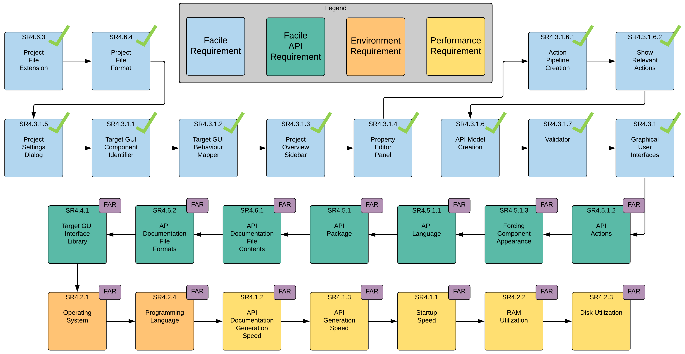
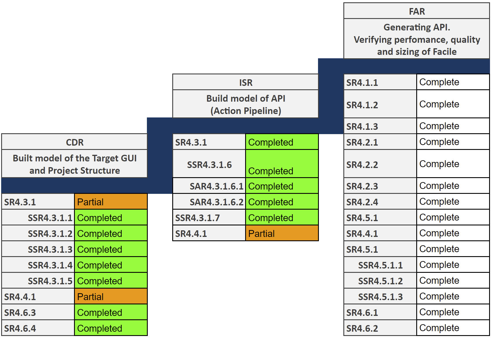

============
Introduction
============

This document contains the test procedures to verify every requirement that is verifiable at the time of ISR. Every test
procedure has a corresponding data sheet that must be filled out and signed/delivered to the sponsor for every
deliverable. :num:`Fig. #roadmap` shows the schedule of when each system requirement will be verified by.
:num:`Fig. #reqschedule` shows a schedule of all system, subsystem, and sub-assembly requirement progress.

.. _RoadMap:

	Test Plan Rev 2: A visual test plan for Facile showing 12 out of 26 requirements have been fully verified at ISR.

.. _ReqSchedule:

	Requirements Schedule Rev 2: A detailed schedule for all requirements planned for the project.